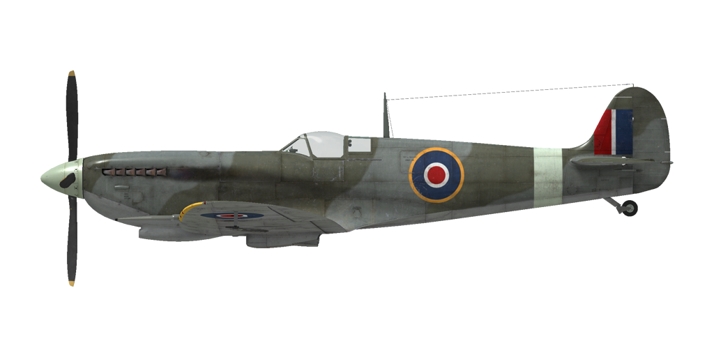

# Spitfire Mk.IXc  
  
  
  
## Описание  
  
Приборная скорость сваливания в полётной конфигурации: 143...163 км/ч (89..101 миль/ч)  
Приборная скорость сваливания в посадочной конфигурации: 135...154 км/ч (84..96 миль/ч)  
  
Предельная скорость в пикировании: 725 км/ч (451 миль/ч)  
Разрушающая перегрузка: 12,5 единиц  
Угол атаки сваливания, в полётной конфигурации: 18,8 °  
Угол атаки сваливания, в посадочной конфигурации: 16,0 °  
  
Характеристики с двигателем Merlin 66:  
Максимальная истинная скорость у земли, режим работы двигателя - обороты 3000 об/мин, наддув +18: 542 км/ч (337 миль/ч)  
Максимальная истинная скорость на высоте 3350 м (10991 фут), режим работы двигателя - обороты 3000 об/мин, наддув +18: 610 км/ч (379 миль/ч)   
Максимальная истинная скорость на высоте 6850 м (22474 фут), режим работы двигателя - обороты 3000 об/мин, наддув +18: 664 км/ч (413 миль/ч)  
  
Практический потолок: 12500 м (41011 футов)  
Режим работы двигателя при наборе высоты - обороты 2850 об/мин, наддув +12  
Скороподъёмность у земли: 21,5 м/с (4232 фут/мин)  
Скороподъёмность на высоте 3000 м (9843 фут): 18,6 м/с (3661 фут/мин)  
Скороподъёмность на высоте 6000 м (19685 фут): 15,5 м/с (3051 фут/мин)  
  
Время виража предельного по тяге у земли: 17,7 с, на скорости 270 км/ч (168 миль/ч) по прибору  
Время виража предельного по тяге на высоте 3000 м (9843 фут): 20,5 с, на скорости 260 км/ч (162 миль/ч) по прибору  
  
Характеристики с двигателем Merlin 70:  
Максимальная истинная скорость у земли, режим работы двигателя - обороты 3000 об/мин, наддув +18: 532 км/ч (331 миль/ч)  
Максимальная истинная скорость на высоте 4900 м (16076 фут), режим работы двигателя - обороты 3000 об/мин, наддув +18: 634 км/ч (394 миль/ч)   
Максимальная истинная скорость на высоте 8500 м (27887 фут), режим работы двигателя - обороты 3000 об/мин, наддув +18: 677 км/ч (421 миль/ч)  
  
Практический потолок: 13000 м (42651 фут)  
Режим работы двигателя при наборе высоты - обороты 2850 об/мин, наддув +12  
Скороподъёмность у земли: 18,5 м/с (3642 фут/мин)  
Скороподъёмность на высоте 3000 м (9843 фут): 17,5 м/с (3445 фут/мин)   
Скороподъёмность на высоте 6000 м (19685 фут): 14,1 м/с (2776 фут/мин)  
  
Время виража предельного по тяге у земли: 17,8 с, на скорости 270 км/ч (168 миль/ч) по прибору  
Время виража предельного по тяге на высоте 3000 м (9843 фут): 20,7 с, на скорости 260 км/ч (162 миль/ч) по прибору  
  
Продолжительность полёта на высоте 3000 м (9843 фут): 1 ч 40 мин, на скорости 350 км/ч (218 миль/ч) по прибору  
  
Скорость взлётная: 185...195 км/ч (115..121 миль/ч)   
Скорость на глиссаде: 165...185 км/ч (103..115 миль/ч)   
Скорость посадочная: 150...155 км/ч (93..96 миль/ч)  
Посадочный угол: 12,5 °  
  
Примечание 1: данные указаны для условий международной стандартной атмосферы.  
Примечание 2: диапазоны характеристик даны для допустимого диапазона масс самолёта.  
Примечание 3: максимальные скорости, скороподъемности и время виража даны для стандартной массы самолёта.  
Примечание 4: скороподъемность дана на режиме работы двигателя - обороты 2850 об/мин, наддув +12, время виража - на режиме - обороты 3000 об/мин, наддув +18.  
  
Двигатель:  
Модель: Merlin 66  
Максимальная мощность на взлётном режиме (3000 об/мин, наддув +12, первая ступень нагнетателя) у земли: 1320 л.с.  
  
Максимальная мощность на боевом режиме (2850 об/мин, наддув +12, первая ступень нагнетателя) на высоте 9250 футов: 1400 л.с.  
Максимальная мощность на боевом режиме (2850 об/мин, наддув +12, вторая ступень нагнетателя) на высоте 19000 футов: 1310 л.с.  
  
Максимальная мощность на чрезвычайном режиме (3000 об/мин, наддув +18, первая ступень нагнетателя) на высоте 5750 футов: 1705 л.с.  
Максимальная мощность на режиме набора высоты (3000 об/мин, наддув +18, вторая ступень нагнетателя) на высоте 16000 футов: 1580 л.с.  
  
Двигатель:  
Модель: Merlin 70  
Максимальная мощность на взлётном режиме (3000 об/мин, наддув +12, первая ступень нагнетателя) у земли: 1250 л.с.  
  
Максимальная мощность на боевом режиме (2850 об/мин, наддув +12, первая ступень нагнетателя) на высоте 13500 футов: 1375 л.с.  
Максимальная мощность на боевом режиме (2850 об/мин, наддув +12, вторая ступень нагнетателя) на высоте 25250 футов: 1255 л.с.  
  
Максимальная мощность на чрезвычайном режиме (3000 об/мин, наддув +18, первая ступень нагнетателя) на высоте 10000 футов: 1655 л.с.  
Максимальная мощность на режиме набора высоты (3000 об/мин, наддув +18, вторая ступень нагнетателя) на высоте 22250 футов: 1475 л.с.  
  
Режимы работы двигателя:  
Крейсерский (время не ограничено): 2650 об/мин, наддув +7.   
Боевой (до 1 часа): 2850 об/мин, наддув +12.  
Чрезвычайный (до 5 минут): 3000 об/мин, наддув +18.  
  
Температура воды на выходе из двигателя номинальная: 105..115 °С  
Температура воды на выходе из двигателя предельная: 135 °С  
Температура масла на входе в двигатель номинальная: 90 °С  
Температура масла на входе в двигатель предельная: 105 °С  
  
Высота переключения нагнетателя: автомат с возможностью принудительного включения первой скорости  
  
Масса пустого самолёта: 2532 кг (5582 фунт)  
Минимальная масса (без БК, 10% топлива): 2962 кг (6530 фунт)  
Стандартная масса: 3310 кг (7297 фунт)  
Максимальный запас топлива: 274 кг (604 фунт) / 386 л (85 галлонов)  
Максимальная полезная нагрузка: 1302 кг (2870 фунт).  
  
Вооружение курсовое (крыло типа "c"):  
2 x 20,0мм пушка "Hispano Mk.II", 140 снарядов на ствол, 650 выстр/мин, крыльевые  
4 x 7,7мм пулемёт "Browning .303", 350 патронов на ствол, 1150 выстр/мин, крыльевые  
  
Вооружение курсовое (крыло типа "e"):  
2 x 20,0мм пушка "Hispano Mk.II", 140 снарядов на ствол, 650 выстр/мин, крыльевые  
2 x 12,7мм пулемёт "Browning .50", 250 патронов на ствол, 850 выстр/мин, крыльевые  
  
Вооружение бомбовое:  
2x250 фунтовые осколочно-фугасные авиабомбы "250 lb. G.P."  
500 фунтовая осколочно-фугасная авиабомба "500 lb. G.P."  
  
Вооружение ракетное:  
2x25 фунтовые бронебойные ракеты "RP-3 A.P. 25 lb. mk.II"  
2x60 фунтовые полу-бронебойные ракеты "RP-3 S.A.P. 60 lb. mk.II"  
  
Длина: 9,65 м (31 7-59/64 фут)  
Размах крыла: 11,21 м (36 11/32 фут)  
Площадь крыла: 22,48 кв.м (242 кв. фут)  
  
Начало участия в боевых действиях: июнь 1942  
  
Особенности эксплуатации:  
- На самолёте установлен автомат постоянного наддува. При положении РУД большем, чем 1/3 хода, автомат поддерживает наддув, заданный положением РУДа.  
- Двигатель оборудован двуступенчатым нагнетателем, который не требует ручного управления. Возможно принудительное включение первой скорости нагнетателя.  
- Самолёт оборудован автоматическим высотным корректором, который поддерживает оптимальный состав топливовоздушной смеси.  
- Регулятор постоянных оборотов винта поддерживает заданные рычагом винта обороты мотора за счёт автоматического изменения шага винта.  
- Регулировка температуры воды и масла осуществляется автоматически, но имеется возможность при необходимости принудительно открыть створки полностью.  
- Самолёт обладает нейтральной статической устойчивостью. Эффективность руля высоты самолёта высокая, из-за этого пилотировать самолёт следует аккуратно, не допуская больших отклонений ручки управления.  
- При выпуске щитков самолёт становится неустойчивым.  
- Самолёт оснащён триммером руля высоты и руля направления.  
- Привод посадочных щитков пневматический. По команде на выпуск щитки выпускаются полностью. Ограничение по скорости с выпущенными щитками - 160 миль в час.  
- Самолёт не имеет стопора хвостового колеса. На рулении следует опасаться кренения самолёта, из-за узкой колеи шасси возможно касание крылом земли.  
- Тормоза колёс шасси пневматические, дифференциальные: отклонение педалей при зажатом тормозе приводит к растормаживанию колеса, противоположного нажатой педали.  
- Самолёт оснащён сиреной, предупреждающей о убранном положении шасси при установке РУД на малый газ.   
- На высоких скоростях полёта фонарь кабины невозможно сдвинуть из-за скоростного напора воздуха. Конструкция фонаря кабины предусматривает систему аварийного сброса фонаря для покидания лётчиком самолёта в полёте.  
- Самолёт оснащён нижним строевым огнем.  
- Стандартный коллиматорный прицел самолёта имеет дальномерную сетку, которую можно отрегулировать на заданную базу цели и заданное расстояние до цели.  
- Гироскопический коллиматорный прицел самолёта позволяет автоматически определять необходимое угловое упреждение при стрельбе по цели. Прицел имеет 4 режима работы: неподвижная прицельная сетка, подвижная и неподвижная прицельные сетки, подвижная прицельная сетка, подвижная прицельная сетка с фиксированной дистанцией до цели 150 ярдов (ночной режим). Корректное упреждение при стрельбе вычисляется при правильно заданном расстоянии до цели. Расстояние определяется с помощью подвижной дальномерной сетки после введения базы цели.   
- Оба прицела имеют сдвижной светофильтр.  
  
Основные данные и рекомендуемые положения органов управления самолётом:  
1. Запуск двигателя:  
	- рекомендуемое положение рукояти управления смесью: автоматическое управление смесью  
	- рекомендуемое положение рукояти управления маслорадиатором: автоматическое управление радиаторами  
	- рекомендуемое положение рукояти управления водорадиатором: автоматическое управление радиаторами  
	- рекомендуемое положения рукояти управления шагом: легкий винт  
	- рекомендуемое положение рычага управления двигателем: 5%  
  
2. Рекомендуемые положения рукояти смеси при различных режимах полёта: автоматическое управление смесью  
  
3. Рекомендуемые положения рукояти управления радиаторами при различных режимах полёта: автоматическое управление радиаторами  
  
4. Ориентировочный расход топлива на различных режимах работы на высоте 2000 м:  
	- крейсерский режим работы двигателя: 6,3 л/мин  
	- боевой режим работы двигателя: 10,2 л/мин  
  
## Модификации  
### 150 октановое топливо  
  
Позволяет использовать наддув +25 lb  
Автомат переключения ступеней нагнетателя отключен. Высота ручного переключения ступеней нагнетателя: 2743 м (9000 футов).  
Ориентировочная прибавка скорости у земли: 29 км/ч  
  
### 2 х 250 lb G.P.  
  
2 x 113 кг осколочно-фугасные авиабомбы 250 lb G.P.  
Дополнительная масса: 247 кг  
Масса вооружения: 227 кг  
Масса держателей: 20 кг  
Ориентировочная потеря скорости до сброса: 24 км/ч  
Ориентировочная потеря скорости после сброса: 8 км/ч  
  
### 500 lb G.P.  
  
227 кг осколочно-фугасная авиабомба 500 lb G.P.  
Дополнительная масса: 237 кг  
Масса вооружения: 227 кг  
Масса держателей: 10 кг  
Ориентировочная потеря скорости до сброса: 13 км/ч  
Ориентировочная потеря скорости после сброса: 7 км/ч  
  
### Крыло типа "E"  
  
Установка 2 x 12,7мм пулемётов "Browning .50" вместо 4 x 7,7мм пулемётов "Browning .303"  
Дополнительная масса: 48 кг  
Масса боекомплекта: 70 кг  
Масса орудия: 72 кг  
Ориентировочная прибавка скорости: 5 км/ч  
  
### Гироприцел  
  
Гироприцел MkII  
Дополнительная масса: 5.2 кг  
Ориентировочная потеря скорости: 0 км/ч  
  
### Двигатель Merlin 70  
  
Двигатель Merlin 70  
Дополнительная масса: 0 кг  
Ориентировочная потеря скорости: 0 км/ч  
  
### Зеркало  
  
Зеркало обзора задней полусферы  
Дополнительная масса: 1 кг  
Ориентировочная потеря скорости: 1 км/ч  
  
### 2 х RP-3  
  
2 х 3-дюймовых полу-бронебойно фугасных или бронебойных реактивных снаряда RP-3  
  
RP-3 полу-бронебойно фугасные:  
Дополнительная масса: 106 кг  
Масса вооружения: 86 кг  
Масса держателей: 20 кг  
Ориентировочная потеря скорости до пуска: 23 км/ч  
Ориентировочная потеря скорости после пуска: 17 км/ч  
  
RP-3 бронебойные:  
Дополнительная масса: 75 кг  
Масса вооружения: 55 кг  
Масса держателей: 20 кг  
Ориентировочная потеря скорости до пуска: 21 км/ч  
Ориентировочная потеря скорости после пуска: 17 км/ч  
  
### Укороченное крыло  
  
Укороченное крыло  
Уменьшение массы: 4 кг  
Ориентировочная потеря скорости: 0 км/ч  
