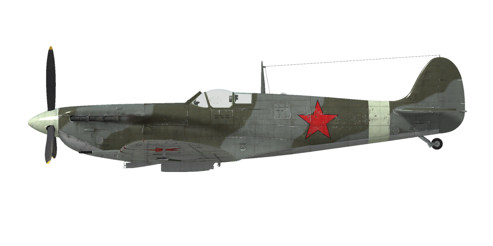

# Spitfire Mk.VB

## Beschreibung

Überziehgeschwindigkeit in Flugkonfiguration: 137..144 km/h
Überziehgeschwindigkeit in Landekonfiguration: 129..135 km/h

Höchstzulässige Geschwindigkeit im Sturzflug: 725 km/h
Bruchlastvielfache: 12.5 G
Kritischer Anstellwinkel in Flugkonfiguration: 18.8 °
Kritischer Anstellwinkel in Landekonfiguration: 16.0 °

Merlin 46 Triebwerk:

Höchstgeschwindigkeit in Bodennähe, 3000 U/min, Zusatzleistung +9: 457 km/h
Höchstgeschwindigkeit in Bodennähe, 3000 U/min, Zusatzleistung +16: 515 km/h
Höchstgeschwindigkeit in 7400 m Höhe, 3000 U/min, Zusatzleistung +9: 597 km/h
Höchstgeschwindigkeit in 5000 m Höhe, 3000 U/min, Zusatzleistung +16: 604 km/h

Dienstgipfelhöhe: 12000 m
Steigleistung in Bodennähe: 12.9 m/s
Steigleistung in 3000 m Höhe: 13.1 m/s
Steigleistung in 6000 m Höhe: 12.0 m/s

Maximale Wendegeschwindigkeit in Bodennähe: 25 s (270 km/h IAS).
Maximale Wendegeschwindigkeit in 3000 m Höhe: 30 s (270 km/h IAS).

Merlin 45 Triebwerk:

Höchstgeschwindigkeit in Bodennähe, 3000 U/min, Zusatzleistung +9: 480 km/h
Höchstgeschwindigkeit in Bodennähe, 3000 U/min, Zusatzleistung +16: 535 km/h
Höchstgeschwindigkeit in 6000 m Höhe, 3000 U/min, Zusatzleistung +9: 590 km/h
Höchstgeschwindigkeit in 3500 m Höhe, 3000 U/min, Zusatzleistung +16: 596 km/h

Dienstgipfelhöhe: 11200 m
Steigleistung in Bodennähe: 14.5 m/s
Steigleistung in 3000 m Höhe: 14.7 m/s
Steigleistung in 6000 m Höhe: 11.4 m/s

Maximale Wendegeschwindigkeit in Bodennähe: 22 s (270 km/h IAS).
Maximale Wendegeschwindigkeit in 3000 m Höhe: 28.2 s (270 km/h IAS).

Reichweite in 3000 m: 1 h 45 m, bei 350 km/h IAS.

Startgeschwindigkeit: 160..170 km/h
Anfluggeschwindigkeit: 145..160 km/h
Landegeschwindigkeit: 130..135 km/h
Sinkflugpfad: 12.5 °

Anmerkung 1: Die Werte gelten für Normatmosphäre (ISA).
Anmerkung 2: Flugleistungen varrieren je nach Abfluggewicht.
Anmerkung 3: Höchstgeschwindigkeiten, Steigleistungen und Wendegeschwindigkeiten gelten für Standard-Fluggewicht.
Anmerkung 4: Steigraten sind für 2850 U/min und Ladedruck +9 angegeben, Kurvenzeiten für 3000 U/min und Ladedruck +9.

Triebwerk:
Baumuster: Merlin 46
Startleistung in Bodennähe (3000 U/min, Zusatzleistung +12): 1100 PS
Zusatzleistung in 14000 ft Höhe (3000 U/min, Zusatzleistung +16): 1400 PS
Nennleistung in 19000 ft Höhe (2850 U/min, Zusatzleistung +9): 1115 PS

Baumuster: Merlin 45
Startleistung in Bodennähe (3000 U/min, Zusatzleistung +12): 1185 PS
Zusatzleistung in 9000 ft Höhe (3000 U/min, Zusatzleistung +16): 1455 PS
Nennleistung in 14200 ft Höhe (2850 U/min, Zusatzleistung +9): 1170 PS

Leistungsstufen:
Nennleistung (unbegrenzt): 2650 U/min, Zusatzleistung +7
Kampfleistung (bis zu 30 Minuten): 2850 U/min, Zusatzleistung +9
Zusatzleistung (bis zu 3 Minuten): 3000 U/min, Zusatzleistung +16

Kühlstoffaustrittstemperatur (normal): 105..115 °C
Kühlstoffaustrittstemperatur (höchstens): 125 °C
Schmierstoffeintrittstemperatur (normal): 70..85 °C
Schmierstoffeintrittstemperatur (höchstens): 105 °C

Laderumschalthöhe: Einganglader

Leergewicht: 2415 kg
Minimalgewicht (keine Munition, 10% Treibstoff): 2732 kg
Normalgewicht: 2979 kg
Kraftstoffmenge: 274 kg / 386 l / 85 Gallone
Nutzlast: 564 kg

Starre Schusswaffenanlage:
2 x 20 mm Hispano Mk.II, 60 Schuss, 650 Schuss pro Minute, flügelmontiert
4 x 7.7 mm Browning .303, 350 Schuss, 1150 Schuss pro Minute, flügelmontiert

Lange: 9.2 m
Spannweite: 11.21 m
Flügelfläche: 22.48 m²

Erster Fronteinsatz: Winter 1941

Eigenschaften:
- Der Motor ist mit einem automatischen Regler des Ladedrucks ausgestattet, der funktioniert, wenn der Schubhebel auf 1/3 oder höher gestellt wird. Der automatische Regler muss ausgeschaltet werden, um den Ladedruck auf +16 zu stellen.
- Der Motor hat einen Einganglader, welcher nicht umgeschaltet werden muss.
- Der Motor ist mit einer automatischen Gemischregelung ausgestattet, die das optimale Gemisch beibehält, wenn sich der Gemischhebel in der hinteren Position befindet. Um die automatische Abmagerung des Gemisches zur Reduzierung des Spritverbrauchs während des Flugs zu verwenden, wird der Gemischhebel in die vordere Position gebracht. 
- Die Drehzahl des Motors hat einen automatischen Regler, der die Einstellung des Propellers kontrolliert, um die geforderte Drehzahl einzuhalten.
- Der Wasserkühler wird manuell verstellt, der Ölkühler ist nicht verstellbar.
- To use the fuel gauge, press and hold the corresponding button (RShift+I by default).
- Das Flugzeug hat eine neutrale Stabilität. Die Effektivität des Höhenruders ist hoch, so dass das Flugzeug vorsichtig gesteuert werden sollte, ohne zu starke Steuereingaben vorzunehmen.
- Das Flugzeug wird bei ausgefahrenen Landeklappen instabil.
- Das Flugzeug ist mit Höhen- und Seitenrudertrimmung ausgestattet.
- Die Landeklappen haben eine pneumatische Steuerung und können nur auf maximale Stellung ausgefahren werden. Die Geschwindigkeit mit ausgefahrenen Landeklappen ist auf 150 mph (241 km/h) beschränkt.
- Das Spornrad des Flugzeugs dreht sich frei und hat keine Verriegelung. Da die Räder des Fahrwerks relativ eng beieinander stehen, ist es nötig, die Ruderpedale während Start und Landung mit Nachdruck und sehr genau zu betätigen.
- Das Flugzeug hat differentielle pneumatische Bremsen, die mit einem gemeinsamen Bremshebel betätigt werden. Wenn der Bremshebel gezogen und das Ruderpedal betätigt wird, wird die gegenüberliegende Bremse gelöst und das Flugzeug dreht sich zu der einen oder der anderen Seite.
- Das Flugzeug ist mit einer Sirene ausgestattet, die den Piloten warnt, wenn der Schubhebel auf niedrige Stellung gebracht wird und gleichzeitig das Fahrgestell eingefahren ist.
- Aufgrund des starken Luftstroms ist es nicht möglich die Cockpithaube bei hoher Geschwindigkeit zu öffnen oder zu schließen. Die Cockpithaube kann für den Notausstieg abgeworfen werden.
- Das Flugzeug ist mit oberen und unteren Positionslichtern ausgestattet, die gleichzeitig oder getrennt voneinander eingeschaltet werden können.
- Die Visiereinrichtung ist einstellbar: Zielentfernung und Zielgröße können eingestellt werden.
- Das Visier ist mit einen Sonnenfilter ausgestattet.

Basic data and recommended positions of the aircraft controls:
1. Starting the engine:
	- recommended position of the mixture control lever: forward (auto mixture control)
	- recommended position of the water radiator control handle: open 60%
	- recommended position of the prop pitch control handle: light
	- recommended position of the throttle lever: 10%

2. Recommended mixture control lever positions for various flight modes: forward (auto mixture control)

3. Recommended positions of the radiator control handle for various flight modes:
	- takeoff: open 60%
	- climb: open 100%
	- cruise flight: open 60% (in winter conditions - close if necessary)
	- combat: open 60%

4. Approximate fuel consumption at 2000 m altitude:
	- Cruise engine mode: 6.2 l/min
	- Combat engine mode: 7.7 l/min

## Änderungen
### Merlin 45 Motor

Später Merlin 45 Motor.
Zusätzliches Gewicht: 0 kg
Geschwindigkeitsverlust: 0 km/h

### Rückspiegel

Rückspiegel
Zusätzliches Gewicht: 1 kg
Geschwindigkeitsverlust: 0 km/h
