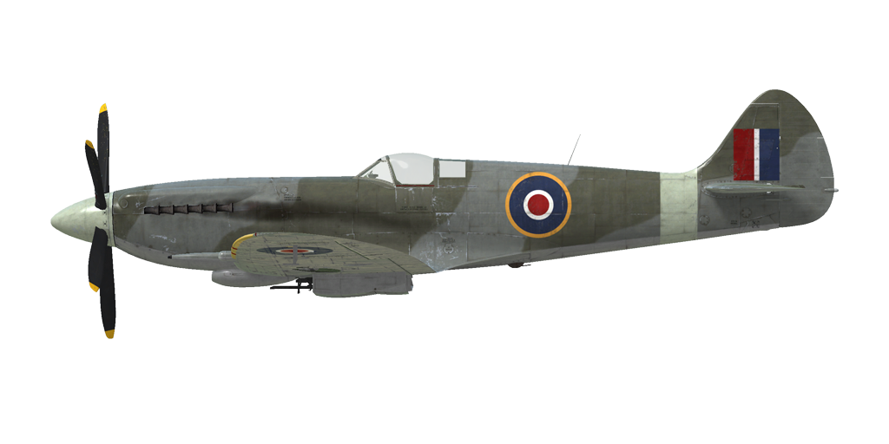

# Spitfire Mk.XIV  
  
  
  
## Description  
  
Vitesse de décrochage indiquée en configuration de vol : 152..172 km/h  
Vitesse de décrochage indiquée en configuration de décollage/atterrissage : 145..163 km/h  
  
Vitesse limite de piqué : 756 km/h  
Facteur de charge maximum : 12,5 g  
Angle d\attaque de décrochage en configuration de vol : 19,0 °  
Angle d\attaque de décrochage indiquée en configuration d\atterrissage : 16,2 °  
  
Vitesse sol au niveau de la mer, 2750 RPM, boosté +18 : 574 km/h  
Vitesse sol maximale à 4000 m, 2750 RPM, boosté +18 : 671 km/h  
Vitesse sol maximale à 8100 m, 2750 RPM, boosté +18 : 720 km/h  
  
Plafond opérationnel : 13400 m  
Taux de montée au niveau de la mer : 23,8 m/s  
Taux de montée à 2650 m : 23,5 m/s  
Taux de montée à 6750 m : 18,2 m/s  
  
Virage à 360° au niveau de la mer en : 18,1 s, à 270 km/h vitesse indiquée (IAS).  
Virage à 360° à 3000 m : 21,0 s, à 260 km/h vitesse indiquée (IAS).  
  
Endurance à 3000 m : 1 h 45 m, à 350 km/h vitesse indiquée (IAS).  
  
Vitesse de décollage : 170...195 km/h  
Vitesse d\approche : 180...210 km/h  
Vitesse d\atterrissage : 140...160 km/h  
Angle d\atterrissage : 12,5 °  
  
Note 1 : les données sont indiquées à l\atmosphère standard international (ISA).  
Note 2 : les performances d\endurance sont données pour plusieurs masses possibles.  
Note 3 : la vitesse maximale, le taux de montée et le temps de virage sont donnés pour une masse standard.  
Note 4 : climb rates and turn times are given for 2750 RPM and boost +18.  
  
Moteur :  
Modèle : Griffon 65  
Puissance maximale au régime de décollage au niveau de la mer (2750 RPM, boosté +12) : 1565 cv  
Puissance maximale au régime combat à 4270 m (2600 RPM, boosté +9) : 1520 cv  
Puissance maximale au régime combat à 8070 m (2600 RPM, boosté +9) : 1375 cv  
Puissance maximale au régime boosté à 2134 m (2750 RPM, boosté +18) : 2063 cv  
Puissance maximale au régime boosté à 6400 m (2750 RPM, boosté +18) : 1845 cv  
  
Performance du moteur :  
Continu (durée illimitée) : 2400 tr/min, boosté +7  
Combat (jusqu\à 60 minutes) : 2600 tr/min, boosté +9  
Boosté (jusqu\à 5 minutes) : 2750 tr/min, boosté +18  
  
Température de fonctionnement d\eau en sortie du moteur : 105..115 °C  
Température maximale d\eau en sortie du moteur : 135 °C  
Température de fonctionnement d\huile à l\admission du moteur : 90 °C  
Température maximale d\huile à l\admission du moteur : 105 °C  
  
Altitude de changement d\étage du compresseur : automatic with possibility of manual switch to low gear  
  
Masse à vide : 3295,0 kg  
Masse minimale (sans munitions, 10% de carburant) : 3422,7 kg  
Masse standard : 3862,7 kg  
Masse de carburant : 363,3 kg / 504,6 l / 111 Gl  
Charge utile : 1027,8 kg  
  
Armement offensif (aile de type "c"):  
2 mitrailleuse Hispano Mk.II de 20 mm, 150 coups, 650 coups par minute, dans l\aile  
4 mitrailleuse Browning .303 de 7,7 mm, 350 coups, 1150 coups par minute, dans l\aile  
  
Armement offensif (aile de type "e"):  
2 mitrailleuse Hispano Mk.II de 20 mm, 150 coups, 650 coups par minute, dans l\aile  
2 mitrailleuse Browning .50 de 12,7 mm, 250 coups, 850 coups par minute, dans l\aile  
  
Bombs :  
2 bombes d\emploi général 250 lb. G.P. de 113 kg  
Bomb d\emploi général 500 lb. G.P. de 226 kg  
  
Longueur : 9,9 m  
Envergure : 11,21 m  
Surface alaire : 22,48 m²  
  
Premier engagement : Janvier 1944  
  
Caractéristiques  
- The engine is equipped with the automatic governor of the manifold pressure that works when the throttle is set to 1/3 position or above.  
- The engine has a two stage mechanical supercharger which does not require manual control. It can be switched to the low gear manually.  
- The engine is equipped with an automatic fuel mixture control which maintains optimal mixture.  
- Engine RPM has an automatic governor that controls the propeller pitch to maintain the required RPM.  
- The water and oil radiators shutters are operated automatically, but there is a special manual mode that forces radiator shutters to open completely.  
- The aircraft has a neutral static stability. The elevator effectiveness is high, so the aircraft should be controlled carefully, not giving too much flight stick input.  
- The aircraft becomes unstable with extended landing flaps.  
- The aircraft is equipped with elevator and rudder trimmers.  
- Landing flaps have a pneumatic actuator so they can be extended to maximum position only. Speed with extended landing flaps is limited to 160 mph.  
- The aircraft tailwheel rotates freely and does not have a lock. Since the landing gear wheels are relatively close to each other, it is necessary to confidently and accurately operate the rudder pedals during the takeoff and landing.  
- The aircraft has differential pneumatic wheel brakes with shared control lever. This means that if the brake lever is held and the rudder pedal the opposite wheel brake is gradually released causing the plane to swing to one side or the other.  
- The aircraft is equipped with a siren that warns a pilot if the throttle is set to low position with landing gear retracted.  
- It is impossible to open or close the canopy at high speed due to strong airflow. The canopy has an emergency release system for bailouts.  
- The aircraft is equipped with two underwing formation lights.  
- Standard gunsight is adjustable: both the target distance and target base can be set.  
- The gyroscopic gunsight automaticly calculates required angular deflection while firing at a target. It has 4 modes: fixed reticle, fixed and gyro reticle, gyro reticle, gyro reticle with the target range fixed at 150 yards (night mode). The angular deflection will be calculated correctly only if the target range is set properly. To set the range, adjust the target base first using separate controls and then set the range by adjusting the size of the rangefiding reticle to be the same as the target size.  
- Both gunsights have sliding sun-filters.  
  
Basic data and recommended positions of the aircraft controls:  
1. Starting the engine:  
	- recommended position of the mixture control lever: auto mixture control  
	- recommended position of the oil radiator control handle: auto radiators control  
	- recommended position of the prop pitch control handle: light  
	- recommended position of the throttle lever: 5%  
  
2. Recommended mixture control lever positions for various flight modes: auto mixture control  
  
3. Recommended positions of the radiators control handle for various flight modes: auto radiators control  
  
4. Approximate fuel consumption at 2000 m altitude:  
	- Cruise engine mode: 7.4 l/min  
	- Combat engine mode: 12.9 l/min  
  
## Modifications  
  
  
### 150 grade fuel  
  
Allows +21 lb boost  
Supercharger gear shift automat is disabled. Stages should be manually switched at 11000ft altitude.  
Estimated speed increase at sea level: 20 km/h  
  
### 2 bombes 250 lb G.P.  
  
2 bombes d’emploi général 250 lb G.P.  
Masse supplémentaire : 247 kg  
Masse des munitions : 227 kg  
Masse des pylones : 20 kg  
Perte estimée de vitesse avant le largage : 22 km/h  
Perte estimée de vitesse après le largage : 11 km/h  
  
### 500 lb G.P.  
  
Le bombe d’emploi général 500 lb G.P.  
Masse supplémentaire : 237 kg  
Masse des munitions : 227 kg  
Masse des pylones : 10 kg  
Perte estimée de vitesse avant le largage : 12 km/h  
Perte estimée de vitesse après le largage : 6 km/h  
  
### Aile de type "e"  
  
Installation de 2 x 12.7mm "Browning .50" mitrailleuses au lieu de 4 x 7.7mm "Browning .303" mitrailleuses  
Masse supplémentaire: 48 kg  
Masse des munitions : 70 kg  
Masse des canons : 72 kg  
Gain estimée de vitesse : 5 km/h  
  
### Gyro Gunsight  
  
MkII Gyro Gunsight  
Additional mass: 5.2 kg  
Estimated speed loss: 0 km/h  
  
### Miroir  
  
Miroir pour voir lhémisphère arrière  
Additional mass: 1 kg  
Estimated speed loss: 1 km/h  
  
### Suppression des mitrailleuses  
  
Retrait des mitrailleuses montées sur les ailes pour réduire la masse totale  
Masse enlevée : 95 kg  
Masse des munitions enlevées : 42 kg  
Masse des mitrailleuses enlevées : 53 kg  
Gain estimé de vitesse : 8 km/h  
  
### Clipped Wing  
  
Clipped Wing  
Removed mass: 4 kg  
Estimated speed loss: 0 km/h  