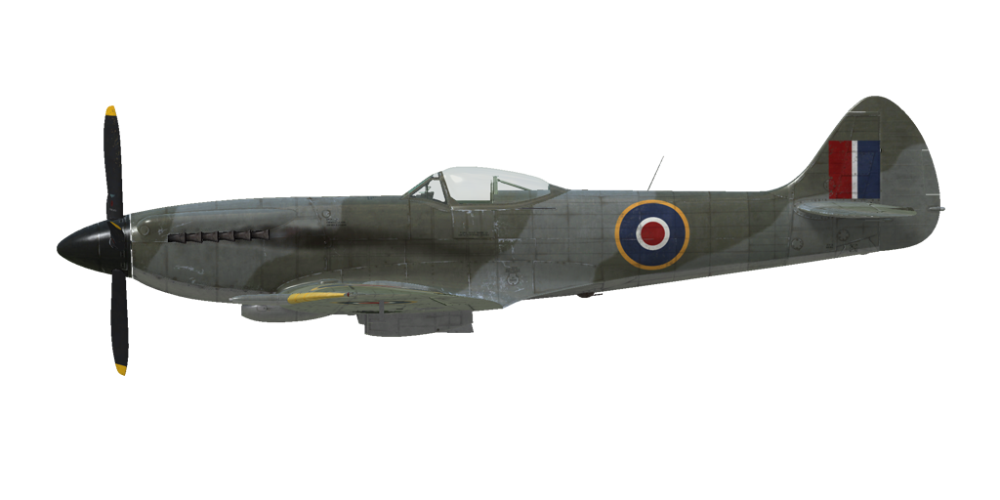

# Spitfire Mk.XIVe  

  

## 描述  

飞行构型的失速指示空速：153~173 km/h  
起降构型的失速指示空速：145~164 km/h  
  
俯冲极速：756 km/h  
最大过载：12.5 G  
飞行构型失速迎角：19.0 °  
着陆构型失速迎角：16.3 °  
  
最大真空速，高度海平面，2750 RPM，增压 +18：566 km/h  
最大真空速，高度4000m，2750 RPM，增压 +18：661 km/h  
最大真空速，高度8100m，2750 RPM，增压 +18：712 km/h  
  
实用升限：13400 m  
海平面爬升率：23.8 m/s  
2650m时爬升率：23.5 m/s  
6750m时爬升率：18.2 m/s  
  
海平面最大性能盘旋时间：18.1 s，指示空速 270 km/h。  
3000m时最大性能盘旋时间：21.0 s，指示空速 260 km/h。  
  
3000m时续航时间：1h 45min，指示空速 350 km/h。  
  
起飞速度：170~195 km/h  
进近速度：180~210 km/h  
着陆速度：140~160 km/h  
着陆迎角：12.5 °  
  
注1：所提供的数据适用于国际标准大气（ISA）。  
注2：飞行性能范围基于可能的飞机质量范围。  
注3：极速、爬升率和盘旋时间基于标准飞机质量。  
注4：此爬升率和转向时间基于发动机2750 RPM和boost +18。  
  
发动机：  
型号：Griffon 65  
起飞模式下的最大功率(2750 RPM，增压 +12，低档位）海平面：1565 HP  
国际动力（最大可持续）模式下的最大功率(2600 RPM，增压 +9，低档位）4270m：1520 HP  
国际动力（最大可持续）模式下的最大功率(2600 RPM，增压 +9，高档位）8070m：1375 HP  
应急最大全出力模式下的最大功率(2750 RPM，增压 +18，低档位）2134m：2063 HP  
应急最大全出力模式下的最大功率(2750 RPM，增压 +18，高档位）6400m：1845 HP  
  
发动机模式：  
最大巡航动力（无时间限制）：2400 RPM，增压 +7  
国际动力（最大可持续）(最多1h)：2600 RPM，增压 +9  
应急最大全出力动力（不超过5min）：2750 RPM，增压 +18  
  
发动机液冷出水口额定水温：105~115 °C  
发动机液冷出水口最高水温：135 °C  
发动机滑油进油口额定油温：90 °C  
发动机滑油进油口最高油温：105 °C  
  
机械增压器换挡高度：自动的，可以手动切换到低级增压  
  
空重：3322 kg  
最小重量（无弹药、10%燃油）：3444.2 kg  
标准重量：3906.9 kg  
燃油载荷：363 kg/504.6 L/111 gal  
最大有效载荷：1052 kg  
  
前射武器：  
2 x 20mm“Hispano Mk.II”机炮，150发，650发/分，机翼安装  
2 x 12.7mm“Browning .50”机枪，250发，850发/分，机翼安装  
  
炸弹：  
2 x 250 lb 通用炸弹"250 lbG.P."  
500 lb 通用炸弹"500 lbG.P."  
  
长度：9.9 m  
翼展：11.21 m  
机翼面积：22.48 m²  
  
首次投入战斗：1945年3月  
  
操作特性：  
—发动机配备有进气压力自动调节器。该调节器在油门设置为1/3或以上行程时运行。  
—发动机具有二级机械增压器（无需手动控制）。可手动将该增压器切换至低挡。  
—发动机装有自动燃油混合比控制装置，其会保持最优混合比。  
—螺旋桨有两档转速设置：当置于后位时自动调整螺旋桨桨距以保持实时发动机节流阀状态的最佳转速，当置于前位时其将转速恒定在可达到的最大转速。  
—水冷和滑油散热器风门是自动控制的，但是有特殊手动模式可以强制散热器风门完全打开。  
—飞机有中立的静平衡。升降舵效高，所以应小心操纵飞机，不要给太大的杆力。  
—飞机在着陆襟翼放下后将变得不稳定。  
—飞机装备有升降舵和方向舵配平。  
—着陆襟翼由压缩空气驱动，所以仅可放下到最大位置。襟翼放下时限速160mph。  
—飞机尾轮自由旋转，没有尾轮锁。由于起落架主轮相对较近，在起飞和着陆时必须自信而准确地操作方向舵脚蹬。  
—飞机有共用一个控制杆的差动气压机轮刹车。这意味着捏住刹车踩舵，反向一侧的机轮刹车会逐渐释放，导致飞机转向踩舵一侧。  
—该型飞机装配有一个警报器，当油门位于低位而起落架却处于收起状态时，该装置会向飞行员发出警报。  
—由于强气流，高速时无法开闭座舱盖。座舱盖配有紧急抛弃系统，用于跳伞。  
—该机型配备底部编队灯。  
—该飞机配备有两个机翼编队灯。  
—陀螺瞄准具在对目标开火时自动计算需要的偏转角。它有4个模式：固定环、固定和陀螺活动环、陀螺活动环、目标距离固定在150码的陀螺活动环（夜间模式）。目标正确设置时才可获得正确的偏转角。要设置距离，首先使用独立的控制器调节目标基线（翼展），然后通过调节测距环的大小和目标大小一样来设定距离。  
—两个射击瞄准具都有滑动式的太阳滤光片。  
  
Basic data and recommended positions of the aircraft controls:  
1. Starting the engine:  
	- recommended position of the mixture control lever: auto mixture control  
	- recommended position of the oil radiator control handle: auto radiators control  
	- recommended position of the prop pitch control handle: forward (auto prop pitch control)  
	- recommended position of the throttle lever: 5%  
  
2. Recommended mixture control lever positions for various flight modes: auto mixture control  
  
3. Recommended positions of the radiators control handle for various flight modes: auto radiators control  
  
4. Approximate fuel consumption at 2000 m altitude:  
	- Cruise engine mode: 7.4 l/min  
	- Combat engine mode: 12.9 l/min  

## 修改  
### 150号汽油  

允许+21 lb增压  
禁用增压器自动换挡。应在11000 feet高度手动换挡。  
预期海平面增速：20 km/h  

### 2 x 250 lb 通用炸弹  

2 x 250 lb 通用炸弹  
增加质量：247 kg  
弹药质量：227 kg  
挂架质量：20 kg  
投弹前预期速度损失：22 km/h  
投弹后预期速度损失：11 km/h  

### 500 lb 通用炸弹  

500 lb 通用炸弹  
增加质量：237 kg  
弹药质量：227 kg  
挂架质量：10 kg  
投弹前预期速度损失：12 km/h  
投弹后预期速度损失：6 km/h  

### Recon camera  

F.24 camera installation behind the cockpit (clipped wing only)  
增加质量：28 kg  
预期速度损失：0 km/h  

### Rounded exhaust pipes  

Rounded exhaust pipes  

### 后视镜  

后视镜  
增加质量：1 kg  
预期速度损失：1 km/h  

### Reflector Gunsight  

Replacement of MkII Gyro Gunsight with MkII* Reflector Gunsight  

### 裁剪翼  

裁剪翼  
减少质量：4 kg  
预期速度损失：0 km/h  
