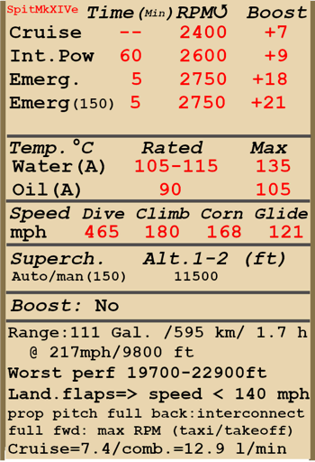

# Spitfire Mk.XIVe  

<table><tbody><tr><td style="text-align: center"></td><td style="text-align: center"></td></tr></tbody></table>  

## Descripción  

Velocidad indicada de pérdida en configuración de vuelo: 153..173 km/h  
Velocidad indicada de pérdida en configuración de despegue/aterrizaje: 145..164 km/h  
  
Velocidad de picado límite: 756 km/h  
Carga de rotura máxima (en fuerzas <i>g</i>): 12,5 <i>g</i>  
Ángulo de ataque crítico en configuración de vuelo: 19,0°  
Ángulo de ataque crítico en configuración de aterrizaje: 16,3°  
  
Velocidad respecto al suelo al nivel del mar, 2750 rpm, impulso +18: 566 km/h  
Velocidad máxima respecto al suelo a 4000 m, 2750 rpm, impulso +18: 661 km/h  
Velocidad máxima respecto al suelo a 8100 m, 2750 rpm, impulso +18: 712 km/h  
  
Techo de servicio: 13400 m  
Tasa de ascenso al nivel del mar: 23,8 m/s  
Tasa de ascenso a 2650 m: 23,5 m/s  
Tasa de ascenso a 6750 m: 18,2 m/s  
  
Viraje de máximo rendimiento al nivel del mar: 18,1 s, a 270 km/h velocidad indicada (IAS).  
Viraje de máximo rendimiento a 3000 m: 21,0 s, a 260 km/h velocidad indicada (IAS).  
  
Autonomía de vuelo a 3000 m: 1 h 45 m, a 350 km/h velocidad indicada (IAS).  
  
Velocidad de despegue: 170..195 km/h  
Velocidad senda de planeo: 180..210 km/h  
Velocidad de aterrizaje: 140..160 km/h  
Ángulo de aterrizaje: 12,5°  
  
Nota 1: los datos están basados en la atmósfera estándar internacional (ISA).  
Nota 2: diferentes rendimientos de vuelo dados para los diferentes pesos posibles del avión.  
Nota 3: velocidades máximas, tasas de ascenso y tiempos de giro dados para el peso estándar del avión.  
Nota 4: tasas de ascenso y tiempos de giro dadas para 2750 rpm y +18 de impulso.  
  
Motor:  
Modelo: Griffon 65  
Potencia máxima en modo Despegue al nivel del mar (2750 rpm, impulso +12): 1565 CV  
Potencia máxima en modo Combate a 4270 m (2600 rpm, impulso +9): 1520 CV  
Potencia máxima en modo Combate a 8070 m (2600 rpm, impulso +9): 1375 CV  
Potencia máxima en modo Impulso a 2134 m (2750 rpm, impulso +18): 2063 CV  
Potencia máxima en modo Impulso a 6400 m (2750 rpm, impulso +18): 1845 CV  
  
Modos de funcionamiento motor:  
Continuo (sin límite de tiempo): 2400 rpm, impulso +7  
Combate (hasta 60 minutos): 2600 rpm, impulso +9  
Impulso (hasta 5 minutos): 2750 rpm, impulso +18  
  
Temperatura nominal del agua en la salida del motor: 105..115 °C  
Temperatura máxima del agua en la salida del motor: 135 °C  
Temperatura nominal del aceite en la admisión del motor: 90 °C  
Temperatura máxima del aceite en la admisión del motor: 105 °C  
  
Altitud de cambio de etapa del compresor: automático con posibilidad de bajar la etapa manualmente  
  
Peso vacío: 3322 kg  
Peso mínimo (sin munición, 10% de combustible): 3444,2 kg  
Peso estándar: 3906,9 kg  
Carga de combustible: 363,3 kg / 504,6 l / 111 Gl  
Carga útil: 1052 kg  
  
Armamento delantero:  
2 cañones de 20 mm «Hispano Mk.II», 150 balas, 650 balas por minuto, montadas en ala  
2 ametralladoras de 12,7 mm «Browning .50», 250 balas, 850 balas por minuto, montadas en ala  
  
Bombas:  
2 bombas de propósito general (G.P., <i>General Purpose</i>) de 250 lb (113 kg)  
1 bomba de propósito general (G.P., <i>General Purpose</i>) de 500 lb (232 kg)  
  
Longitud: 9,9 m  
Envergadura alar: 11,21 m  
Superficie de ala: 22,48 m²  
  
Debut en combate: marzo de 1945  
  
Características operativas:  
- El motor está equipado con un regulador automático de la presión del colector que entra en funcionamiento cuando la potencia se fija a 1/3 o más.  
- El motor tiene un compresor mecánico de una sola etapa, por lo que no necesita control manual, aunque es posible bajar la etapa del compresor manualmente.  
- El motor cuenta con un control automático de la mezcla de combustible que la mantiene en el punto óptimo.  
- El regulador de la hélice tiene dos posiciones: hacia atrás, ajusta el paso de la hélice automáticamente para mantener las rpm al régimen necesario según la posición de la palanca de potencia; hacia adelante, mantiene de forma constante el régimen máximo de rpm de la hélice.  
- Las persianas de los radiadores de agua y aceite se gestionan automáticamente, aunque hay un modo manual especial que fuerza a las persianas de los radiadores a abrirse completamente.  
- El avión tiene una estabilidad estática neutra. La efectividad del timón de profundidad o elevadores es alta, por lo que el avión debe ser manejado con cuidado, sin mover demasiado la palanca de vuelo.  
- El avión se vuelve inestable con los flaps extendidos.  
- El avión cuenta con compensadores para el timón de cola y el timón de profundidad (elevadores).  
- Los flaps tienen un accionador neumático, por lo que solamente pueden extenderse a su posición máxima. La velocidad con los flaps extendidos está limitada a 160 mph.  
- La rueda de cola del avión gira libremente sin posibilidad de bloqueo. Como las ruedas del tren de aterrizaje están bastante cerca entre sí, es necesario manejar los pedales del timón con seguridad y precisión durante el despegue y aterrizaje.  
- El avión posee frenos neumáticos diferenciales en la ruedas compartidos por una palanca de freno. Cuando se tira de la palanca del freno y se pisa un pedal del control del timón el freno opuesto se libera y el avión comienza a girar en un sentido u otro.  
- El avión está equipado con una sirena que avisa al piloto cuando la palanca de potencia está en una posición baja y el tren de aterrizaje está subido.  
- Es imposible abrir o cerrar la cubierta a altas velocidades debido a la intensidad del flujo del aire. La cubierta tiene un sistema de desbloqueo de emergencia para facilitar el salto.  
- El avión está equipado con dos luces de formación subalares.  
- La mira regular es ajustable: tanto la distancia al objetivo como la envergadura del mismo son configurables.  
- La mira giroscópica calcula automáticamente el ángulo de deflexión necesario mientras se dispara al objetivo. Tiene 4 modos: retícula fija, retícula fija y giroscópica, retícula giroscópica y retícula giroscópica con distancia al objetivo fijada en 150 yardas (modo nocturno). El ángulo de deflexión solo se calculará correctamente si la distancia al objetivo está configurada de forma adecuada. Para configurar la distancia, primero es necesario ajustar la base del objetivo usando los controles separados y después establecer la distancia ajustando el tamaño de la retícula de telemetría al mismo tamaño que el del objetivo.  
- Ambas miras tienen filtros solares deslizantes.  
  
Datos básicos y configuraciones recomendadas de los controles del avión:  
1. Arranque del motor:  
	- palanca de control de la mezcla: (control de mezcla automático)  
	- posición de los radiadores de agua y de aceite: (control radiadores automático)  
	- palanca de control rpm de la hélice: hacia atrás (control paso hélice automático))  
	- palanca de potencia: 5%  
  
2. Posición de la palanca de control de mezcla según momento de vuelo: (control de mezcla automático)  
  
3. Posición de las aletas/persianas de radiadores según momento de vuelo: (control radiadores automático)  
  
4. Consumo aproximado de combustible a 2000 m de altitud:  
	- Modo motor - Crucero: 7,4 l/min  
	- Modo motor - Combate: 12,9 l/min  

## Modificaciones  
### Combustible de 150 octanos  

Permite un impulso de +21 lb  
El cambio de etapa automático del compresor se deshabilita. El cambio de etapa debe realizarse de forma manual a 11000 ft de altitud.  
Incremento estimado de velocidad a nivel del mar: 20 km/h  
  
### 2 bombas G.P. de 250 lb  

2 bombas de propósito general (G.P., General Purpose) de 250 lb  
Peso adicional: 247 kg  
Peso de munición: 227 kg  
Peso de los soportes: 20 kg  
Pérdida de velocidad estimada antes de soltar: 22 km/h  
Pérdida de velocidad estimada tras soltar: 11 km/h  
  
### 1 bomba G.P. de 500 lb  

1 bomba de propósito general (G.P., General Purpose) de 500 lb  
Peso adicional: 237 kg  
Peso de munición: 227 kg  
Peso de los soportes: 10 kg  
Pérdida de velocidad estimada antes de soltar: 12 km/h  
Pérdida de velocidad estimada tras soltar: 6 km/h  
  
### Cámara de reconocimento  

Instalación de una cámara F.24 tras la cabina del piloto  
(esta modificación requiere también la de las alas recortadas)  
Peso adicional: 28 kg  
Pérdida de velocidad estimada: 0 km/h  
  
### Tubos de escape redondos  

Instalación de tubos de escape redondos  
  
### Espejo  

Espejo para ver qué sucede detrás del avión  
Peso adicional: 1 kg  
Pérdida de velocidad estimada: 1 km/h  
  
### Mira reflectora  

Reemplaza la mira giroscópica Mk.II por una mira reflectora Mk.II* fija  
  
### Alas recortadas  

Alas recortadas  
Peso retirado: 4 kg  
Pérdida de velocidad estimada: 0 km/h  
