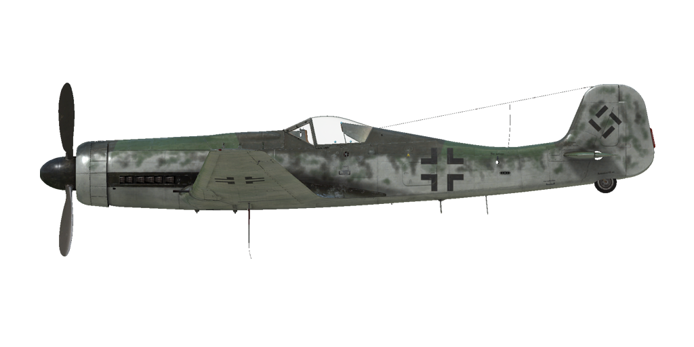
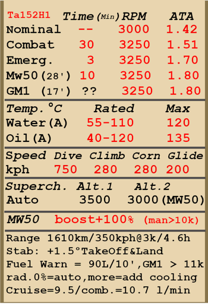

# Ta 152 H-1  

<table><tbody><tr><td style="text-align: center"></td><td style="text-align: center"></tr></td></tr></tbody></table>  

飞行构型的失速指示空速：170~192 km/h  
起降构型的失速指示空速：156~178 km/h  
俯冲极速：750 km/h  
最大过载：8.5 G  
飞行构型失速迎角：19.1°  
着陆构型失速迎角：17.7°  
  
最大真空速，高度海平面，发动机模式——应急：579 km/h  
最大真空速，高度5000m，发动机模式——应急：663 km/h  
最大真空速，高度9500m，发动机模式——应急：740 km/h  
最大真空速，高度12000m，发动机模式——应急：756 km/h  
  
最大真空速，高度海平面，发动机模式——战斗：541 km/h  
最大真空速，高度10700m，发动机模式——战斗：707 km/h  
最大真空速，高度12000m，发动机模式——战斗：678 km/h  
  
实用升限：14000 m  
海平面爬升率：17.5 m/s  
3000m时爬升率：15.8 m/s  
6000m时爬升率：13.4 m/s  
  
海平面最大性能盘旋时间：21.5 s，指示空速 280 km/h。  
3000m时最大性能盘旋时间：26.9 s，指示空速 280 km/h。  
  
3000m（9843 feet）时续航时间：4.6h，指示空速 350 km/h。  
  
起飞速度：175~210 km/h  
进近速度：190~210 km/h  
着陆速度：155~175 km/h  
着陆迎角：12.5°  
  
注1：所提供的数据适用于国际标准大气（ISA）。  
注2：飞行性能范围基于可能的飞机质量范围。  
注3：极速、爬升率和盘旋时间基于标准飞机质量。  
注4：爬升率数据基于发动机在紧急动力下工作并开启MW-50甲醇-水混合加力系统，回转时间基于发动机在战斗动力下工作。  
  
发动机：  
型号：Jumo-213 E1  
海平面应急模式下的最大功率：2050 HP  
应急模式下的最大功率，高度9500m：1450 HP  
战斗模式下的最大功率，高度海平面：1750 HP  
战斗模式下的最大功率，高度9800m：1330 HP  
海平面标称动力模式下的最大功率：1580 HP  
标称模式下的最大功率，高度10700m：1260 HP  
  
发动机模式：  
标称（无时间限制）：3000 RPM，1.42 ATA  
战斗（不超过30min）：3250 RPM，1.51 ATA  
应急动力（不超过3min）：3250 RPM，1.7 ATA  
开启MW-50时的应急动力（不超过10min）：3250 RPM，1.8 ATA  
开启GM-1时的应急动力：3250 RPM  
  
发动机液冷出水口额定水温：55~110 °C  
发动机液冷出水口最高水温：120 °C  
发动机滑油出油口额定油温：40~120 °C  
发动机滑油出油口最高油温：135 °C  
  
机械增压器换挡高度：自动  
  
空重：3877 kg  
最小重量（无弹药、10%燃油）：4184 kg  
标准重量：5217 kg  
最大起飞重量：5230 kg  
燃油载荷：736 kg/995 L  
有效载荷：1353 kg  
  
前射武器：  
2 x 20mm机炮"MG 151/20"，175发，700发/分，翼根挂载  
30mm机炮"MK 108"，90发，650发/分，桨轴安装  
  
长度：10.71 m  
翼展：14.44 m  
机翼面积：23.5 m²  
  
首次投入战斗：1945年3月初  
  
操作特性：  
——飞机的发动机系统自动化程度较高，控制速度只需控制节流阀即可。正常飞行中无需手动调整发动机的转速、混合比以及增压器的档位。发动机增压器有自动开关系统，其工作取决于高度和发动机转速。  
——飞机装有MW-50甲醇-水混合加力系统，防止发动机在应急动力模式时发生喘振。该系统由飞行员在10000米以上时启动，MW-50 甲醇-水混合加力系统可持续运行约28分钟。该机上配备一个指示灯提示飞行员MW-50甲醇-水混合加力系统在非工作状态（发动机转速超过转速计量程）  
—— 该机配备GM-1 一氧化二氮喷射系统，可为发动机提供额外的氧气以提高飞机升限。该系统使飞机可在实用升限以上飞行。该系统由飞行员在11000米以上时开启，并可持续运行约17分钟。一氧化二氮消耗速率：100克/s。  
——散热器龙鳞片为自动控制，以维持所设定的冷却剂温度。温度设定可通过飞行员控制恒温调节器来控制（发动机在所有工作模式下，散热器鱼鳞片开合度为默认0%，当调大后发动机散热效果更好）。  
——当攻角增加到临界水平时，机翼可能突然无预警地失速。为避免这种情况，飞行员在进行极端操纵时必须格外注意。  
——飞机没有配平系统，仅有由地勤人员在飞行前调整的配平片。  
——飞机有手动控制的电动水平安定面。在起飞和着陆前应设置为+1.5°。它也可用于飞行时配平操纵杆。在大角度俯冲时应设定安定面，让飞行员必须向前推杆才能保持俯冲角。  
——着陆襟翼由液压机构控制，可展开至0-73°之间的任意角度。襟翼角度也可以通过驾驶舱外左右机翼上的指示器检查。  
——飞机有尾轮锁系统，向后拉杆时会锁住尾轮。在长距离直线滑行时、起飞前和降落接地后应锁住尾轮。  
——飞机有独立的左右液压机轮刹车。  
—— 该机配备一个油量表，根据开关位置显示相应的油箱中的剩余燃油量。可按下(RShift+I)油量表显示开关来切换到其他油箱。该机机翼油箱未连接到油量表上，机翼油箱中的燃料将在机身油箱中的燃料被消耗后自动补充至机身油箱。该机同时配备有低油量警示灯，当机身后油箱燃料剩余量下降至10升时将闪烁白灯，当机身前油箱燃料剩余量下降至80升时将闪烁红灯。  
—— 该机配备有驾驶舱压力表和驾驶舱增压供氧开关，飞行高度8000米以上时自动开启驾驶舱增压系统，在开启驾驶舱增压供氧系统的情况下驾驶舱可达到高于标准大气压0.1-0.2bar。该机同时配备有驾驶舱减压警告灯（位于仪表盘顶部）。  
——高速时无法开闭座舱盖。座舱盖配有紧急抛离系统，用于飞行员在紧急状态下逃生。  
——射击瞄准具拥有一个滑动式的滤光片。  
  
基本飞行参数和推荐:  
1. 发动机启机:  
	- 推荐油气混合比: 自动混合比控制  
	- 推荐散热器位置: 自动散热器控制  
	- 推荐发动机转速: 自动发动机转速控制  
	- 推荐节流阀位置: 10%  
  
2. 各种工况下的油气混合比推荐位置: 自动混合比控制  
  
3. 各种工况下的散热器出风口龙鳞片推荐位置 (温控器): 0%  
  
4. 海拔2000米飞行时的大致油耗:  
	- 发动机巡航模式: 9.5 升/min  
	- 发动机战斗模式: 10.7 升/min  

## 修改  
### 陀螺仪瞄具  

EZ42 陀螺仪瞄具  
增加质量：13 kg  
预期速度损失：0 km/h  
