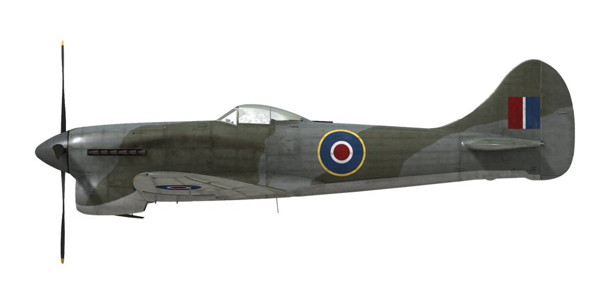

# Tempest Mk.V ser.2

## 描述

飞行构型的失速指示空速：150~174 km/h
起降构型的失速指示空速：128~149 km/h

俯冲极速：870 km/h
最大过载：12.0 G
飞行构型失速迎角：17.5 °
着陆构型失速迎角：13.7 °

最大真空速，高度海平面，3700 RPM，增压 +9：600 km/h
最大真空速，高度1950m，3700 RPM，增压 +9：664 km/h
最大真空速，高度5640m，3700 RPM，增压 +9：703 km/h

实用升限：10800 m
海平面爬升率：21.0 m/s
3000m时爬升率：15.1 m/s
6000m时爬升率：12.1 m/s

海平面最大性能盘旋时间：20.0 s，指示空速 270 km/h。
3000m时最大性能盘旋时间：27.8 s，指示空速 270 km/h。

3000m（9843 feet）时续航时间：3h 18min，指示空速 350 km/h。

起飞速度：150~170 km/h
进近速度：170~200 km/h
着陆速度：150~155 km/h
着陆迎角：11.6 °

注1：所提供的数据适用于国际标准大气（ISA）。
注2：飞行性能范围基于可能的飞机质量范围。
注3：极速、爬升率和盘旋时间基于标准飞机质量。
注4：爬升率和盘旋时间基于3700 RPM和+9增压。

发动机：
型号：Napier Sabre IIA
战斗模式3700 m(3700 RPM，增压 +9，低档位）最大功率：2180 HP
战斗模式3700 m(3700 RPM，增压 +9，高档位）最大功率：1830 HP

发动机模式：
最大巡航动力（无时间限制）：3150 RPM，增压 +4.5
爬升动力（最多1h）：3700 RPM，增压 +7
战斗（不超过5min）：3700 RPM，增压 +9

发动机液冷出水口额定水温：65~125 °C
发动机液冷出水口最高水温：130 °C
发动机滑油进油口额定油温：60~90 °C
发动机滑油进油口最高油温：95 °C

机械增压器换挡高度：9500 feet

空重：4354 kg
最小重量（无弹药、10%25燃油）：4585 kg
标准重量：5221 kg
最大起飞重量：6190 kg
燃油载荷：516 kg/718 L/158 gal
最大有效载荷：1836 kg

前射武器：
4 x 20mm“Hispano Mk.V”机炮，150发，650发/分，机翼安装

炸弹：
2 x 500 lb 通用炸弹"500 lbM.C."
2 x 1000 lb 通用炸弹"1000 lbM.C."

长度：10.26 m
翼展：12.50 m
机翼面积：27.81 m²

首次投入战斗：1944年5月

操作特性：
—该发动机配备有二级机械增压器，应在9500 feet的高度手动切换。
—当混合比杆设置为正常（1/2）位置时，发动机混合比控制是自动的。启动发动机时应设置为启动（向前, throttle lever movement will be limited by 1/10）位置，关闭发动机时应设置到关断位置（向后）。
—该发动机具有自动转速调节器，可以通过控制螺旋桨桨距来维持所需转速。
—水温和油温是由手动调节散热器风口加以控制的。
—该机型有俯仰和偏航配平设置。
—着陆襟翼由液压驱动，可以放下到不超过80°的任意角度。襟翼放下后限速160 mph。
—飞机尾轮自由旋转，没有锁。
—气动刹车是差动的：带刹车踩舵导致对侧的刹车松开。
—当油门设置到低（低于1/3）位置且起落架收起时，起落架指示灯会亮起。
—高速状态下，该机的座舱盖会受高速气流影响无法打开，不过机上装有一个用于跳伞的应急抛盖把手。
—该机型配备底部编队灯。
—瞄准具测距环可以调节给定目标的基线和距离。

## 修改

### 2 x 1000 lb 通用炸弹

2 x 1000 lb 通用炸弹
增加质量：969 kg
弹药质量：949 kg
挂架质量：20 kg
投弹前预期速度损失：57 km/h

### 军刀IIA发动机（+11 lb型）

军刀IIA发动机（+11 lb型）

### 2 x 500 lb 通用炸弹

2 x 500 lb 通用炸弹
增加质量：484 kg
弹药质量：464 kg
挂架质量：20 kg
投弹前预期速度损失：45 km/h
投弹后预期速度损失：12 km/h