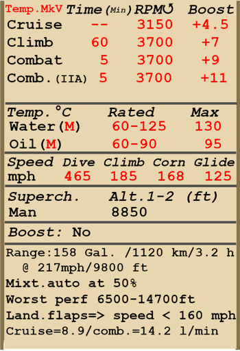

# Tempest Mk.V ser.2  

<table><tbody><tr><td style="text-align: center"></td><td style="text-align: center"></td></tr></td></tr></tbody></table>  

Vitesse de décrochage indiquée en configuration de vol : 150...174 km/h  
Vitesse de décrochage indiquée en configuration de décollage/atterrissage : 128...149 km/h  
  
Vitesse limite de piqué : 870 km/h  
Facteur de charge maximum : 12,0 G  
Angle d\attaque de décrochage en configuration de vol : 17.5 °  
Angle d\attaque de décrochage indiquée en configuration d\atterrissage : 13.7 °  
  
Vitesse sol au niveau de la mer, 3700 RPM, boosté +9 : 600 km/h  
Vitesse sol maximale à 1950 m, 3700 RPM, boosté +9 : 664 km/h  
Vitesse sol maximale à 5640 m, 3700 RPM, boosté +9 : 703 km/h  
  
Plafond opérationnel : 10800 m  
Taux de montée au niveau de la mer : 21,0 m/s  
Taux de montée à 3000 m : 15,1 m/s  
Taux de montée à 6000 m : 12,1 m/s  
  
Virage à 360° au niveau de la mer en : 20,0 s, à 270 km/h vitesse indiquée (IAS).  
Virage à 360° à 3000 m : 27,8 s, à 270 km/h vitesse indiquée (IAS).  
  
Endurance à 3000 m : 3 h 18 m, à 350 km/h vitesse indiquée (IAS).  
  
Vitesse de décollage : 150...170 km/h  
Vitesse d\approche : 170...200 km/h  
Vitesse d\atterrissage : 150...155 km/h  
Angle d\atterrissage : 11,6 °  
  
Note 1 : les données sont indiquées à l\atmosphère standard international (ISA).  
Note 2 : les performances d\endurance sont données pour plusieurs masses possibles.  
Note 3 : la vitesse maximale, le taux de montée et le temps de virage sont donnés pour une masse standard.  
Note 4: climb rates and turn times are given for 3700 RPM and boost +9.  
  
Moteur :  
Modèle : Napier Sabre IIA  
Puissance maximale au régime combat au niveau de la mer (3700 RPM, boosté +9) : 2180 cv  
Puissance maximale au régime combat à 11500 feet (3700 RPM, boosté +9) : 1830 cv  
  
Performance du moteur :  
Continu (durée illimitée) : 3150 tr/min, boosté +4,5  
Montée (jusqu\à 60 minutes) : 3700 tr/min, boosté +7  
Combat (jusqu\à 5 minutes) : 3700 tr/min, boosté +9  
  
Température de fonctionnement d\eau en sortie du moteur : 65..125 °C  
Température maximale d\eau en sortie du moteur : 130 °C  
Température de fonctionnement d\huile à l\admission du moteur : 60..90 °C  
Température maximale d\huile à l\admission du moteur : 95 °C  
  
Altitude de changement d\étage du compresseur : 2900 m  
  
Masse à vide : 4364 kg  
Masse minimale (sans munitions, 10% de carburant) : 4585 kg  
Masse standard : 5221 kg  
Masse maximale au décollage : 6190 kg  
Masse de carburant : 516 kg / 718 l  
Charge utile : 1836 kg  
  
Armement offensif :  
4 mitrailleuse Hispano Mk.V de 20 mm, 150 coups, 650 coups par minute, dans l\aile  
  
Bombs :  
2 bombes d\emploi général 500 lb. M.C. de 232 kg  
2 bombes d\emploi général 1000 lb. M.C. de 474,5 kg  
  
Longueur : 10,26 m  
Envergure : 12,50 m  
Surface alaire : 27,81 m²  
  
Premier engagement : mai 1944  
  
Operation features:  
- The engine is equipped with the two-stage mechanical supercharger which should be manually switched at 2700m altitude.  
- The engine mixture control is automatic when the mixture lever is set to NORMAL (1/2) position. It should be set to START (forward, throttle lever movement will be limited by 1/10) position when starting the engine and to CUT-OUT position (back) to stop it.  
- The engine has an automatic RPM governor that controls the propeller pitch to maintain the required RPM.   
- Water and oil temperatures are controlled manually by adjusting the radiator shutters.  
- The aircraft has pitch and yaw flight-control trimmers.  
- Landing flaps have hydraulic actuators and can be extended to any angle up to 80°. The speed with the extended flaps is limited to 160 mph.  
- The airplane tailwheel rotates freely and does not have a lock.  
- The pneumatic brakes are differential: moving the pedals with brakes pressed results in releasing the brake opposite to the pressed pedal.  
- The landing gear indicator lamp lights up if the throttle is set to low (less than 1/3) position with the landing gear retracted.  
- It is impossible to open the canopy at high speeds because of the ram air, but there is an emergency jettison handle for bailing out.  
- The aircraft is equipped with bottom formation lights.  
- The range-finding gunsight reticle can be adjusted for a given target base and range.  
  
Basic data and recommended positions of the aircraft controls:  
1. Starting the engine:  
	- recommended position of the mixture control lever: Start  
	- recommended position of the radiator control handle: close  
	- recommended position of the prop pitch control handle: 100%  
	- recommended position of the throttle lever: 10%  
  
2. Recommended mixture control lever positions for various flight modes: Normal (auto mixture control)  
  
3. Recommended positions of the radiator control handle for various flight modes:  
	- takeoff: open  
	- climb: open  
	- cruise flight: close  
	- combat: open  
  
4. Approximate fuel consumption at 2000 m altitude:  
	- Cruise engine mode: 8.9 l/min  
	- Combat engine mode: 14.2 l/min  

## Modifications  
### 2 bombes 1000 lb M.C.  

2 bombes d’emploi général 1000 lb M.C.  
Masse supplémentaire : 969 kg  
Masse des munitions : 949 kg  
Masse des pylones : 20 kg  
Perte estimée de vitesse avant le largage : 57 km/h  
Perte estimée de vitesse après le largage : 12 km/h  
  
### Sabre IIA engine with +11 lb boost  

Sabre IIA engine with +11 lb boost  
Estimated speed increase at sea level: 23 km/h  
  
### 2 bombes 500 lb M.C.  

2 bombes d’emploi général 500 lb M.C.  
Masse supplémentaire : 484 kg  
Masse des munitions : 464 kg  
Masse des pylones : 20 kg  
Perte estimée de vitesse avant le largage : 45 km/h  
Perte estimée de vitesse après le largage : 12 km/h  
