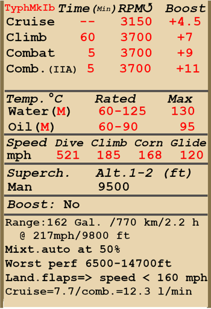

# Typhoon Mk.Ib  

<table><tbody><tr><td style="text-align: center"></td><td style="text-align: center"></td></tr></tbody></table>  

## Beschreibung  

Überziehgeschwindigkeit in Flugkonfiguration: 152...182 km/h  
Überziehgeschwindigkeit in Landekonfiguration: 126...151 km/h  
  
Höchstzulässige Geschwindigkeit im Sturzflug: 840 km/h  
Bruchlastvielfache: 12,0 G  
Kritischer Anstellwinkel in Flugkonfiguration: 20,0 °  
Kritischer Anstellwinkel in Landekonfiguration: 15,1 °  
  
Höchstgeschwindigkeit in Bodennähe, 3700 U/min, Ladedruck +9: 581 km/h  
Höchstgeschwindigkeit in 2000 m Höhe, 3700 U/min, Ladedruck +9: 634 km/h  
Höchstgeschwindigkeit in 5500 m Höhe, 3700 U/min, Ladedruck +9: 670 km/h  
  
Dienstgipfelhöhe: 10300 m  
Steigleistung in Bodennähe: 19,3 m/s  
Steigleistung in 3000 m Höhe: 14,4 m/s  
Steigleistung in 6000 m Höhe: 11,2 m/s  
  
Maximale Wendegeschwindigkeit in Bodennähe: 21,2 s (270 km/h IAS).  
Maximale Wendegeschwindigkeit in 3000 m Höhe: 28,4 s (270 km/h IAS).  
  
Reichweite in 3000 m: 2 h 15 m, bei 350 km/h IAS.  
  
Startgeschwindigkeit: 162...197 km/h  
Anfluggeschwindigkeit: 170...210 km/h  
Landegeschwindigkeit: 128..153 km/h  
Sinkflugpfad: 11,5 °  
  
Anmerkung 1: Die Werte gelten für Normatmosphäre (ISA).  
Anmerkung 2: Flugleistungen varrieren je nach Abfluggewicht.  
Anmerkung 3: Höchstgeschwindigkeiten, Steigleistungen und Wendegeschwindigkeiten gelten für Standard-Fluggewicht.  
Anmerkung 4: Steigraten sind und Kurvenzeiten für 3700 U/min und Ladedruck +9.  
  
Triebwerk:  
Baumuster: Napier Sabre IIA  
Kampfleistung in Bodennähe (3700 U/min, Ladedruck +9): 2180 PS  
Kampfleistung in 11510 ft Höhe (3700 U/min, Ladedruck +9): 1830 PS  
  
Leistungsstufen:  
Nennleistung (unbegrenzt): 3151 U/min, Ladedruck +4.5  
Steigleistung (bis zu 60 Minuten): 3700 U/min, Ladedruck +7  
Kampfleistung (bis zu 5 Minuten): 3700 U/min, Ladedruck +9  
  
Kühlstoffaustrittstemperatur (normal): 65..125 °C  
Kühlstoffaustrittstemperatur (höchstens): 130 °C  
Schmierstoffeintrittstemperatur (normal): 60..90 °C  
Schmierstoffeintrittstemperatur (höchstens): 95 °C  
  
Laderumschalthöhe: 2900 m  
  
Leergewicht: 4256 kg  
Minimalgewicht (keine Munition, 10% Treibstoff): 4304 kg  
Normalgewicht: 4915 kg  
Höchstabfluggewicht: 6094 kg  
Kraftstoffmenge: 496 kg / 691 l / 162 gal  
Nutzlast: 1838 kg  
  
Starre Schusswaffenanlage:  
4 x 20 mm Hispano Mk.II, 143/145 Schuss, 650 Schuss pro Minute, flügelmontiert  
  
Abwurfwaffen:  
2 x 232 kg Mehrzweck-Sprengbomben 500 lb. M.C.  
2 x 474,5 kg Mehrzweck-Sprengbomben 1000 lb. M.C.  
  
Raketen:  
8 x 11 kg Raketen RP-3 A.P. 25 lb. mk.II, Panzerbrechend  
12 x 27 kg Raketen RP-3 S.A.P. 60 lb. mk.II, Halb-panzerbrechend  
  
Länge: 9,77 m  
Spannweite: 12,66 m  
Flügelfläche: 25,92 m²  
  
Erster Fronteinsatz: Mai 1942  
  
Operation features:  
- Der Motor ist mit einem zweistufigen mechanischen Lader ausgestattet, der in 2900 m Höhe manuell geschaltet werden sollte.  
- Die Steuerung des Motorgemischs erfolgt automatisch, wenn sich der Gemischhebel in der Position NORMAL (1/2) befindet. Er sollte beim Starten des Motors auf die Position START (vorwärts, die Bewegung des Triebwerksteuerung wird um 1/10 begrenzt) und beim Stoppen auf die Position CUT-OUT (rückwärts) eingestellt werden.  
- Der Motor verfügt über einen automatischen Drehzahlregler, der die Propellereinstellung steuert, um die erforderliche Drehzahl einzuhalten.  
- Die Wasser- und Öltemperaturen werden manuell durch Verstellen der Kühlerverschlüsse gesteuert.  
- Das Flugzeug hat eine Anzeige, welche den Treibstoffstand des Tanks je nach Position des Treibstoffstandschalters anzeigt. In der Simulation wechselt der Schalter selbständig alle 10 Sekunden. Im Simulator ändert sich der Schalter durch Drücken von (Shift+I).  
- Das Flugzeug verfügt nur über eine Höhenund Seitenrudertrimmung.  
- Die Landeklappen verfügen über hydraulische Regler und können in jedem Winkel bis zu 80° ausgefahren werden. Die Geschwindigkeit mit ausgefahrenen Klappen ist auf 160 mph begrenzt.  
- Das Flugzeug hat ein frei bewegliches und nicht verriegelbares Spornrad.  
- Die pneumatischen Bremsen sind differential: Das Bewegen der Pedale bei gedrückten Bremsen führt dazu, dass die Bremse auf der anderen Seite des gedrückten Pedals gelöst wird.  
- Die Fahrwerksanzeigeleuchte leuchtet auf, wenn der Gashebel bei eingefahrenem Fahrwerk in die untere (weniger als 1/3) Position gebracht wird.  
- Aufgrund der Stauluft ist es unmöglich, die Haube bei hohen Geschwindigkeiten zu öffnen, aber es gibt einen Griff zum Notabwurf, um abspringen zu können.  
- Das Flugzeug ist mit unten angebrachten Formationslichtern ausgestattet.  
- Das Reflexvisier kann auf eine bestimmte Zielgröße und Entfernung eingestellt werden. Um das Zielen von Raketen zu erleichtern, kann die Ziellinie um bis zu 5 Grad nach unten verschoben werden (Tastenkombinationen Rechtsverschiebung + Semikolon / Rechtsverschiebung + Periode standardmäßig).  
  
Basic data and recommended positions of the aircraft controls:  
1. Starting the engine:  
	- recommended position of the mixture control lever: Start  
	- recommended position of the radiator control handle: close  
	- recommended position of the prop pitch control handle: 100%  
	- recommended position of the throttle lever: 10%  
  
2. Recommended mixture control lever positions for various flight modes: Normal (auto mixture control)  
  
3. Recommended positions of the radiator control handle for various flight modes:  
	- takeoff: open  
	- climb: open  
	- cruise flight: close  
	- combat: open  
  
4. Approximate fuel consumption at 2000 m altitude:  
	- Cruise engine mode: 7.7 l/min  
	- Combat engine mode: 12.3 l/min  

## Änderungen  
### Sabre IIA Motor mit +11 lb Ladedruck  

Sabre IIA Motor mit +11 lb Ladedruck  
Geschwindigkeitsgewinn in Bodennähe: 23 km/h  
  
### 4-Blatt-Luftschraube  

Einbau einer 4-Blatt-Luftschraube  
Geschätzter maximale Drehzahlerhoehung: 12 km/h  
Geschätzter maximale Erhöhung der Steigleistung: 12,3 m/s  
  
### Zusätzliche Rüstung  

Einbau zusätzlicher Motor und Cockpitpanzerung  
Zusätzliches Gewicht: 157 kg  
Geschwindigkeitsverlust: 2 km/h  
  
### Bomben, Typ M.C.  

2 x Splitterbomben M.C.  
  
2 Splitterbomben 500 lb M.C.  
Zusätzliches Gewicht: 484 kg  
Gewicht der Munition: 464 kg  
Gewicht der Abwurfwaffenroste: 20 kg  
Geschwindigkeitsverlust vor Abwurf: 33 km/h  
Geschwindigkeitsverlust nach Abwurf: 9 km/h  
  
2 Splitterbomben 1000 lb M.C.  
Zusätzliches Gewicht: 969 kg  
Gewicht der Munition: 949 kg  
Gewicht der Abwurfwaffenroste: 20 kg  
Geschwindigkeitsverlust vor Abwurf: 42 km/h  
Geschwindigkeitsverlust nach Abwurf: 9 km/h  
  
### Kuppelstaubabweiser  

Einbau eines Kuppelstaubabweiser am Motor Lufteinlass  
Zusätzliches Gewicht: 1 kg  
Geschätzter maximaler Geschwindigkeitsverlust: 8 km/h  
  
### Zwillingsrakete, Typ RP-3 auf Startschiene Mk.I  

Ungelenkte Raketen RP-3 auf Startschiene Mk.I  
  
4 x Zwillinge RP-3 (Halb-panzerbrechend) und 4 x RP-3 (Halb-panzerbrechend):  
Zusätzliches Gewicht: 544 kg  
Gewicht der Munition: 460 kg  
Gewicht der Abwurfwaffenroste: 84 kg  
Geschwindigkeitsverlust vor dem Abfeuern: 66 km/h  
Geschwindigkeitsverlust nach dem Abfeuern: 30 km/h  
  
### Visier ohne Reflektor  

Einbau von Typ I Mk.III visier  
Zusätzliches Gewicht: 0 kg  
Geschwindigkeitsverlust: 0 km/h  
  
### Raketen, Typ RP-3 auf Startschiene Mk.I  

Ungelenkte Raketen RP-3 auf Startschiene Mk.I  
  
8 x RP-3 (Halb-panzerbrechend):  
Zusätzliches Gewicht: 388 kg  
Gewicht der Munition: 304 kg  
Gewicht der Abwurfwaffenroste: 84 kg  
Geschwindigkeitsverlust vor dem Abfeuern: 55 km/h  
Geschwindigkeitsverlust nach dem Abfeuern: 30 km/h  
  
8 x RP-3 (Panzerbrechend):  
Zusätzliches Gewicht: 254 kg  
Gewicht der Munition: 170 kg  
Gewicht der Abwurfwaffenroste: 84 kg  
Geschwindigkeitsverlust vor dem Abfeuern: 50 km/h  
Geschwindigkeitsverlust nach dem Abfeuern: 30 km/h  
  
### Raketen, Typ RP-3 auf Startschiene Mk.III  

Ungelenkte Raketen RP-3 auf Startschiene Mk.III  
  
8 x RP-3 (Halb-panzerbrechend):  
Zusätzliches Gewicht: 360 kg  
Gewicht der Munition: 304 kg  
Gewicht der Abwurfwaffenroste: 56 kg  
Geschwindigkeitsverlust vor dem Abfeuern: 48 km/h  
Geschwindigkeitsverlust nach dem Abfeuern: 21 km/h  
  
8 x RP-3 (Panzerbrechend):  
Zusätzliches Gewicht: 226 kg  
Gewicht der Munition: 170 kg  
Gewicht der Abwurfwaffenroste: 56 kg  
Geschwindigkeitsverlust vor dem Abfeuern: 42 km/h  
Geschwindigkeitsverlust nach dem Abfeuern: 21 km/h  
