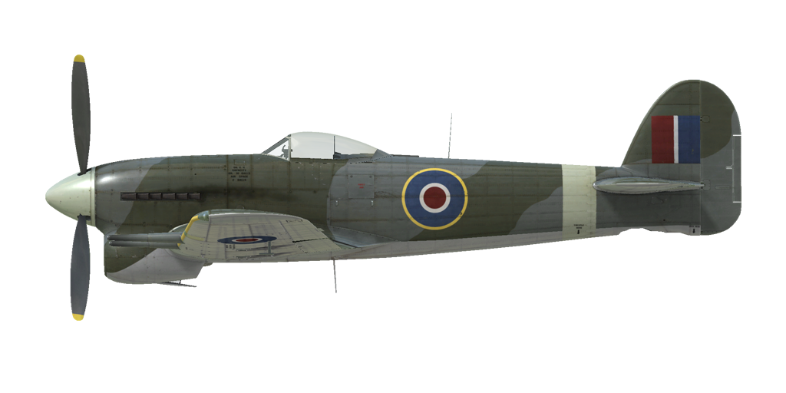

# Typhoon Mk.Ib

## Descripción

Velocidad indicada de pérdida en configuración de vuelo: 152...182 km/h
Velocidad indicada de pérdida en configuración de despegue/aterrizaje: 126...151 km/h

Velocidad de picado límite: 840 km/h
Carga de rotura máxima (en fuerzas <i>g</i>): 12 <i>g</i>
Ángulo de ataque crítico en configuración de vuelo: 20,0°
Ángulo de ataque crítico en configuración de aterrizaje: 15,1°

Velocidad respecto al suelo al nivel del mar, 3700 rpm, impulso +9: 581 km/h
Velocidad máxima respecto al suelo a 2000 m, 3700 rpm, impulso +9: 634 km/h
Velocidad máxima respecto al suelo a 5500 m, 3700 rpm, impulso +9: 670 km/h

Techo de servicio: 10300 m
Tasa de ascenso al nivel del mar: 19,3 m/s
Tasa de ascenso a 3000 m: 14,4 m/s
Tasa de ascenso a 6000 m: 11,2 m/s

Viraje de máximo rendimiento al nivel del mar: 21,2 s, a 270 km/h velocidad indicada (IAS).
Viraje de máximo rendimiento a 3000 m: 28,4 s, a 270 km/h velocidad indicada (IAS).

Autonomía de vuelo a 3000 m: 2 h 15 m, a 350 km/h velocidad indicada (IAS).

Velocidad de despegue: 162..197 km/h
Velocidad senda de planeo: 170...210 km/h
Velocidad de aterrizaje: 128..153 km/h
Ángulo de aterrizaje: 11,5°

Nota 1: los datos están basados en la atmósfera estándar internacional (ISA).
Nota 2: diferentes rendimientos de vuelo dados para los diferentes pesos posibles del avión.
Nota 3: velocidades máximas, tasas de ascenso y tiempos de giro dados para el peso estándar del avión.
Nota 4: tasas de ascenso y tiempos de giro dados para 3700 rpm e impulso +9.

Motor:
Modelo: Napier Sabre IIA
Potencia máxima en modo Combate (3700 rpm, impulso +9, etapa baja) al nivel del mar: 2180 HP
Potencia máxima en modo Combate (3700 rpm, impulso +9, etapa alta) a 11510 ft: 1830 HP

Modos de funcionamiento motor:
Continuo (sin límite de tiempo): 3151 rpm, impulso +4,5
Ascenso (hasta 1 hora): 3700 rpm, impulso +7
Combate (hasta 5 minutos): 3700 rpm, impulso +9

Temperatura nominal del agua en la salida del motor: 65..125 °C
Temperatura máxima del agua en la salida del motor: 130 °C
Temperatura nominal del aceite en la admisión del motor: 60..90 °C
Temperatura máxima del aceite en la admisión del motor: 95 °C

Altitud de cambio de etapa del compresor: 2900 m (9500 ft)

Peso vacío: 4256 kg
Peso mínimo (sin munición, 10% de combustible): 4304 kg
Peso estándar: 4915 kg
Peso máximo al despegue: 6094 kg
Carga de combustible: 496 kg / 691 l / 162 galones
Carga útil: 1838 kg

Armamento delantero:
4 cañones de 20 mm «Hispano Mk.II», 143/145 balas por cañón, 650 balas por minuto, montados en ala

Bombas:
2 bombas de capacidad media (M.C., <i>Medium Capacity</i>) de 500 lb (232 kg)
2 bombas de capacidad media (M.C., <i>Medium Capacity</i>) de 1000 lb (475 kg)

Cohetes:
8 cohetes perforantes de 25 lb (11 kg) «RP-3 AP» (modificación)
8 cohetes semiperforantes con carga explosiva de 60 lb (27 kg) «RP-3 SAP/HE» (modificación)
12 cohetes semiperforantes con carga explosiva de 60 lb (27 kg) «RP-3 SAP/HE» (modificación)

Longitud: 9,77 m
Envergadura alar: 12,66 m
Superficie de ala: 25,92 m²

Debut en combate: Mayo de 1942

Características operativas:
- El motor tiene un compresor mecánico de dos etapas que debe conmutarse a 2900 m (9500 ft) de altitud.
- El motor está equipado con un sistema de control automático de la mezcla que la mantiene en su grado óptimo cuando la palanca de control de la mezcla está en la posición «NORMAL» (posición central). Para arrancar el motor debe ponerse en la posición «START» (palanca completamente hacia delante, el movimiento de la palanca de potencia estará limitado a 1/10) y en la posición «CUT-OUT» (palanca completamente hacia atrás), para apagarlo.
- El motor tiene un regulador automático de las rpm que controla el paso de la hélice para mantener las rpm requeridas.
- Las temperaturas del agua y aceite se controlan manualmente ajustando las persianas del radiador.
- El avión cuenta con un indicador de combustible que muestra la cantidad de combustible remanente en los depósitos dependiendo de la posición del selector. En la simulación el selector conmuta de posición entre depósitos presionando «Mayús_Dcha + I».
- El avión cuenta con compensadores para los controles de vuelo de cabeceo y guiñada.
- Los flaps tienen un accionador hidraúlico y pueden bajarse gradualmente hasta formar un ángulo de 80°. La velocidad con los flaps bajados está limitada a 160 mph.
- La rueda de cola del avión girar libremente y no se puede bloquear.
- Los frenos neumáticos son diferenciales: cuando se mueven los pedales con la palanca de los frenos presionada se va soltando el freno de la rueda opuesta al pedal movido.
- La luz del indicador del tren de aterrizaje se enciende si la palanca de potencia está en una posición baja (menos de 1/3) y el tren está recogido.
- No es posible abrir la cubierta a altas velocidades debido a la presión del flujo de aire, pero cuenta con una palanca de ejección de emergencia para poder saltar.
- El avión está equipado con luces de formación inferiores.
- Se puede ajustar la retícula de la mira para un objetivo y rango determinados. Para facilitar la puntería de los cohetes, es posible desplazar la mira hasta 5 grados hacia abajo (por defecto, «Mayús_Dcha + Ñ» / «Mayús_Dcha + Punto»).

Datos básicos y configuraciones recomendadas de los controles del avión:
1. Arranque del motor:
	- palanca de control de la mezcla: «START»
	- radiador de agua y aceite: cerrado
	- palanca de control rpm de la hélice: 100%
	- palanca de potencia: 10%

2. Posición de la palanca de control de mezcla según momento de vuelo: «NORMAL» (control de mezcla automático)

3. Posición de aleta/persiana radiador según momento de vuelo:
	- despegue: abierta
	- ascenso: abierta
	- crucero: cerrada
	- combate: abierta

4. Consumo aproximado de combustible a 2000 m de altitud:
	- Modo motor - Crucero: 7,7 l/min
	- Modo motor - Combate: 12,3 l/min

## Modificaciones

### Motor Sabre IIA con impulso +11 lb

Motor Sabre IIA con impulso +11 lb
Incremento estimado de velocidad a nivel del mar: 23 km/h

### Hélice de 4 palas

Instalación de una hélice de 4 palas
Aumento estimado de la velocidad máxima: 12 km/h
Aumento estimado de la tasa de ascenso máxima: 2,3 m/s

### Blindaje adicional

Instalación de blindaje adicional para el motor y la cabina
Peso adicional: 157 kg
Pérdida de velocidad estimada: 2 km/h

### Bombas M.C.

2 bombas de capacidad media (M.C., Medium Capacity)

2 bombas M.C. de 500 lb
Peso adicional: 484 kg
Peso de munición: 464 kg
Peso de los soportes: 20 kg
Pérdida de velocidad estimada antes de soltar: 33 km/h
Pérdida de velocidad estimada tras soltar: 9 km/h

2 bombas M.C. de 1000 lb
Peso adicional: 969 kg
Peso de munición: 949 kg
Peso de los soportes: 20 kg
Pérdida de velocidad estimada antes de soltar: 42 km/h
Pérdida de velocidad estimada tras soltar: 9 km/h

### Deflector de polvo de cúpula

Instalación de un deflector de polvo en la entrada de aire del motor.
Peso adicional: 1 kg
Pérdida de velocidad máxima estimada: 8 km/h

### Сohetes dobles RP-3 en lanzadores Mk.I

12 Сohetes no guiados de 3 pulgadas (76 mm) RP-3 semiperforante con carga explosiva (SAP/HE) en carriles de lanzamiento Mk.I

4 cohetes dobles RP-3 SAP/HE y 4 cohetes RP-3 SAP/HE:
Peso adicional: 544 kg (1199 lb)
Peso de munición: 460 kg (1014 lb)
Peso de los soportes: 84 kg (185 lb)
Pérdida de velocidad estimada antes de lanzarlos: 66 km/h (41 mph)
Pérdida de velocidad estimada tras lanzarlos: 30 km/h (19 mph)

### Mira sin reflector

Instalación de mira Mk.III tipo I
Peso adicional: 0 kg
Pérdida de velocidad estimada: 0 km/h

### 8 cohetes RP-3 en lanzadores Mk.I

8 cohetes no guiados de 3 pulgadas (76 mm) RP-3 semiperforante con carga explosiva (SAP/HE) o perforante (AP) en carriles de lanzamiento Mk.I

8 cohetes RP-3 SAP/HE:
Peso adicional: 388 kg (855 lb)
Peso de munición: 304 kg (670 lb)
Peso de los soportes: 84 kg (185 lb)
Pérdida de velocidad estimada antes de lanzarlos: 55 km/h (34 mph)
Pérdida de velocidad estimada tras lanzarlos: 30 km/h (19 mph)

8 cohetes RP-3 AP:
Peso adicional: 254 kg (560 lb)
Peso de munición: 170 kg (375 lb)
Peso de los soportes: 84 kg (185 lb)
Pérdida de velocidad estimada antes de lanzarlos: 50 km/h (34 mph)
Pérdida de velocidad estimada tras lanzarlos: 30 km/h (19 mph)

### 8 cohetes RP-3 en lanzadores Mk.III

8 cohetes no guiados de 3 pulgadas (76 mm) RP-3 semiperforante con carga explosiva (SAP/HE) o perforante (AP) en carriles de lanzamiento Mk.III

8 сohetes RP-3 SAP/HE:
Peso adicional: 360 kg (794 lb)
Peso de munición: 304 kg (670 lb)
Peso de los soportes: 56 kg (123 lb)
Pérdida de velocidad estimada antes de lanzarlos: 48 km/h (30 mph)
Pérdida de velocidad estimada tras lanzarlos: 21 km/h (13 mph)

8 cohetes RP-3 AP:
Peso adicional: 226 kg (498 lb)
Peso de munición: 170 kg (375 lb)
Peso de los soportes: 56 kg (123 lb)
Pérdida de velocidad estimada antes de lanzarlos: 42 km/h (26  mph)
Pérdida de velocidad estimada tras lanzarlos: 21 km/h (13 mph)
