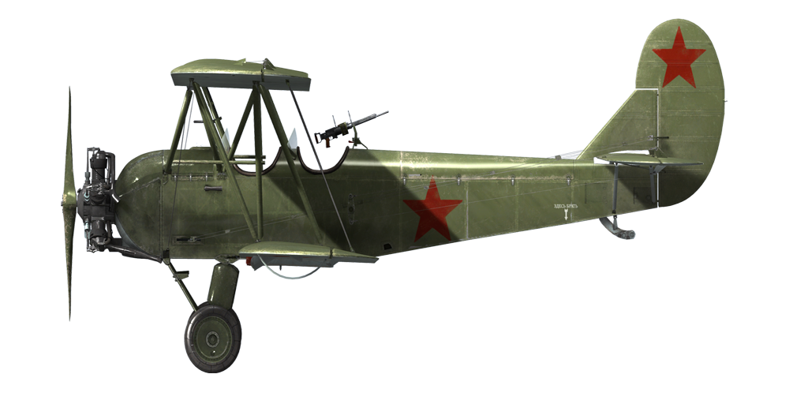

# U-2VS

## Beschreibung

Überziehgeschwindigkeit in Flugkonfiguration: 63..70 km/h
Höchstzulässige Geschwindigkeit im Sturzflug: 240 km/h
Bruchlastvielfache: 6.5 G
Kritischer Anstellwinkel in Flugkonfiguration: 19°

Höchstgeschwindigkeit in Bodennähe, Startleistung, 1750 U/min: 151.7 km/h
Höchstgeschwindigkeit in 500 m Höhe, Startleistung, 1740 U/min: 150.3 km/h
Höchstgeschwindigkeit in 1000 m Höhe, Startleistung, 1730 U/min: 148.9 km/h

Dienstgipfelhöhe: 3700 m
Steigrate:
500 m — 3 min 5 s
1000 m — 6 min 35 s
1500 m — 10 min 40 s
2000 m — 15 min 24 s
2500 m — 21 min 15 s
3000 m — 28 min 35 s
3500 m — 38 min 20 s

Maximale Wendegeschwindigkeit: 22..23 s (105..115 km/h IAS).

Reichweite in 500 m: 5 h, bei 90 km/h IAS, 1300 U/min.

Startgeschwindigkeit: 75..85 km/h
Anfluggeschwindigkeit: 100 km/h
Landegeschwindigkeit: 60..70 km/h
Sinkflugpfad: 12°

Anmerkung 1: Die Werte gelten für Normatmosphäre (ISA).
Anmerkung 2: Flugleistungen varrieren je nach Abfluggewicht.
Anmerkung 3: Höchstgeschwindigkeiten, Steigleistungen und Wendegeschwindigkeiten gelten für Standard-Fluggewicht.
Anmerkung 4: Steigraten werden für den Vollgasmodus angegeben und 95 km/h IAS.
Anmerkung 5: Wendegeschwindigkeit ist für 1400..1500 U / min mit einer Rolle von 43 bis 45 angegeben.

Triebwerk:
Baumuster: M-11D

Startleistung (1750 U/min) in Bodennähe: dass weniger als 125 PS

Nennleistung (1700 U/min) in Bodennähe: 118 PS
Nennleistung (1700 U/min) in 500 m Höhe: 110 PS
Nennleistung (1700 U/min) in 1000 m Höhe: 105 PS

Dauerbelastung (1640 U/min) in Bodennähe: 107 PS
Dauerbelastung (1640 U/min) in 500 m Höhe: 100 PS
Dauerbelastung (1640 U/min) in 1000 m Höhe: 95 PS

Leistungsstufen:
Startleistung/Notbetriebszustand (5 min): 1750/1840 U/min
Nennleistung/Dauerbelastung (unbegrenzt): 1640/1700 U/min

Schmierstoffaustrittstemperatur (normal): 70..80 °C
Schmierstoffaustrittstemperatur (höchstens): 115 °C

Schraubenpropeller:
Typ 257, D 2.4 m, ganghöhe 1.524 m

Leergewicht: 748 kg
Minimalgewicht (keine Munition, 10% Treibstoff): 927 kg
Normalgewicht: 1007 kg
Höchstabfluggewicht: 1350 kg
Kraftstoffmenge: 90 kg / 126 l
Nutzlast: 350 kg

Starre Schusswaffenanlage:
1 x 7.62 mm ShKAS, 500 Schuss, 1800 Schuss pro Minute, flügelmontiert (Rüstsatz)

Abwehrbewaffnung:
Rückwärts: 7.62 mm ShKAS, 400 Schuss, 1800 Schuss pro Minute (Rüstsatz)

Abwurfwaffe:
2 x 50 kg Mehrzweck-Sprengbomben FAB-50sv
4 x 50 kg Mehrzweck-Sprengbomben FAB-50sv
6 x 50 kg Mehrzweck-Sprengbomben FAB-50sv
2 x 104 kg Mehrzweck-Sprengbomben FAB-100M
2 x 50 kg Mehrzweck-Sprengbomben FAB-50sv und 2 x 104 kg Mehrzweck-Sprengbomben FAB-100M

Höhe: 2.9 m
Länge: 8.17 m
Obere spannweite: 11.4 m
Unteren Spannweite: 10.65 m
Flügelfläche: 33.15 m²

Die U-2 wurde unter der Aufsicht von N.N. Polikarpov in den Jahren 1923-1928 entwickelt. Sie wurde als einfach gehaltenes, robustestes und einfach zu bedienendes zweisitziges Flugzeug für Flugschulen konzipiert. Am 24. Juni 1927 ging sie zum ersten Mal in die Luft, aber danach wurden viele Verbesserungen an ihrem Design vorgenommen, um ihre Steigrate zu verbessern. Das modernisierte Flugzeug ging 1929 nach dem Erstflug am 7. Januar 1928 in Produktion.

Fluglehrer und Pilotenanwärter mochten das Flugzeug - es verzieh die typischen Fehler der Flugschüler, war schwer zu stallen und leicht abzufangen, vorhersehbar bei hohen Anstellwinkeln und hatte eine niedrige Landegeschwindigkeit. Viele zukünftige Asse lernten auf dieser \fliegenden Schulbank\ das Fliegen. Es war das erste Flugzeug für die meisten der Piloten der Luftstreitkräfte der Sowjetunion.

Mehrere Modifikationen dieses Flugzeugs wurden entwickelt: Ambulanz S-1 und S-2, Passagier U-2SP und U-2L, Agrar U-2AP und Militär U-2VS. Der militärische Umbau konnte bis zu 300 kg Bomben aufnehmen und war mit einem defensiven MG-Stand ausgestattet. Während des Zweiten Weltkriegs wurde die U-2 hauptsächlich als Tiefbomber und Aufklärungsflugzeug eingesetzt. Sie war wegen ihrer geringen Geschwindigkeit ein sehr schwieriges Ziel für feindliche Jäger in niedrigen Höhen, was zu seiner relativ hohen Überlebensrate führte. Sie wurde von den berühmten "Nachthexen", weiblichen Piloten und Navigatoren des 46. Garde-Nachtbomberregiments genutzt. Das Modell wurde in Po-2 umbenannt, um N.N. Polikarpov nach seinem Tod 1944 zu ehren.

Eigenschaften:
- Es gibt keinen Turbolader für den Motor.
- Die Regelung des Kraftstoffgemischs erfolgt manuell: Das Gemisch sollte mit zunehmender Höhe abgemagert werden, um eine optimale Motorfunktion zu gewährleisten und den Kraftstoffverbrauch während des Fluges zu senken.
- Der Festpropeller erfordert manuelles Regeln der Drehzahl.
- Der Hecksporn ist mit dem Ruder verbunden (8° maximale Neigung).
- Es gibt keine Radbremsen.
- Es gibt keinen Stromgenerator in der Standardflugzeugkonfiguration, so dass elektrische Leuchten und Pitotrohrwärmer (die bis zu 226W verbrauchen) aus einer 24V-Batterie gespeist werden (10 Ah Kapazität bei 1 A Strom unter Standardbedingungen). Für die Stromversorgung des RSI-4 Funksenders ist der GS-10-350 Stromgenerator mit installiert.
- Es ist zu beachten, dass das Gesamtflugzeuggewicht mit allen möglichen Modifikationen und vollem Treibstofftank 1390 kg beträgt, mehr als das maximale Startgewicht.

## Änderungen


### Bombenlast

Flügel- und Rumpfhalterungen mit Bomben

2 x 50-kg-Splitterbomben FAB-50sv
Zusätzliches Gewicht: 104 kg
Gewicht der Munition: 100 kg
Gewicht der Abwurfwaffenroste: 4 kg
Geschwindigkeitsverlust vor Abwurf: 5 km/h
Geschwindigkeitsverlust nach Abwurf: 1 km/h

4 x 50-kg-Splitterbomben FAB-50sv
Zusätzliches Gewicht: 208 kg
Gewicht der Munition: 200 kg
Gewicht der Abwurfwaffenroste: 8 kg
Geschwindigkeitsverlust vor Abwurf: 10 km/h
Geschwindigkeitsverlust nach Abwurf: 2 km/h

6 x 50-kg-Splitterbomben FAB-50sv
Zusätzliches Gewicht: 312 kg
Gewicht der Munition: 300 kg
Gewicht der Abwurfwaffenroste: 12 kg
Geschwindigkeitsverlust vor Abwurf: 16 km/h
Geschwindigkeitsverlust nach Abwurf: 3 km/h

2 x 104-kg-Splitterbomben FAB-100M
Zusätzliches Gewicht: 212 kg
Gewicht der Munition: 208 kg
Gewicht der Abwurfwaffenroste: 4 kg
Geschwindigkeitsverlust vor Abwurf: 7 km/h
Geschwindigkeitsverlust nach Abwurf: 1 km/h

2 x 104-kg-Splitterbomben FAB-100M und 2 x 50-kg-Splitterbomben FAB-50sv
Zusätzliches Gewicht: 316 kg
Gewicht der Munition: 308 kg
Gewicht der Abwurfwaffenroste: 8 kg
Geschwindigkeitsverlust vor Abwurf: 13 km/h
Geschwindigkeitsverlust nach Abwurf: 2 km/h

### Female Crew

"Night Witches" (German: die Nachthexen; Russian: Ночные ведьмы, Nochnyye Vedmy) was a World War II German nickname for the all female military aviators of the 588th Night Bomber Regiment, known later as the 46th "Taman" Guards Night Bomber Aviation Regiment, of the Soviet Air Forces.

### Fluglageanzeige

Fluglageanzeige AGP-2
Zusätzliches Gewicht: 2 kg
Geschätzter Geschwindigkeitsverlust: 0 km/h

### Scheinwerfer

Landescheinwerfer für Nachtflüge
Zusätzliches Gewicht: 2 kg
Geschwindigkeitsverlust: 1 km/h

### Navigationslichter

Navigationslichter
Zusätzliches Gewicht: 4 kg

### Funkgerät

Funkgerät RSI-4
Zusätzliches Gewicht: 12.6 kg
Geschwindigkeitsverlust: 0 km/h

### Raketen

 82mm explosive ungelenkte Raketen ROS-82 oder 82mm panzerbrechende ungelenkte Raketen RBS-82 oder 132mm explosive ungelenkte Raketen ROS-132

ROS-82x4:
Zusätzliches Gewicht: 40 kg
Gewicht der Munition: 28 kg
Gewicht der Abwurfwaffenroste: 12 kg
Geschwindigkeitsverlust vor dem Abfeuern: 2 km/h
Geschwindigkeitsverlust nach dem Abfeuern: 1 km/h

ROS-82x4:
Zusätzliches Gewicht: 80 kg
Gewicht der Munition: 56 kg
Gewicht der Abwurfwaffenroste: 24 kg
Geschwindigkeitsverlust vor dem Abfeuern: 4 km/h
Geschwindigkeitsverlust nach dem Abfeuern: 2 km/h

RBS-82x8:
Zusätzliches Gewicht: 72 kg
Gewicht der Munition: 60 kg
Gewicht der Abwurfwaffenroste: 12 kg
Geschwindigkeitsverlust vor dem Abfeuern: 3 km/h
Geschwindigkeitsverlust nach dem Abfeuern: 1 km/h

RBS-82x8:
Zusätzliches Gewicht: 144 kg
Gewicht der Munition: 120 kg
Gewicht der Abwurfwaffenroste: 24 kg
Geschwindigkeitsverlust vor dem Abfeuern: 4 km/h
Geschwindigkeitsverlust nach dem Abfeuern: 2 km/h

ROS-132x8:
Zusätzliches Gewicht: 224 kg
Gewicht der Munition: 184 kg
Gewicht der Abwurfwaffenroste: 40 kg
Geschwindigkeitsverlust vor dem Abfeuern: 8 km/h
Geschwindigkeitsverlust nach dem Abfeuern: 4 km/h

### Heckgeschützturm

Rückwärtiges Geschütz mit 7,62-mm-ShKAS-Maschinengewehr mit 400 Schuss
Zusätzliches Gewicht: 34 kg
Geschwindigkeitsverlust: 2 km/h

### Bug-MG

Flügelmontiertes 7,62mm ShKAS Maschinengewehr mit 500 Schuss
Zusätzliches Gewicht: 27 kg
Geschätzter Geschwindigkeitsverlust: 3 km/h