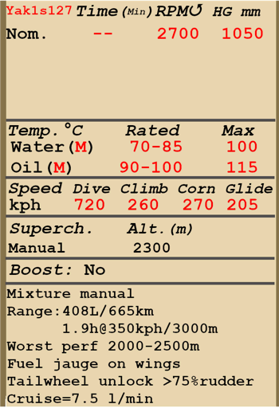

# Yak-1b ser.127  

<table><tbody><tr><td style="text-align: center"></td><td style="text-align: center"></tr></td></tr></tbody></table>  

飞行构型的失速指示空速：153~169 km/h  
起降构型的失速指示空速：132~145 km/h  
俯冲极速：720 km/h  
最大过载：10.3 G  
飞行构型失速迎角：18 °  
着陆构型失速迎角：15.6 °  
  
最大真空速，高度海平面，发动机模式——标称，2550 RPM：530 km/h  
最大真空速，高度2000m，发动机模式——标称，2700 RPM：567 km/h  
最大真空速，高度4500m，发动机模式——标称，2700 RPM：600 km/h  
  
实用升限：10600 m  
海平面爬升率：17.0 m/s  
3000m时爬升率：15.0 m/s  
6000m时爬升率：9.5 m/s  
  
海平面最大性能盘旋时间：19.0 s，指示空速 270 km/h。  
3000m时最大性能盘旋时间：24.1 s，指示空速 270 km/h。  
  
3000m（9843 feet）时续航时间：2.0h，指示空速 350 km/h。  
  
起飞速度：160~190 km/h  
进近速度：195~205 km/h  
着陆速度：135~145 km/h  
着陆迎角：12 °  
  
注1：所提供的数据适用于国际标准大气（ISA）。  
注2：飞行性能范围基于可能的飞机质量范围。  
注3：极速、爬升率和盘旋时间基于标准飞机质量。  
注4：爬升率和盘旋时间基于标称（2700 RPM）动力。  
  
发动机：  
型号：M-105PF  
海平面标称动力模式下的最大功率(2550 RPM)：1240 HP  
海平面标称动力模式下的最大功率(2700 RPM)：1210 HP  
标称模式下的最大功率，高度800 m(2700 RPM)：1260 HP  
标称模式下的最大功率，高度2700 m(2700 RPM)：1200 HP  
  
发动机模式：  
标称（无时间限制）：2550/2700 RPM，1050 mm Hg  
  
发动机液冷出水口额定水温：70~85 °C  
发动机液冷出水口最高水温：100 °C  
发动机滑油出油口额定油温：90~100 °C  
发动机滑油出油口最高油温：115 °C  
  
机械增压器换挡高度：2300 m  
  
空重：2322 kg  
最小重量（无弹药、10%燃油）：2543 kg  
标准重量：2887 kg  
最大起飞重量：3117 kg  
燃油载荷：304 kg/408 L  
有效载荷：795 kg  
  
前射武器：  
20mm机炮"ShVAK"，140发，800发/分，机头安装  
12.7mm机枪"UB"，220发，1000发/分，同步  
  
炸弹：  
2 x 50kg 通用炸弹"FAB-50sv"  
2 x 104kg 通用炸弹"FAB-100M"  
  
长度：8.5 m  
翼展：10 m  
机翼面积：17.15 m²  
  
首次投入战斗：1943年4月  
  
操作特性：  
—发动机为二级机械增压，需2300m高度时手动切换。  
—发动机混合比控制是手动的；如果高度高于3-4 km，需要贫油混合比来优化发动机运行。而且，贫油混合比还可以降低飞行中的油耗。  
—发动机转速有自动调节器，其根据调节器控制杆位置保持对应的需用转速。调节器自动控制螺旋桨桨距来保持需用转速。  
—水冷和滑油散热器风门是手动控制的。  
—该机型只能在俯仰轴上配平。  
—着陆襟翼由冷气驱动。襟翼只可完全放下，不可无级放下。由于致动器放下襟翼的力较弱，当空速大于220km/h时，气流会把襟翼压回收起位置。因此，请记住襟翼在高速时无法完全放下。在高速着陆进近时襟翼可能在着陆前分阶段放下。  
—飞机有尾轮控制系统，如果蹬舵超过行程的75%，尾轮解锁。如果脚蹬偏转不超过75%，则尾轮保持锁定。因此，在高速移动时应避免猛踩舵。  
—飞机有共用一个控制杆的差动气压机轮刹车。这意味着捏住刹车踩舵，反向一侧的机轮刹车会逐渐释放，导致飞机转向踩舵一侧。  
—油量表安装在驾驶舱外的左右机翼油箱上。它们仅显示油箱里少于80 L的剩余油量。  
—座舱盖没有紧急抛离装置。如需跳伞，需先将速度降至550 km/h以下才能打开座舱盖。  
—机翼下安装的炸弹架控制系统只能同时释放两个炸弹。  
  
Basic data and recommended positions of the aircraft controls:  
1. Starting the engine:  
	- recommended position of the mixture control lever: 100%  
	- recommended position of the radiators control handles: close  
	- recommended position of the prop pitch control handle: 100%  
	- recommended position of the throttle lever: 5%  
	- before taxiing, you must unlock the tailwheel  
  
2. Recommended mixture control lever positions for various flight modes:  
	- When running the engine at low throttle near the ground, the mixture control lever should be in the position of about 50%.  
	- When the engine is running at full throttle near the ground, the mixture control lever should be in the 75-80% position.  
	- As you gain altitude, the altitude corrector closes. At 8-9 km altitude, the altitude corrector closes to 0%.  
  
3.1 Recommended positions of the oil radiator control handle for various flight modes:  
	- takeoff: open 100%  
	- climb: open 100%  
	- cruise flight: open 40%  
	- combat: open 100%  
  
3.2 Recommended positions of the water radiator control handle for various flight modes:  
	- takeoff: open 100%  
	- climb: open 100%  
	- cruise flight: open 50%  
	- combat: open 80%  
  
4. Approximate fuel consumption at 2000 m altitude:  
	- Cruise engine mode: 7.5 l/min  

## 修改  
### 2 x FAB-100M炸弹  

2 x 104kg 通用炸弹FAB-100M  
增加质量：228 kg  
弹药质量：208 kg  
挂架质量：20 kg  
投弹前预期速度损失：31 km/h  
投弹后预期速度损失：13 km/h  

### 2 x FAB-50sv炸弹  

2 x 50kg 通用炸弹FAB-50sv  
增加质量：120 kg  
弹药质量：100 kg  
挂架质量：20 kg  
投弹前预期速度损失：23 km/h  
投弹后预期速度损失：13 km/h  

### 女性飞行员  

莉迪亚·弗拉基米罗夫纳·利特维克(1921年8月18日-1943年8月1日) - 苏联战斗机飞行员，飞行指挥官，近卫军中尉，第二次世界大战中战果最多的女性飞行员，苏联英雄。后来的研究证实，其拥有4次个人空战胜利和3次集体空战胜利，以及1个防空气球。最后，她阵亡在了米乌斯河前线的作战中，当时其年龄尚不足22岁。  

### 着陆灯  

夜间飞行用的着陆灯  
增加质量：2 kg  
预期速度损失：0 km/h  

### 后视镜  

后视镜  
增加质量：1 kg  
预期速度损失：0 km/h  

### RPK-10 无线电罗盘  

用于无线电信标导航的固定环形无线电罗盘  
增加质量：10 kg  
预期速度损失：0 km/h  
