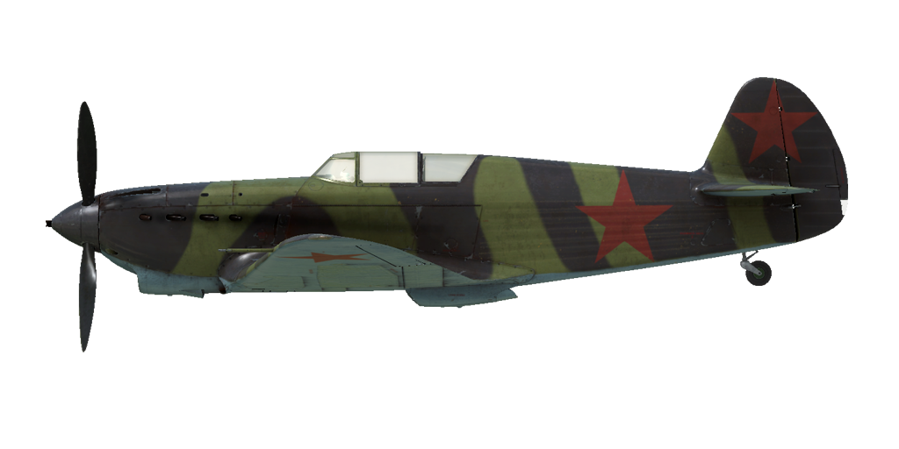

# Yak-1 Brh. 23  

  

## Beschreibung  

Überziehgeschwindigkeit in Flugkonfiguration: 156..172 km/h  
Überziehgeschwindigkeit in Landekonfiguration: 134..147 km/h  
Höchstzulässige Geschwindigkeit im Sturzflug: 720 km/h  
Bruchlastvielfache: 10.3 G  
Kritischer Anstellwinkel in Flugkonfiguration: 18.2 °  
Kritischer Anstellwinkel in Landekonfiguration: 15.7 °  
  
Höchstgeschwindigkeit in Bodennähe, Startleistung, 2600 U/min: 485 km/h  
Höchstgeschwindigkeit in Bodennähe, Nennleistung, 2700 U/min: 475 km/h  
Höchstgeschwindigkeit in 2000 m Höhe, Nennleistung, 2700 U/min: 518 km/h  
Höchstgeschwindigkeit in 4000 m Höhe, Nennleistung, 2700 U/min: 537 km/h  
  
Dienstgipfelhöhe: 10400 m  
Steigleistung in Bodennähe: 14.3 m/s  
Steigleistung in 3000 m Höhe: 12.9 m/s  
Steigleistung in 6000 m Höhe: 8.85 m/s  
  
Maximale Wendegeschwindigkeit in Bodennähe: 19.6 s (270 km/h IAS).  
Maximale Wendegeschwindigkeit in 3000 m Höhe: 25.7 s (270 km/h IAS).  
  
Reichweite in 3000 m: 1.8 h, bei 350 km/h IAS.  
  
Startgeschwindigkeit: 160..190 km/h  
Anfluggeschwindigkeit: 195..205 km/h  
Landegeschwindigkeit: 135..145 km/h  
Sinkflugpfad: 12.3 °  
  
Anmerkung 1: Die Werte gelten für Normatmosphäre (ISA).  
Anmerkung 2: Flugleistungen varrieren je nach Abfluggewicht.  
Anmerkung 3: Höchstgeschwindigkeiten, Steigleistungen und Wendegeschwindigkeiten gelten für Standard-Fluggewicht.  
Anmerkung 4: Steigraten gelten für Nennleistung (2700 U/min), Wendegeschwindigkeiten gelten für Startleistung.  
  
Triebwerk:  
Baumuster: M-105P (M-105PA - Rüstsatz)  
Startleistung in Bodennähe: 1100 PS  
Nennleistung in Bodennähe: 1020 PS  
Nennleistung in 2000 m Höhe: 1100 PS  
Nennleistung in 4000 m Höhe: 1050 PS  
  
Leistungsstufen:  
Nennleistung (unbegrenzt): 2700 U/min, 1050 mm Hg  
Startleistung (bis zu 5 Minute): 2600 U/min, 950 mmHg  
  
Kühlstoffaustrittstemperatur (normal): 70..85 °C  
Kühlstoffaustrittstemperatur (höchstens): 100 °C  
Schmierstoffaustrittstemperatur (normal): 90..100 °C  
Schmierstoffaustrittstemperatur (höchstens): 115 °C  
  
Laderumschalthöhe: 3600 m  
  
Leergewicht: 2371 kg  
Minimalgewicht (keine Munition, 10% Treibstoff): 2589 kg  
Normalgewicht: 2938 kg  
Höchstabfluggewicht: 3034 kg  
Kraftstoffmenge: 304 kg / 408 l  
Nutzlast: 663 kg  
  
Starre Schusswaffenanlage:  
20 mm SchWAK, 120 Schuss, 800 Schuss pro Minute, montiert in Flugzeugnase  
2 x 7.62 mm SchKAS, 750 Schuss, 1800 Schuss pro Minute, gesteuert schießend  
  
Raketen:  
Bis zu 6 x 7 kg Raketen ROS-82, Sprengladung 2.52 kg  
  
Länge: 8.5 m  
Spannweite: 10 m  
Flügelfläche: 17.15 m²  
  
Erster Fronteinsatz: Juli 1941  
  
Eigenschaften:  
- Der Motor hat einen Zweiganglader, welcher manuell auf 3600 m Höhe umgeschaltet werden muss.  
- Die Gemischregelung erfolgt manuell. Es ist erforderlich das Gemisch ab einer Höhe von 3-4 km abzumagern. Das Abmagern des Gemisches reduziert auch den Treibstoffverbrauch während des Fluges.  
- Der Motor besitzt eine automatische Drehzahlregelung, welche die Motordrehzahl je nach Hebelstellung festlegt. Der Regler verstellt automatisch den Anstellwinkel des Propellers um die erforderliche Drehzahl einzuhalten.  
- Die Verstellung der Wasserkühler- und Ölkühlerklappen erfolgt manuell.  
- Das Flugzeug verfügt nur über eine Höhenrudertrimmung.  
- Die Landeklappen sind pneumatisch gesteuert. Die Klappen können nur vollständig ausgefahren werden, ein stufenweises Ausfahren ist nicht möglich. Aufgrund des schwachen Klappenantriebs, werden die Landeklappen bei einer Geschwindigkeit über 220 km/h durch den Luftwiderstand eingefahren. Beachte, dass die Landeklappen bei einer hohen Geschwindigkeit nicht voll ausgefahren werden. Bei einer hohen Geschwindigkeit beim Landeanflug ist es möglich, dass die Klappen direkt vor der Landung noch etwas weiter ausfahren.  
- Das Flugzeug hat eine manuelle Spornradverriegelung. Bei entriegeltem Spornrad ist der Ausschlag auf 90° begrenzt. Das Spornrad sollte bei längerem Geradeausrollen, sowie beim Abflug und bei der Landung verriegelt werden.  
- Das Flugzeug hat differentielle pneumatische Bremsen, die mit einem gemeinsamen Bremshebel betätigt werden. Wenn der Bremshebel gezogen und das Ruderpedal betätigt wird, wird die gegenüberliegende Bremse gelöst und das Flugzeug dreht sich zu der einen oder der anderen Seite.  
- Das Flugzeug hat Tankanzeigen auf dem linken und rechten Flügel außerhalb des Cockpits. Die Tankanzeigen zeigen nur den Treibstoffstand an, wenn weniger als 80 Liter enthalten sind.  
- Aufgrund des starken Luftstroms ist es nicht möglich die Cockpithaube bei hoher Geschwindigkeit zu öffnen oder zu schließen. Die Cockpithaube hat keine Notfallauslösung, weshalb die Geschwindigkeit vor dem Notausstieg reduziert werden muss.  
- Wenn Raketen installiert sind, gibt es eine Steuerung für die Salven. Es gibt drei Abschussarten: einzeln, zwei in einer Salve oder vier in einer Salve.  
- There is no radio station in the default aircraft configuration. As a modification, the installation of the RSI-4 radio station is provided.  
  
Basic data and recommended positions of the aircraft controls:  
1. Starting the engine:  
	- recommended position of the mixture control lever: 100%  
	- recommended position of the radiators control handles: close  
	- recommended position of the prop pitch control handle: 100%  
	- recommended position of the throttle lever: 5%  
	- before taxiing, you must unlock the tailwheel  
  
2. Recommended mixture control lever positions for various flight modes:  
	- When running the engine at low throttle near the ground, the mixture control lever should be in the position of about 50%.  
	- When the engine is running at full throttle near the ground, the mixture control lever should be in the 75-80% position.  
	- As you gain altitude, the altitude corrector closes. At 8-9 km altitude, the altitude corrector closes to 0%.  
  
3.1 Recommended positions of the oil radiator control handle for various flight modes:  
	- takeoff: open 100%  
	- climb: open 100%  
	- cruise flight: open 50%  
	- combat: open 100%  
  
3.2 Recommended positions of the water radiator control handle for various flight modes:  
	- takeoff: open 100%  
	- climb: open 100%  
	- cruise flight: open 66%  
	- combat: open 80%  
  
4. Approximate fuel consumption at 2000 m altitude:  
	- Cruise engine mode: 7.4 l/min  

## Änderungen  
### M-105PA Engine  

The crankcase halves better secured in place, the main connecting rods reinforced. Boost control lever added.  
Zusätzliches Gewicht: 30 kg  
  
### Funkgerät  

Funkgerät RSI-4  
Zusätzliches Gewicht: 12.6 kg  
Geschwindigkeitsverlust: 0 km/h  
  

### 6 x Raketen, Typ ROS-82  

6 x ungelenkte 82-mm-Explosivraketen ROS-82  
Zusätzliches Gewicht: 60 kg  
Gewicht der Munition: 42 kg  
Gewicht der Abwurfwaffenroste: 18 kg  
Geschwindigkeitsverlust vor dem Abfeuern: 23 km/h  
Geschwindigkeitsverlust nach dem Abfeuern: 17 km/h  
