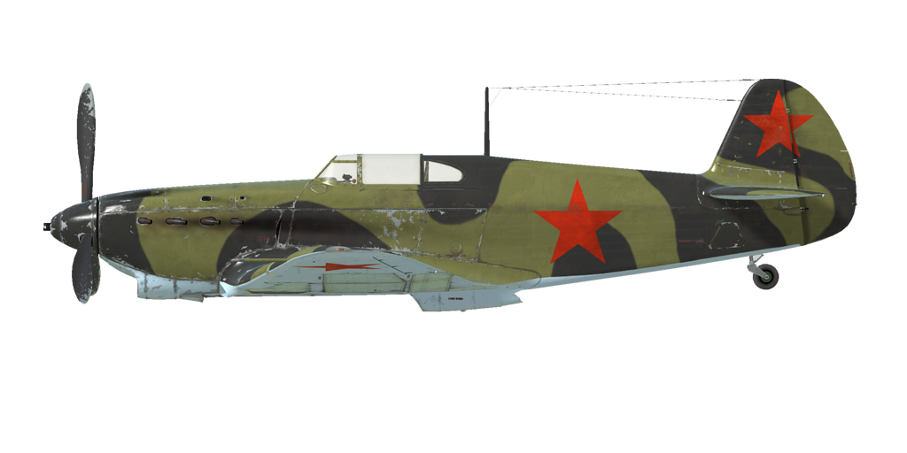

# Yak-1 sér.69  

| Image | Notes  
|:---|:---  
|  |   

## Description  

Vitesse de décrochage indiquée en configuration de vol : 155..171 km/h  
Vitesse de décrochage indiquée en configuration de décollage/atterrissage : 133..146 km/h  
Vitesse limite de piqué : 720 km/h  
Facteur de charge maximum : 10,3 g  
Angle d\attaque de décrochage en configuration de vol : 18 °  
Angle d\attaque de décrochage indiquée en configuration d\atterrissage : 15,6 °  
  
Vitesse sol au niveau de la mer, régime moteur - Nominal, 2550 tr/min : 514 km/h  
Vitesse sol maximale à 2000 m, régime moteur - Nominal, 2700 tr/min : 549 km/h  
Vitesse sol maximale à 4000 m, régime moteur - Nominal, 2700 tr/min : 582 km/h  
  
Plafond opérationnel : 10200 m  
Taux de montée au niveau de la mer : 16,9 m/s  
Taux de montée à 3000 m : 15,0 m/s  
Taux de montée à 6000 m : 9,4 m/s  
  
Virage à 360° au niveau de la mer en : 19,2 s, à 270 km/h vitesse indiquée (IAS).  
Virage à 360° à 3000 m : 24,6 s, à 270 km/h vitesse indiquée (IAS).  
  
Endurance à 3000 m : 1,9 h, à 350 km/h vitesse indiquée (IAS).  
  
Vitesse de décollage : 160..190 km/h  
Vitesse d\approche : 195..205 km/h  
Vitesse d\atterrissage : 135..145 km/h  
Angle d\atterrissage : 12 °  
  
Note 1 : les données sont indiquées à l\atmosphère standard international (ISA).  
Note 2 : les performances d\endurance sont données pour plusieurs masses possibles.  
Note 3 : la vitesse maximale, le taux de montée et le temps de virage sont donnés pour une masse standard.  
Note 4 : le taux de montée et le temps de virage vaut à régime continu (2700 tr/min).  
  
Moteur :  
Modèle : M-105PF  
Puissance maximale au régime continu (2550 tr/min) au niveau de la mer : 1240 cv  
Puissance maximale au régime continu (2700 tr/min) au niveau de la mer : 1210 cv  
Puissance maximale au régime continu (2700 tr/min) à 800 m : 1260 cv  
Puissance maximale au régime continu (2700 tr/min) à 2700 m : 1200 cv  
  
Performance du moteur :  
Continu (durée illimitée) : 2550/2700 tr/min, 1050 mmHg  
  
Température de fonctionnement d\eau en sortie du moteur : 70..85 °C  
Température maximale d\eau en sortie du moteur : 100 °C  
Température de fonctionnement d\huile en sortie du moteur : 90..100 °C  
Température maximale d\huile en sortie du moteur : 115 °C  
  
Altitude de changement d\étage du compresseur : 2300 m  
  
Masse à vide : 2365 kg  
Masse minimale (sans munitions, 10% de carburant) : 2583 kg  
Masse standard : 2932 kg  
Masse maximale au décollage : 3170 kg  
Masse de carburant : 304 kg / 408 l  
Charge utile : 805 kg  
  
Armement offensif :  
20 mm canon ShVAK, 120 coups, 800 coups par minute, dans le nez  
2 mitrailleuses ShKAS de 7,62 mm, 750 coups, 1800 coups par minute, synchronisées  
  
Bombes :  
2 bombes d\emploi général FAB-50sv de 50 kg  
2 bombes d\emploi général FAB-100M de 104 kg  
  
Roquettes:  
Jusqu\à 6 roquettes ROS-82 de 7 kg, charge militaire HE (explosif) de 2,5 kg  
  
Longueur : 8,5 m  
Envergure : 10 m  
Surface alaire : 17,15 m²  
  
Premier engagement : mai 1942  
  
Caractéristiques  
- Le moteur dispose d\un compresseur mécanique à deux étages qui doit être manuellement mis en route à 2300m d\altitude.  
- La commande du mélange de carburant moteur est manuelle. Il est nécessaire d\activer le mélange lorsque l\altitude est supérieure à 3-4 km afin d\obtenir un rendement optimal. En outre, pendant le vol, le mélange peermet une réduction de la consommation de carburant.  
- Il y a un régulateur de tours moteur, les RPM sont ainsi maintenus à la bonne valeur en fonction de la position du levier du régulateur. Le régulateur contrôle automatiquement le pas d\hélice afin de maintenir les RPM demandés.  
- Les volets de radiateurs d\eau et d\huile sont commandés manuellement.  
- L\avion n\a qu\un trim de tangage.  
- Les volets d\atterrissage ont un actionneur pneumatique. Les volets ne peuvent être entièrement sortis; L\extension progressive est impossible. En raison de la faible force de l\actionneur, les volets d\atterrissage sortis peuvent être poussés vers le haut par le flux d\air si la vitesse est supérieure à 220 km/h. N\oubliez pas que les volets ne sortent pas complètement en cas de vitesse élevée. Dans le cas d\un atterrissage à grande vitesse, les volets peuvent sortir juste un peu avant d\atterrir.  
- L\avion a une roulette de queue verouillable manuelement. La roulette de queue déverrouillée a une limite de virage de 90 °. La roulette de queue doit être verrouillée en roulant droit sur une longue distance, avant le décollage et l\atterrissage.  
- L\avion a des freins pneumatiques différentiels de roue avec un levier de commande partagé. Cela signifie que si le levier de frein est maintenu, et que la pédale de gouvernail qui freine la roue opposé est progressivement libérée, cela fera tourner d\un côté ou de l\autre.  
- Des jauges de carburant sont installées sur les réservoirs de carburant gauche et droit, à l\extérieur du poste de pilotage. Ils montrent le niveau de carburant restant seulement quand il reste moins de 80 litres de carburant dans le réservoir.  
- Il est impossible d\ouvrir ou de fermer la verrière à grande vitesse en raison d\un fort flux d\air La verrière n\a pas de systême d\éjection d\urgence, il faut donc réduire la vitesse pour évacuer l\avion.  
- Le système de controle du ratelier des ailes ne permet de larguer les bombes que par pair et au même moment.  
- Quand des roquettes sont installées, il y a un sélecteur de mode tir, qui permet de choisir un tir unitaire, par deux ou par quatre.  
  
Basic data and recommended positions of the aircraft controls:  
1. Starting the engine:  
	- recommended position of the mixture control lever: 100%  
	- recommended position of the radiators control handles: close  
	- recommended position of the prop pitch control handle: 100%  
	- recommended position of the throttle lever: 5%  
	- before taxiing, you must unlock the tailwheel  
  
2. Recommended mixture control lever positions for various flight modes:  
	- When running the engine at low throttle near the ground, the mixture control lever should be in the position of about 50%.  
	- When the engine is running at full throttle near the ground, the mixture control lever should be in the 75-80% position.  
	- As you gain altitude, the altitude corrector closes. At 8-9 km altitude, the altitude corrector closes to 0%.  
  
3.1 Recommended positions of the oil radiator control handle for various flight modes:  
	- takeoff: open 100%  
	- climb: open 100%  
	- cruise flight: open 50%  
	- combat: open 100%  
  
3.2 Recommended positions of the water radiator control handle for various flight modes:  
	- takeoff: open 100%  
	- climb: open 100%  
	- cruise flight: open 66%  
	- combat: open 80%  
  
4. Approximate fuel consumption at 2000 m altitude:  
	- Cruise engine mode: 7.4 l/min  

## Modifications  

### 2 bombes FAB-100M   

2 bombes d’emploi général FAB-100M de 104 kg  
Masse supplémentaire : 228 kg  
Masse des munitions : 208 kg  
Masse des pylones : 20 kg  
Perte estimée de vitesse avant le largage : 27 km/h  
Perte estimée de vitesse après le largage : 12 km/h  
  

### 2 bombes FAB-50sv  

2 bombes d’emploi général FAB-50sv de 50 kg  
Masse supplémentaire : 120 kg  
Masse des munitions : 100 kg  
Masse des pylones : 20 kg  
Perte estimée de vitesse avant le largage : 20 km/h  
Perte estimée de vitesse après le largage : 12 km/h  
  
### Female Pilot  

Lydia (Lilya) Vladimirovna Litvyak (18 August 1921 - 1 August 1943) - a Soviet fighter pilot, flight commander, Guards Junior Lieutenant, most successful female pilot of World War 2, Hero of the Soviet Union. Later research confirms 4 individual and 3 shared victories in aerial combat, as well as 1 aerostat shot down. Killed in action at the age of less than 22 years in a battle over the Mius Front.  
  

### 2 roquettes ROS-82  

2 roquettes Explosives Brisantes non guidées ROS-82 de 82 mm  
Masse supplémentaire : 60 kg  
Masse des munitions : 42 kg  
Masse des rails : 18 kg  
Perte estimée de vitesse avant le lancement : 8 km/h  
Perte estimée de vitesse après le lancement : 6 km/h  
  

### 6 roquettes ROS-82  

6 roquettes Explosives Brisantes non guidées ROS-82 de 82 mm  
Masse supplémentaire : 60 kg  
Masse des munitions : 42 kg  
Masse des rails : 18 kg  
Perte estimée de vitesse avant le lancement : 23 km/h  
Perte estimée de vitesse après le lancement : 17 km/h  
  

### RPK-10  

Goniomètre pour la radionavigation  
Masse supplémentaire : 10 kg  
Perte estimée de vitesse : 0 km/h  
