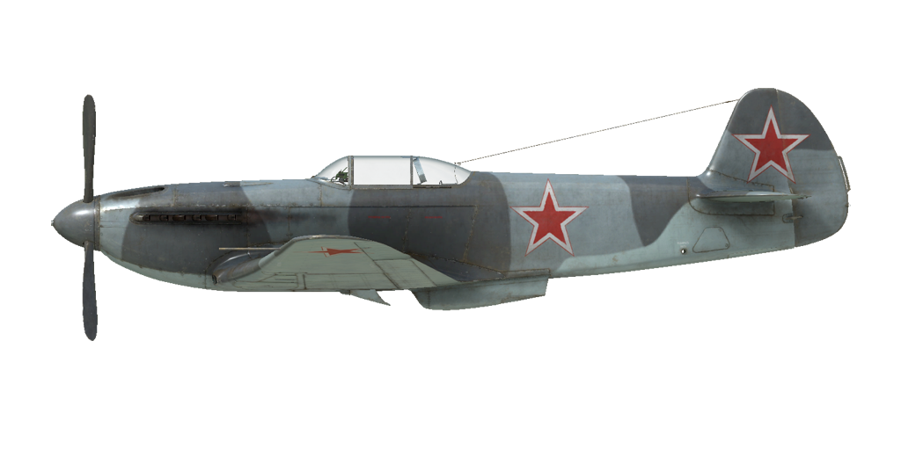

# Як-3 9 серии  
  
  
  
## Описание  
  
Приборная скорость сваливания в полётной конфигурации: 152..160 км/ч  
Приборная скорость сваливания в посадочной конфигурации: 136..141 км/ч  
Предельная скорость в пикировании: 750 км/ч  
Разрушающая перегрузка: 10,5 единиц  
Угол атаки сваливания, в полётной конфигурации: 18°  
Угол атаки сваливания, в посадочной конфигурации: 16°  
  
Максимальная истинная скорость у земли, режим двигателя - номинал, 2700 об/мин: 555 км/ч  
Максимальная истинная скорость на высоте 2000 м, режим двигателя - номинал, 2700 об/мин: 605 км/ч  
Максимальная истинная скорость на высоте 4000 м, режим двигателя - номинал, 2700 об/мин: 629 км/ч  
  
Практический потолок: 10500 м  
Скороподъёмность у земли: 21,5 м/с  
Скороподъёмность на высоте 3000 м: 16,4 м/с  
Скороподъёмность на высоте 6000 м: 11,7 м/с  
  
Время виража предельного по тяге у земли: 18,0 с, на скорости 280 км/ч по прибору  
Время виража предельного по тяге на высоте 3000 м: 26,0 с, на скорости 305 км/ч по прибору  
  
Продолжительность полёта на высоте 3500 м: 1,13 ч, на скорости 457 км/ч по прибору  
  
Скорость взлётная: 160..190 км/ч  
Скорость на глиссаде: 195..205 км/ч  
Скорость посадочная: 135..145 км/ч  
Посадочный угол: 12 °  
  
Примечание 1: данные указаны для условий международной стандартной атмосферы.  
Примечание 2: диапазоны характеристик даны для допустимого диапазона масс самолёта.  
Примечание 3: максимальные скорости, скороподъемности и время виража даны для стандартной массы самолёта.  
Примечание 4: скороподъемность и время виража даны на номинальном (2700 об/мин) режиме работы двигателя.  
  
Двигатель:  
Модель: ВК-105ПФ2  
Максимальная мощность на номинальном режиме (2700 об/мин) у земли: 1290 л.с.  
Максимальная мощность на номинальном режиме (2700 об/мин) на высоте 700 м: 1320 л.с.  
Максимальная мощность на номинальном режиме (2700 об/мин) на высоте 2500 м: 1250 л.с.  
  
Режимы работы двигателя:  
Номинальный (время неограничено): 2700 об/мин, 1050 мм рт.ст.  
  
Температура воды на выходе из двигателя номинальная: 90..100 °С, минимально допустимая 60 °С  
Температура воды на выходе из двигателя предельная: 110 °С  
Температура масла на выходе из двигателя номинальная: 90..100 °С  
Температура масла на выходе из двигателя предельная: 110 °С  
  
Высота переключения нагнетателя: 1400 м  
  
Масса пустого самолёта: 2039 кг  
Минимальная масса (без БК, 10% топлива): 2313 кг  
Стандартная масса: 2595 кг  
Максимальная взлётная масса: 2655 кг  
Максимальный запас топлива: 250 кг / 340 л  
Максимальная полезная нагрузка: 616 кг  
  
Вооружение курсовое:  
20мм пушка "ШВАК", 125 снарядов, 800 выстр/мин, носовая  
12,7мм пулемёт "УБС", 175 патронов, 1000 выстр/мин, синхронизированный  
  
Длина: 8,5 м  
Размах крыла: 9,2 м  
Площадь крыла: 15,85 кв.м  
  
Начало участия в боевых действиях: май 1944  
  
Особенности эксплуатации:  
- Двигатель оборудован двухступенчатым нагнетателем. Ступени нагнетателя следует переключать при пересечении высоты 1200...1600 м.  
- Высотный корректор топливовоздушной смеси имеет ручное управление. С увеличением высоты полёта более 3-4 км необходимо обеднять смесь для оптимальной работы мотора. Также ручное обеднение смеси позволяет снизить расход топлива на маршруте.  
- Регулятор постоянных оборотов винта поддерживает заданные рычагом винта обороты мотора за счёт автоматического изменения шага винта.  
- Маслорадиатор имеет ручное управление створками.  
- Водорадиатор имеет возможность автоматического и ручного управления створками.  
- Самолёт имеет триммер руля высоты для снятия нагрузки на ручку управления.  
- Привод посадочных щитков пневматический. По команде на выпуск щитки выпускаются полностью. Из-за небольшого давления в пневмосети выпущенные щитки могут поджиматься скоростным напором воздуха на скоростях полёта более 220км/ч. Поэтому при заходе на посадку следует помнить, что при выпуске щитков на большей скорости они могут не выпуститься на полный угол. В этом случае полный довыпуск щитков может неожиданно произойти при дальнейшем гашении скорости, например уже на выравнивании, что приведёт к взмыванию самолёта.  
- Тормоза колёс шасси пневматические, дифференциальные: отклонение педалей при зажатом тормозе приводит к растормаживанию колеса, противоположного нажатой педали.  
- Топливомеры установлены только в левом и правом крыльевых баках. Остаток топлива в расходном баке не измеряется (ёмкость расходного бака 20 литров).  
- Конструкция фонаря кабины предусматривает систему аварийного сброса фонаря для покидания лётчиком самолёта в полёте.  
- Хвостовая стойка свободно-ориентирована, но при взятии ручки на себя стойка фиксируется в центральном ("по полёту") положении.  
  
Основные данные и рекомендуемые положения органов управления самолётом:  
1. Запуск двигателя:  
	- рекомендуемое положение рукояти высотного корректора: 100%  
	- рекомендуемое положение рукояток управления радиаторами: закрыто  
	- рекомендуемое положения рукояти управления шагом винта: 100%  
	- рекомендуемое положение рычага управления двигателем: 5%  
  
2. Рекомендуемые положения рукояти высотного корректора режимах полёта:  
	- При работе мотора на малом газу у земли ручка высотный корректор должен быть в положении около 50%.  
	- При работе мотора на полном газу у земли ручка высотный корректор должен быть в положении 75-80%.  
	- По мере набора высоты высотный корректор прикрывается. На 8-9км высоты высотный корректор закрывается до 0%.  
  
3.1 Рекомендуемые положения рукояти управления маслорадиатором при различных режимах полёта:  
	- взлёт: открыто 100%  
	- набор высоты: открыто 100%  
	- крейсерский полёт: открыто 30%  
	- бой: открыто 100%  
  
3.2 Рекомендуемые положения рукояти управления водорадиатором при различных режимах полёта в ручном режиме управления створками водорадиатора:  
	- взлёт: открыто 100%  
	- набор высоты: открыто 100%  
	- крейсерский полёт: открыто 40%  
	- бой: открыто 80%  
  
4. Ориентировочный расход топлива на различных режимах работы на высоте 2000 м:  
	- номинальный режим работы двигателя: 7,5 л/мин  
  
## Модификации  
  
  
### Зеркало  
  
Зеркало обзора задней полусферы  
Дополнительная масса: 1 кг  
Ориентировочная потеря скорости: 0 км/ч  
  
### Прицел ПКИ  
  
Коллиматорный прицел истребителя  
Дополнительная масса: 0.5 кг  
Ориентировочная потеря скорости: 0 км/ч  
  
### РПК-10  
  
Радиополукомпас для навигации по радиомаякам  
Дополнительная масса: 10 кг  
Ориентировочная потеря скорости: 0 км/ч  
  
###  12,7-мм пулемёт УБС  
  
12,7-мм пулемёт УБС справа с боезапасом 175 патронов  
Дополнительная масса: 57 кг  
Масса боекомплекта: 33 кг  
Масса орудия: 24 кг  
Ориентировочная потеря скорости: 0 км/ч  