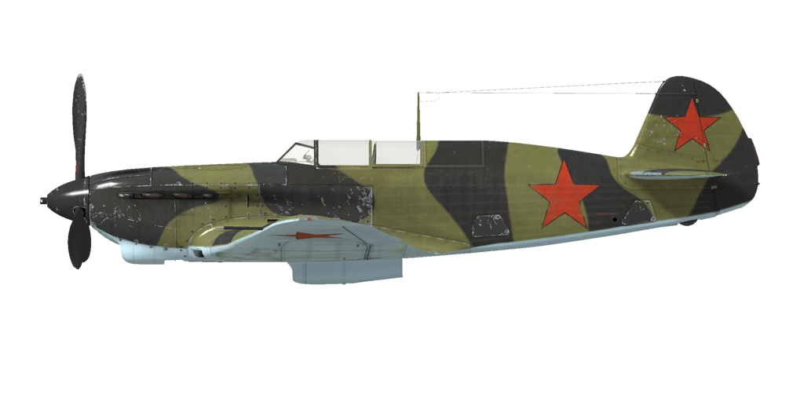

# Yak-7B ser.36

## Opis

Indicated stall speed in flight configuration: 155..172 km/h
Indicated stall speed in takeoff/landing configuration: 139..154 km/h
Dive speed limit: 740 km/h
Maximum load factor: 11.5 G
Stall angle of attack in flight configuration: 18°
Stall angle of attack in landing configuration: 16°

Maximum true air speed at sea level, engine mode - Nominal, 2700 RPM: 526 km/h
Maximum true air speed at 2000 m, engine mode - Nominal, 2700 RPM: 565 km/h
Maximum true air speed at 4000 m, engine mode - Nominal, 2700 RPM: 586 km/h

Service ceiling: 10660 m
Climb rate at sea level: 16.9 m/s
Climb rate at 3000 m: 14.3 m/s
Climb rate at 6000 m: 8.6 m/s

Maximum performance turn at sea level: 19..20 s, at 310 km/h IAS.
Maximum performance turn at 3000 m: 24..25 s, at 310 km/h IAS.

Flight endurance at 3000 m: 1.9 h, at 350 km/h IAS.

Takeoff speed: 170..175 km/h
Glideslope speed: 200 km/h
Landing speed: 145..165 km/h
Landing angle: 11.5°

Note 1: the data provided is for international standard atmosphere (ISA).
Note 2: flight performance ranges are given for possible aircraft mass ranges.
Note 3: maximum speeds, climb rates and turn times are given for standard aircraft mass.
Note 4: climb rates and turn times are given for Nominal (2700 RPM) power.

Engine:
Model: M-105PF
Maximum power in Nominal mode (2700 RPM) at sea level: 1210 HP
Maximum power in Nominal mode (2700 RPM) at 700 m: 1260 HP
Maximum power in Nominal mode (2700 RPM) at 2700 m: 1180 HP

Engine modes:
Nominal (unlimited time): 2600/2700 RPM, 1050 mm Hg

Water rated temperature in engine output: 70..85 °C
Water maximum temperature in engine output: 100 °C
Oil rated temperature in engine output: 90..100 °C
Oil maximum temperature in engine output: 115 °C

Supercharger gear shift altitude: 2000 m

Empty weight: 2302 kg
Minimum weight (no ammo, 10%25 fuel): 2630 kg
Standard weight: 3002 kg
Maximum takeoff weight: 3229 kg
Fuel load: 305 kg / 420 l
Useful load: 927 kg

Forward-firing armament:
20mm gun "SsVAK", 120 rounds, 800 rounds per minute, nose-mounted
2 x 12.7 mm machine gun "UBS", 400 rounds, 900 rounds per minute, synchronized

Bombs:
2 x 50 kg general purpose bombs "FAB-50sv"
2 x 104 kg general purpose bombs "FAB-100M"

Length: 8.5 m
Wingspan: 10 m
Wing surface: 17.15 m²

Combat debut: early 1943

Operation features:
- Engine has a two-stage mechanical supercharger which must be manually switched at 2000 m altitude.
- Engine mixture control is manual; it is necessary to lean the mixture if altitude is more than 3-4 km for optimal engine operation. Also, leaning the mixture allows a reduction in fuel consumption during flight.
- Engine RPM has an automatic governor and it is maintained at the required RPM corresponding to the governor control lever position. The governor automatically controls the propeller pitch to maintain the required RPM.
- Water and oil radiator shutter control is manual.
- Airplane has only a flight-control trimmer on the pitch.
- Landing flaps have a pneumatic actuator. Flaps can only be fully extended; gradual extending is impossible. Due to the weak force of the actuator the extended landing flaps may be pressed upwards by the airflow if the airspeed is more than 250 km/h. Remember that the flaps will not extend fully in case of high speed. In case of a high-speed landing approach the flaps may extend a few steps further right before landing.
- Airplane has a manual control for the tailwheel lock. The unlocked tailwheel has a 90° turn limit. The tailwheel should be locked when taxiing straight for a long distance and before takeoff and landing.
- Airplane has differential pneumatic wheel brakes with shared control lever. This means that if the brake lever is held and the rudder pedal the opposite wheel brake is gradually released causing the plane to swing to one side or the other.
- Fuel gauges are installed on left and right wing fuel tanks, outside of the cockpit. They show remaining fuel level only when there is less than 130 liters of fuel left in the tank.
- It is impossible to open or close the canopy at high speed due to strong airflow. The canopy has no emergency release, so bail out requires the speed drop before it.
- The control system for the wing-mounted bomb racks only allows releasing of both bombs together.

## Modyfikacje

&name=2 x bomba FAB-100M

2 x bomba ogólnego przeznaczenia FAB-100M – 104 kg
Additional mass: 228 kg
Ammunition mass: 208 kg
Racks mass: 20 kg
Estimated speed loss before drop: 27 km/h
Estimated speed loss after drop: 12 km/h
&name=2 x bomba FAB-50SW

2 x bomba ogólnego przeznaczenia FAB-50SW – 50 kg
Additional mass: 120 kg
Ammunition mass: 100 kg
Racks mass: 20 kg
Estimated speed loss before drop: 20 km/h
Estimated speed loss after drop: 12 km/h
### Bezpośrednie światło

Lądowanie światło dla lotów nocnych
Additional mass: 2 kg
Estimated speed loss: 0 km/h
&name=RPK-10

Radiopółkompas służący do nawigacji z użyciem radiostacji prowadzących
Additional mass: 10 kg
Estimated speed loss: 0 km/h