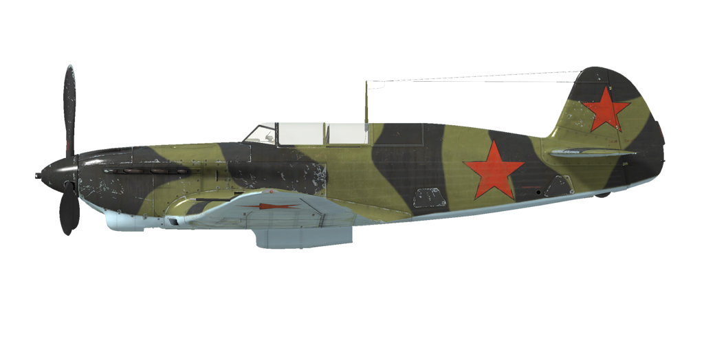

# Як-7Б 36 серии  

  
  

## Описание  

Приборная скорость сваливания в полётной конфигурации: 155..172 км/ч  
Приборная скорость сваливания в посадочной конфигурации: 139..154 км/ч  
Предельная скорость в пикировании: 740 км/ч  
Разрушающая перегрузка: 11.5 единиц  
Угол атаки сваливания, в полётной конфигурации: 18°  
Угол атаки сваливания, в посадочной конфигурации: 16°  
  
Максимальная истинная скорость у земли, режим двигателя - номинал, 2700 об/мин: 526 км/ч  
Максимальная истинная скорость на высоте 2000 м, режим двигателя - номинал, 2700 об/мин: 565 км/ч  
Максимальная истинная скорость на высоте 4000 м, режим двигателя - номинал, 2700 об/мин: 586 км/ч  
  
Практический потолок: 10660 м  
Скороподъёмность у земли: 16.9 м/с  
Скороподъёмность на высоте 3000 м: 14.3 м/с  
Скороподъёмность на высоте 6000 м: 8.6 м/с  
  
Время виража предельного по тяге у земли: 19..20 с, на скорости 310 км/ч по прибору  
Время виража предельного по тяге на высоте 3000 м: 24..25 с, на скорости 310 км/ч по прибору  
  
Продолжительность полёта на высоте 3000 м: 1.9 ч, на скорости 350 км/ч по прибору  
  
Скорость взлётная: 170..175 км/ч  
Скорость на глиссаде: 200 км/ч  
Скорость посадочная: 145..165 км/ч  
Посадочный угол: 11.5°  
  
Примечание 1: данные указаны для условий международной стандартной атмосферы.  
Примечание 2: диапазоны характеристик даны для допустимого диапазона масс самолёта.  
Примечание 3: максимальные скорости, скороподъемности и время виража даны для стандартной массы самолёта.  
Примечание 4: скороподъемность и время виража даны на номинальном (2700 об/мин) режиме работы двигателя.  
  
Двигатель:  
Модель: М-105ПФ  
Максимальная мощность на номинальном режиме (2700 об/мин) у земли: 1210 л.с.  
Максимальная мощность на номинальном режиме (2700 об/мин) на высоте 700 м: 1260 л.с.  
Максимальная мощность на номинальном режиме (2700 об/мин) на высоте 2700 м: 1180 л.с.  
  
Режимы работы двигателя:  
Номинальный (время неограничено): 2600/2700 об/мин, 1050 мм рт.ст.  
  
Температура воды на выходе из двигателя номинальная: 70..85 °С  
Температура воды на выходе из двигателя предельная: 100 °С  
Температура масла на выходе из двигателя номинальная: 90..100 °С  
Температура масла на выходе из двигателя предельная: 115 °С  
  
Высота переключения нагнетателя: 2000 м  
  
Масса пустого самолёта: 2302 кг  
Минимальная масса (без БК, 10% топлива): 2630 кг  
Стандартная масса: 3002 кг  
Максимальная взлётная масса: 3229 кг  
Максимальный запас топлива: 305 кг / 420 л  
Максимальная полезная нагрузка: 927 кг  
  
Вооружение курсовое:  
20мм пушка "ШВАК", 120 снарядов, 800 выстр/мин, носовая  
2 x 12.7 мм пулемёт "УБС", 400 патронов, 900 выстр/мин, синхронизированный  
  
Вооружение бомбовое:  
2 x 50 кг осколочно-фугасные авиабомбы "ФАБ-50св"  
2 x 104 кг осколочно-фугасные авиабомбы "ФАБ-100М"  
  
Длина: 8.5 м  
Размах крыла: 10 м  
Площадь крыла: 17.15 кв.м  
  
Начало участия в боевых действиях: начало 1943 года  
  
Особенности эксплуатации:  
- Двигатель оборудован двухступенчатым нагнетателем. Ступени нагнетателя следует переключать при пересечении высоты 2000 м.  
- Высотный корректор топливовоздушной смеси имеет ручное управление. С увеличением высоты полёта более 3-4 км необходимо обеднять смесь для оптимальной работы мотора. Также ручное обеднение смеси позволяет снизить расход топлива на маршруте.  
- Регулятор постоянных оборотов винта поддерживает заданные рычагом винта обороты мотора за счёт автоматического изменения шага винта.  
- Водо- и маслорадиатор имеют ручное управление створками.  
- Самолёт имеет триммер руля высоты для снятия нагрузки на ручку управления.  
- Привод посадочных щитков пневматический. По команде на выпуск щитки выпускаются полностью. Из-за небольшого давления в пневмосети выпущенные щитки могут поджиматься скоростным напором воздуха на скоростях полёта более 250 км/ч. Поэтому при заходе на посадку следует помнить, что при выпуске щитков на большей скорости они могут не выпуститься на полный угол. В этом случае полный довыпуск щитков может неожиданно произойти при дальнейшем гашении скорости, например уже на выравнивании, что приведёт к взмыванию самолёта.  
- Свободно-ориентируемое хвостовое колесо может быть застопорено в положении "по полёту" при помощи рычага в кабине лётчика. Колесо необходимо застопорить при продолжительном рулении по прямой, а также перед взлётом и посадкой. Расстопоренное колесо может поворачиваться на угол не более 90°.  
- Тормоза колёс шасси пневматические, дифференциальные: отклонение педалей при зажатом тормозе приводит к растормаживанию колеса, противоположного нажатой педали.  
- Топливомеры установлены только в левом и правом центропланных баках, и показывают остаток топлива при остатке менее чем 130 литров в группе баке.  
- На высоких скоростях полёта фонарь кабины невозможно сдвинуть из-за скоростного напора воздуха. Самолёт не оборудован системой аварийного сброса фонаря, поэтому для покидания лётчиком самолёта в полёте необходимо предварительно сбросить скорость.  
- Система управления крыльевыми бомбодержателями позволяет осуществлять только одновременный сброс бомб с обоих полукрыльев.  
  
Основные данные и рекомендуемые положения органов управления самолётом:  
1. Запуск двигателя:  
	- рекомендуемое положение рукояти высотного корректора: 100%  
	- рекомендуемое положение рукояток управления радиаторами: закрыто  
	- рекомендуемое положения рукояти управления шагом винта: 100%  
	- рекомендуемое положение рычага управления двигателем: 5%  
	- перед рулением необходимо разблокировать колесо  
  
2. Рекомендуемые положения рукояти высотного корректора режимах полёта:  
	- При работе мотора на малом газу у земли ручка высотный корректор должен быть в положении около 50%.  
	- При работе мотора на полном газу у земли ручка высотный корректор должен быть в положении 75-80%.  
	- По мере набора высоты высотный корректор прикрывается. На 8-9км высоты высотный корректор закрывается до 0%.  
  
3.1 Рекомендуемые положения рукояти управления маслорадиатором при различных режимах полёта:  
	- взлёт: открыто 100%  
	- набор высоты: открыто 100%  
	- крейсерский полёт: открыто 30%  
	- бой: открыто 100%  
  
3.2 Рекомендуемые положения рукояти управления водорадиатором при различных режимах полёта:  
	- взлёт: открыто 100%  
	- набор высоты: открыто 100%  
	- крейсерский полёт: открыто 50%  
	- бой: открыто 80%  
  
4. Ориентировочный расход топлива на различных режимах работы на высоте 2000 м:  
	- номинальный режим работы двигателя: 7,8 л/мин  

## Модификации  
### 2 х ФАБ-100М  

2 x 104 кг осколочно-фугасные авиабомбы ФАБ-100М  
Дополнительная масса: 228 кг  
Масса вооружения: 208 кг  
Масса держателей: 20 кг  
Ориентировочная потеря скорости до сброса: 20 км/ч  
Ориентировочная потеря скорости после сброса: 12 км/ч  

### 2 х ФАБ-50св  

2 x 50 кг осколочно-фугасные авиабомбы ФАБ-50св  
Дополнительная масса: 120 кг  
Масса вооружения: 100 кг  
Масса держателей: 20 кг  
Ориентировочная потеря скорости до сброса: 20 км/ч  
Ориентировочная потеря скорости после сброса: 12 км/ч  
  
### Фара  

Посадочная фара для ночных полётов  
Дополнительная масса: 2 кг  
Ориентировочная потеря скорости: 0 км/ч  
  
### РПК-10  

Радиополукомпас для навигации по радиомаякам  
Дополнительная масса: 10 кг  
Ориентировочная потеря скорости: 0 км/ч  
