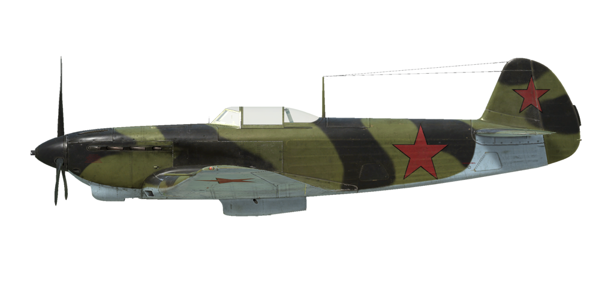

# Yak-9 Brh.1  
  
  
  
## Beschreibung  
  
Überziehgeschwindigkeit in Flugkonfiguration: 152..160 km/h  
Überziehgeschwindigkeit in Landekonfiguration: 136..141 km/h  
Höchstzulässige Geschwindigkeit im Sturzflug: 750 km/h  
Bruchlastvielfache: 10.5 G  
Kritischer Anstellwinkel in Flugkonfiguration: 18 °  
Kritischer Anstellwinkel in Landekonfiguration: 16 °  
  
Höchstgeschwindigkeit in Bodennähe, Nennleistung, 2550 U/min: 537 km/h  
Höchstgeschwindigkeit in Bodennähe, Nennleistung, 2700 U/min: 529 km/h  
Höchstgeschwindigkeit in 1700 m Höhe, Nennleistung, 2700 U/min: 563 km/h  
Höchstgeschwindigkeit in 3800 m Höhe, Nennleistung, 2700 U/min: 594 km/h  
  
Dienstgipfelhöhe: 10500 m  
Steigleistung in Bodennähe: 18.5 m/s  
Steigleistung in 3000 m Höhe: 15.8 m/s  
Steigleistung in 6000 m Höhe: 9.0 m/s  
  
Maximale Wendegeschwindigkeit in Bodennähe: 17.0 s (270 km/h IAS).  
Maximale Wendegeschwindigkeit in 3000 m Höhe: 22.5 s (285 km/h IAS).  
  
Reichweite in 5000 m: 1.7 h, bei 350 km/h IAS.  
  
Startgeschwindigkeit: 160..190 km/h  
Anfluggeschwindigkeit: 195..205 km/h  
Landegeschwindigkeit: 135..145 km/h  
Sinkflugpfad: 12 °  
  
Anmerkung 1: Die Werte gelten für Normatmosphäre (ISA).  
Anmerkung 2: Flugleistungen varrieren je nach Abfluggewicht.  
Anmerkung 3: Höchstgeschwindigkeiten, Steigleistungen und Wendegeschwindigkeiten gelten für Standard-Fluggewicht.  
Anmerkung 4: Steigraten und Wendegeschwindigkeiten gelten für Nennleistung (2700 U/min).  
  
Triebwerk:  
Baumuster: M-105PF  
Nennleistung (2550 U/min) in Bodennähe: 1240 PS  
Nennleistung (2700 U/min) in Bodennähe: 1210 PS  
Nennleistung (2700 U/min) in 800 m Höhe: 1260 PS  
Nennleistung (2700 U/min) in 2700 m Höhe: 1200 PS  
  
Leistungsstufen:  
Nennleistung (unbegrenzt): 2550/2700 U/min, 1050 mm Hg  
  
Kühlstoffaustrittstemperatur (normal): 70..85 °C  
Kühlstoffaustrittstemperatur (höchstens): 100 °C  
Schmierstoffaustrittstemperatur (normal): 90..100 °C  
Schmierstoffaustrittstemperatur (höchstens): 115 °C  
  
Laderumschalthöhe: 2200 m  
  
Leergewicht: 2254 kg  
Minimalgewicht (keine Munition, 10% Treibstoff): 2549 kg  
Normalgewicht: 2841 kg  
Höchstabfluggewicht: 2858 kg  
Kraftstoffmenge: 324 kg / 440 l  
Nutzlast: 604 kg  
  
Starre Schusswaffenanlage:  
20 mm SchWAK, 120 Schuss, 800 Schuss pro Minute, montiert in Flugzeugnase  
12.7 mm UB, 200 Schuss, 1000 Schuss pro Minute, gesteuert schießend  
  
Länge: 8.5 m  
Spannweite: 10 m  
Flügelfläche: 17.15 m²  
  
Erster Fronteinsatz: November 1942  
  
Eigenschaften:  
- Der Motor hat einen Zweiganglader, welcher manuell auf 2000...2400m m Höhe umgeschaltet werden muss.  
- Die Gemischregelung erfolgt manuell. Es ist erforderlich das Gemisch ab einer Höhe von 3-4 km abzumagern. Das Abmagern des Gemisches reduziert auch den Treibstoffverbrauch während des Fluges.  
- Der Motor besitzt eine automatische Drehzahlregelung, welche die Motordrehzahl je nach Hebelstellung festlegt. Der Regler verstellt automatisch den Anstellwinkel des Propellers um die erforderliche Drehzahl einzuhalten.  
- Die Verstellung der Wasserkühlerund Ölkühlerklappen erfolgt manuell.  
- Das Flugzeug verfügt nur über eine Höhenrudertrimmung.  
- Die Landeklappen sind pneumatisch gesteuert. Die Klappen können nur vollständig ausgefahren werden, ein stufenweises Ausfahren ist nicht möglich. Aufgrund des schwachen Klappenantriebs, werden die Landeklappen bei einer Geschwindigkeit über 220 km/h durch den Luftwiderstand eingefahren. Beachte, dass die Landeklappen bei einer hohen Geschwindigkeit nicht voll ausgefahren werden. Bei einer hohen Geschwindigkeit beim Landeanflug ist es möglich, dass die Klappen direkt vor der Landung noch etwas weiter ausfahren.  
- Das Flugzeug hat eine manuelle Spornradverriegelung. Bei entriegeltem Spornrad ist der Ausschlag auf 90° begrenzt. Das Spornrad sollte bei längerem Geradeausrollen, sowie beim Abflug und bei der Landung verriegelt werden.  
- Das Flugzeug hat differentielle pneumatische Bremsen, die mit einem gemeinsamen Bremshebel betätigt werden. Wenn der Bremshebel gezogen und das Ruderpedal betätigt wird, wird die gegenüberliegende Bremse gelöst und das Flugzeug dreht sich zu der einen oder der anderen Seite.  
- Das Flugzeug hat Tankanzeigen auf dem linken und rechten Flügel außerhalb des Cockpits.  
- Aufgrund des starken Luftstroms ist es nicht möglich die Cockpithaube bei hoher Geschwindigkeit zu öffnen oder zu schließen. Die Cockpithaube hat keine Notfallauslösung, weshalb die Geschwindigkeit vor dem Notausstieg reduziert werden muss.  
  
Basic data and recommended positions of the aircraft controls:  
1. Starting the engine:  
	- recommended position of the mixture control lever: 100%  
	- recommended position of the radiators control handles: close  
	- recommended position of the prop pitch control handle: 100%  
	- recommended position of the throttle lever: 5%  
	- before taxiing, you must unlock the tailwheel  
  
2. Recommended mixture control lever positions for various flight modes:  
	- When running the engine at low throttle near the ground, the mixture control lever should be in the position of about 50%.  
	- When the engine is running at full throttle near the ground, the mixture control lever should be in the 75-80% position.  
	- As you gain altitude, the altitude corrector closes. At 8-9 km altitude, the altitude corrector closes to 0%.  
  
3.1 Recommended positions of the oil radiator control handle for various flight modes:  
	- takeoff: open 100%  
	- climb: open 100%  
	- cruise flight: open 30%  
	- combat: open 100%  
  
3.2 Recommended positions of the water radiator control handle for various flight modes:  
	- takeoff: open 100%  
	- climb: open 100%  
	- cruise flight: open 40%  
	- combat: open 80%  
  
4. Approximate fuel consumption at 2000 m altitude:  
	- Cruise engine mode: 7.5 l/min  
  
## Änderungen  
### Scheinwerfer  
  
Landescheinwerfer für Nachtflüge  
Zusätzliches Gewicht: 2 kg  
Geschwindigkeitsverlust: 0 km/h  
### Rückspiegel  
  
Rückspiegel  
Zusätzliches Gewicht: 1 kg  
Geschwindigkeitsverlust: 0 km/h  
### PBP-1A Reflexvisier  
  
PBP-1A Reflexvisier  
Zusätzliches Gewicht: 0.5 kg  
Geschwindigkeitsverlust: 0 km/h  
  
### RPK-10  
  
Rahmenantennen-Funkkompass zur Navigation über Radiosignalquellen  
Zusätzliches Gewicht: 10 kg  
Geschwindigkeitsverlust: 0 km/h  
