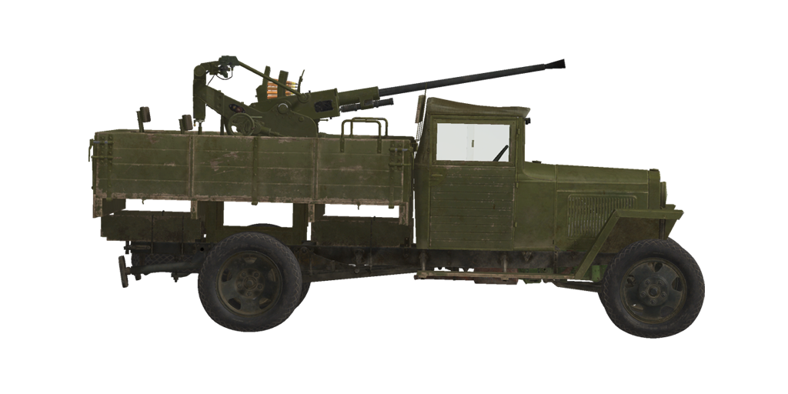

# GAZ-MM 72-K

## Description

GAZ-MM truck made at the Molotov automobile factory in Gorky in 1943 with 25 mm 72-K automatic anti-air gun installed on the special wooden platform. This truck was an improved model of GAZ-AA with more powerful engine, better steering mechanism and reinforced suspension.

The development of the 25 mm automatic regimental AA gun began at the Kalinin factory in Leningrad in 1939. It was accepted into service in 1940 and its mass production begun in 1941. However, the production of towed platforms for these guns was problematic, so 72-K guns were installed on armoured train platforms, three-axle trucks GAZ-AAA and then on two-axle GAZ-MM ones.

GAZ-MM trucks were substantially reworked for 72-K installation, the additions included:
- The special wooden platform with the gun support in the middle;
- Side flaps that created additional working space when opened (they could be lowered only to the horizontal position);
- Manually extendable rear supports for additional vehicle stability when firing;
- Ammunition crates at the platform corners containing 5 clips each;
- The barrel support arm on the forward fixed platform wall.

<b><u>Unladen weight:</u></b> ~2880 kg.
Length: 5.1 m.
Width: 2.0 m.
Height: 2.5 m.
Clearance: 200 mm.

Engine: GAZ-MM, petrol.
Maximum power: 50 HP at 2800 RPM.
Maximum RPM: 3000 RPM.
4 speed gearbox.

<b><u>Maximum road speed:</u></b>
1st: 11.5 kph.
2nd: 23.7 kph.
3rd: 43.4 kph.
4th: 65.0 kph.
Reverse: 9.4 kph.

<b><u>Maximum offroad speed:</u></b> 20 kph.

<b><u>Fluids:</u></b>
Internal fuel tanks capacity: 90 l.
Engine oil system capacity: 5 l.
Engine coolant: 12 l. of water
Endurance range: 440 km.
Maximum oil consumption: 1 l/h.

<b><u>Chassis:</u></b>
Rear-drive two axle truck with special wooden platform installed.
Dual rear wheels are equipped with drum brakes, forward steering wheels are single.
The truck frame is made of steel, the driver\s cabin is composite (wood and metal) with fabric roof, engine hood is metallic.

<b><u>Optional armour shield:</u></b>
5 mm rolled armour.

<b><u>Main gun:</u></b> rifled, 25 mm 72-K.
Barrel length: 67.3.
Elevation: +85°..-10°.
Ammo: up to 147 rounds (21 clips, 7 rounds per clip).
Rate of fire: 240 rounds per minute.
Turret drive: mechanical, 9 seconds per rotation.

<b><u>Ammunition: </u></b>
BR-132 armour piercing solid (AP): 286 g, 900 m/s, 33 mm at 500 m.
OZR-132 high explosive (HE): 288 g, 910 m/s, 13 g explosives.

<b><u>Gunsights:</u></b>
K8-T collimator gunsight with automatic correction process.
Reserve iron sights.

## Modifications


### Armour Piercing Shells

BR-132

Solid armour piercing shells without explosive filling.
Good against spaced armour plates, but cause less damage inside a target than more advanced APHE.

Mass: 286 g.

When fired from a 72-K gun:
Muzzle velocity 900 m/s, armour penetration at point blank range 44 mm.
500 m: armour penetration 33 mm, velocity 806 m/s, drop -1.8 m.
1000 m: armour penetration 25 mm, velocity 528 m/s, drop -8.3 m.
2000 m: armour penetration 13 mm, velocity 380 m/s, drop -46.4 m.

### Gun shield (early)

5 mm armored plate for protecting the gun crew from shell fragments and regular (not AP) bullets. The early variant had a simple rectangular form.
The shield has an additional window that should be opened when firing at low angles.

### Gun shield

5 mm armored plate for protecting the gun crew from shell fragments and regular (not AP) bullets. The late variant had a complex form.
The shield has an additional window that should be opened when firing at low angles.

### Remove gunsight cover

Removing the protective cover of the K8-T collimator sight gives the gunner a slightly wider field of view.


### High-Explosive Shells

OZR-132

Good against soft, unarmoured or lightly armoured targets.

Mass 288 g, explosives mass 13 g.
Self-destroying (they explode after 5 seconds at roughly 2700 m range).
Direct hit armour penetration 4 mm, effective damage distance for light vehicles 1 m.

When fired from a 72-K gun:
Muzzle velocity: 910 m/s.
500 m: velocity 753 m/s, drop -1.8 m.
1000 m: velocity 623 m/s, drop -8.1 m.
2000 m: velocity 436 m/s, drop -42.4 m.
