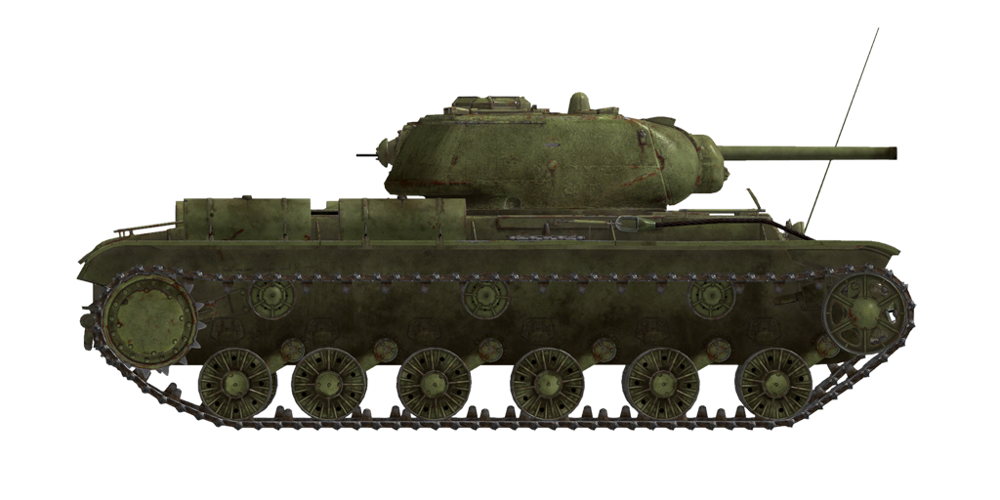

# KV-1S ChTZ（1943型）

## 描述

该型坦克由车里雅宾斯克坦克厂设计局在1942年夏季设计。1942年末在顿河和沃罗涅日方面军中首次参加战斗。

该坦克设计基于其前身KV-1重型坦克。由于KV-1较低的机动性和可靠性，KV-1s（“s”的意思是“skorostnoy”-快速）被设计以减少的装甲防护为代价换取更好的可靠性和机动性。

它的主炮是主要缺点——使用从KV-1上继承的76mmZiS-5坦克炮。由于装甲被削弱，使得坦克防护几乎等同于被广泛使用的T-34/76。

自1942年7月至1943年8月，共生产1083辆KV-1s坦克。

<b><u>空载重量：</u></b> 43350 kg
长度：6.9m
宽度：3.3m
高度：2.6m
间隙：450 mm

发动机：哈尔科夫V-2型（В-2К），柴油
最大功率：600 HP（2000 RPM）
最大转速：2150 RPM
带2级分频器的4档变速箱。

<b><u>最高行车速度 ：</u></b>
倒挡1：4.5 km/h
倒挡2：6.6 km/h
倒挡3：9.3 km/h
倒挡4：12.9 km/h
前进挡1：16.0 km/h
前进挡2：23.1 km/h
前进挡3：33.0 km/h
前进挡4：45.4 km/h
低速倒挡：5.0 km/h
高速倒档：17.9 km/h

<b><u>最大越野速度 ：</u></b> 24 km/h

<b><u>流体：</u></b>
内部油箱容量：600 L
机油系统容量：100 L
夏季发动机冷却液：150L水
冬季发动机冷却液：150L含67%25乙二醇
续航范围：200 km
最大油耗：11 L/h

<b><u>车体装甲：</u></b>
上前：75mm轧制装甲
中前：50mm轧制装甲
前下：60mm轧制装甲
侧面：60mm轧制装甲
后面：60mm轧制装甲
首上：40mm轧制装甲
后车顶：30mm轧制装甲
底部：30mm轧制装甲

<b><u>炮塔装甲：</u></b>
前面：82mm铸造装甲
侧面：82mm铸造装甲
后面：82mm铸造装甲
顶盖：30mm轧制装甲
炮塔：60mm铸造装甲
炮盾：70~82mm铸造装甲

<b><u>主炮：</u></b> 线膛炮，76.2mm Zis-5坦克炮。
炮管长度：41.6
俯仰角：+12°~-5°
弹药：最多114发
有效射速：8 发/分
炮塔驱动：电动，每圈30s

<b><u>弹药：</u></b>
BR-350B 穿甲榴弹（APHE）：弹头重量6.5 kg，炮口初速660 m/s，500m距离上最大穿深72 mm
BR-350BSP 穿甲弹（AP）：弹头重量6.6 kg，炮口初速660 m/s，500m距离上最大穿深73 mm
BR-354P 硬芯穿甲弹（APCR）：弹头重量3.02 kg，炮口初速950 m/s，最大穿深129 mm
OF-350 高爆弹（HE) 弹头质量：6.2kg 初速：680m/s 装药量：710g

<b><u>机枪：</u></b>7.62mm捷格加廖夫，DT轻机枪
子弹质量：9.8 g
炮口初速：840 m/s
100m处穿甲能力：11 mm
射速：600 发/分
同轴机枪：22个弹匣，每个弹匣63发（1386发）
航向机枪：+-15°/+15°~-5°，21个弹匣，每个弹匣63发（1323发）
后射机枪：+-15°/ +-12°，6个弹匣，每个弹匣63发（378发）

<b><u>Gunsights:</u></b>
TMFD-7 gunner scope-sight, field of view 15°.
PT4-7 gunner panoramic periscopic sight, field of view 26°.

<b><u>Radio equipment:</u></b>
VHF 9-RM transceiver.
4 intercom terminals.

## 修改

### 穿甲弹

BR-350BSP

没有炸药装填的实心穿甲弹
对抗间隙装甲板效果好，但是比更先进的穿甲榴弹（APHE）对目标内部造成的伤害少。

质量: 6.6 kg

当从F-34/ZiS-5火炮发射时：
炮口初速：660 m/s，近距离装甲穿深 87 mm
500m时：装甲穿深 73mm，速度 585 m/s，下坠高度 3.2m
1000m时：装甲穿深 62mm，速度 524 m/s，下坠高度 13.6m

### 穿甲榴弹

BR-350B

炮弹上装有爆炸弹头。
对抗装甲目标效果好。击穿时对目标内部造成比穿甲弹（AP）更大伤害，但是榴弹（HE）装药可能过早引爆（比如用于对抗间隙装甲板时）

质量 6.5 kg，炸药质量 119 g

当从F-34/ZiS-5火炮发射时：
炮口初速：660 m/s，近距离装甲穿深 86 mm
500m时：装甲穿深 72mm，速度 584 m/s，下坠高度 3.2m
1000m时：装甲穿深 61mm，速度 522 m/s，下坠高度 13.6m

### Removed Fuel Tank

The external rear-mounted fuel tank was commonly removed on the Eastern front.

### 榴弹

OF-350

对抗软目标、无装甲和轻装甲目标效果好。

质量 6.2 kg，炸药质量 710 g
直接命中装甲穿深 20mm，对轻型车辆有效杀伤距离3m

当从F-34/ZiS-5火炮发射时：
炮口初速：680 m/s
500m时：速度 ：616 m/s，下坠高度 3.0m
1000m时：速度 ：558 m/s，下坠高度 12.5m
2000m时：速度 ：468 m/s，下坠高度 56.7m

### 次口径穿甲弹

BR-354P

装有次口径穿甲弹芯的炮弹

在近距离对抗重装甲目标效果好：比普通炮弹轻得多，拥有高得多的炮口初速和近距离穿深。
但是，由于质量较低，它们的速度 会随着距离的增加而迅速减小，并且在距离较远的情况下，其速度 比普通弹药还要差。

弹芯被像是线轴一样的弹托固定在桶里。在减小炮弹质量以增加炮口初速：的同时，由于空气阻力其减速更快。

质量：3.02 kg，弹芯口径28 mm

当从F-34/ZiS-5火炮发射时：
炮口初速：950 m/s，近距离装甲穿深 129 mm
500m时：装甲穿深 90mm，速度 741 m/s，下坠高度 1.7m
1000m时：装甲穿深 60mm，速度 558 m/s，下坠高度 8.0m
2000m时：装甲穿深 24mm，速度 295 m/s，下坠高度 53.3m