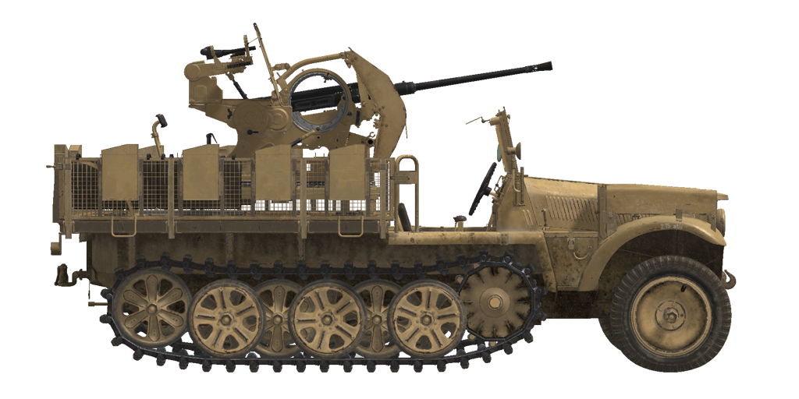

&name=Sd.Kfz.10/5

## 描述

自 1939 年开始，Demag公司生产的众多 Sd.Kfz.10 半履带车改装型之一，该改装型作为机动的 Flak 38 防空炮平台。

这种全金属整体式半履带车由带传动装置的双差速履带底盘（前轮胎无动力）推动，并有一个安装高射炮的定制金属平台。

20 毫米 Flak 38 高射炮是早期 Flak 30 高射炮的改进型，具有双倍的射速和改进的横向和垂直速度瞄准系统，于 1938 年开始生产。

<b><u>空重：</u></b> ~4900 kg.
长：4.8 m。
宽：2.4 m。
高：2.4 m。
底盘高：310 mm。

发动机：Maybach HL42 TRKM，汽油。
最大功率：2800 RPM时100 HP。
最大转速：3000 RPM。
7速变速箱。

<b><u>最大公路时速：</u></b>
1挡：5.9 kph。
2挡：9.6 kph。
3挡：13.9 kph。
4挡：21.4 kph。
5挡：33.2 kph。
6挡：51.4 kph。
7挡：69.6 kph。
1倒车：5.9 kph。
2倒车：9.6 kph。
3倒车：13.9 kph。

<b><u>最大越野时速：</u></b> 25 kph.

<b><u>流体：</u></b>
内部油箱：90 l。
滑油：12 l。
冷却液：水18 l。
续航：260 km。
最大油耗：1 l/h。

<b><u>可选防盾：</u></b>
6 mm轧制装甲。

<b><u>主炮：</u></b>20 mm Flak 38线膛炮。
炮管长度：65。
仰角：+85°至-12°。
备弹：最多280发。
最大射速：每分钟450发。
炮塔旋转：机械式，每秒最大6度。

<b><u>弹药：</u></b>
2 cm Pzgr. L\spur穿甲弹：重148g，初速780m/s，500米处穿深33mm。
2 cm Spgr.Patr.高爆弹：重115g，初速880m/s，6g装药。

<b><u>瞄具：</u></b>
带遮阳板的38型机械式防空炮瞄准具。
用于攻击地面目标的 ZF 3x8 望远镜瞄准具。
备用机械式瞄具。

## 修改
&name=穿甲弹

2 cm Pzgr. Lspur

没有炸药装填的实心穿甲弹
对抗间隙装甲板效果好，但是比更先进的穿甲榴弹（APHE）对目标内部造成的伤害少。

质量: 148 g

当从Flak 38火炮发射时：
炮口初速：780 m/s，近距离装甲穿深 25 mm
500m时：装甲穿深 16mm，速度 561 m/s，下坠高度 2.7m
1000m时：装甲穿深 9mm，速度 393 m/s，下坠高度 13.6m
2000m时：装甲穿深 5mm，速度 264 m/s，下坠高度 96.1m
### 榴弹

2 cm Spgr.Patr.

对抗软目标、无装甲和轻装甲目标效果好。

质量 115 g，炸药质量 6 g
自爆(炮弹将在6秒后，大约2000 m的距离自爆)。
直接命中装甲穿深 3mm，对轻型车辆有效杀伤距离1m

当从Flak 38火炮发射时：
炮口初速：880 m/s
500m时：速度 634 m/s，下坠高度 2.1m
1000m时：速度 373 m/s，下坠高度 11.0m
2000m时：速度 245 m/s，下坠高度 95.8m
&name=移除两个炮盾

炮盾被完全移除以改善视野
### 移除瞄准具护罩

取下瞄准器护罩可以让炮手的视野稍大一些。