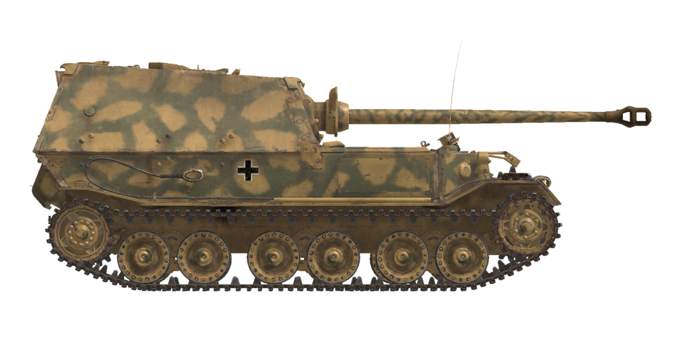

# Sd.Kfz.184

## Описание

Тяжёлая самоходная артиллерийская установка - истребитель танков Sd.Kfz.184 выпуска завода Nibelungenwerke 1943 года. Ранняя версия без командирской башенки и пулеметной установки, известная как "Фердинанд", в отличие от более поздней модификации "Элефант", имевшей данное оборудование. Всего было произведено 91 САУ всех модификаций.

Самоходная установка была разработана на базе обширного задела шасси танков "Tiger (P)", созданного для конкурса на тяжелый танк прорыва, но оказавшегося невостребованным ввиду выбора немецким руководством конкурирующей разработки. Данное шасси имело уникальную электромеханическую трансмиссию, которая при всей своей перспективности имела массу различных недостатков, главным из которых было сильное снижение КПД с ростом скорости, приводившее к малой дальности и скорости движения. Тем не менее, "Фердинанд" обладал мощнейшим бронированием среди серийных боевых машин на момент Курской битвы. Единственным вооружением этого истребителя танков было длинноствольное 88-мм орудие KwK 43, созданное на базе зенитного орудия Flak 41. Его дульная энергия более чем в 1,5 раза превосходила таковую у орудия KwK 39 танка "Тигр". Бронебойные снаряды, выпущенные из него, могли поразить любую серийную бронированную машину противника того времени на дальности вплоть до предельной прицельной 3000м. У самоходных  установок ранних серий были серьёзные проблемы с обзорностью: наводчик использовал перископический прицел с сильно ограниченным сектором горизонтального обзора, а у командира вовсе не было смотровых приборов для обзора при закрытых люках.  Места двух заряжающих были оборудованы перископическими устройствами обзора задней полусферы (в игре они доступны наводчику и командиру).

Во время Курской битвы Sd.Kfz.184 был самой бронированной боевой машиной с самым мощным противотанковым вооружением, которая, однако, ввиду малочисленности и низких показателей подвижности не смогла оказать решающего влияния на исход сражения.

<b><u>Снаряжённая масса:</u></b> 67000 кг.
Длина: 8,2 м.
Ширина: 3,4 м.
Высота: 3,0 м.
Клиренс: 479 мм.

Двигатели: 2 x бензиновый Maybach HL 120TRM
Мощность максимальная: 2 x 300 л.с. при 3000 об/мин.
Предельно допустимые обороты: 3000 об/мин.
Электромеханическая трансмиссия включает в себя 2 тяговых генератора постоянного тока мощностью 250 кВт, каждый из которых приводится от своего двигателя. Генераторы питают общую линию подачи тока на два маршевых электродвигателя - по одному на каждую сторону.
Силовая установка имеет три режима работы:
1-й: страгивание, повороты на малой скорости, движение по крутому склону.
2-й: разгон, движение по сложнопересеченной местности.
3-й: маршевый режим.

<b><u>Максимальная допустимая скорость по шоссе:</u></b> 20 км/ч.

<b><u>Максимальная скорость по пересечённой местности:</u></b> 11 км/ч.

<b><u>Запас хода по шоссе:</u></b> 150 км.

<b><u>Заправка:</u></b>
Топлива во внутренних баках: 950 л.
Масла в системе смазки двигателя: 50 л.
Летний хладагент: 200 л. 40%25 глисантин
Зимний хладагент: 200 л. 60%25 глисантин
Максимальный расход масла: 22 л/ч.

<b><u>Бронирование корпуса:</u></b>
Маска орудия: 100мм литая + 30мм катаный экран.
Лоб рубки: 100 мм + 100 мм катаная.
Лоб корпуса: 100 мм + 100 мм катаная.
Борт верх: 80 мм катаная.
Борт низ: 60 мм катаная.
Корма: 80 мм катаная.
Корма, бронирование выхлопа охлаждения электромоторов: 45 mm.
Крыша рубки: 30 мм катаная.
Крыша корпуса: 30 мм катаная.
Днище спереди: 50 мм катаная.
Днище сзади: 25 мм катаная.
Днище полки: 25 мм катаная.

<b><u>Главное орудие:</u></b> нарезное, 8,8 cm KwK 43 L/71.
Длина ствола: 58.5 калибра.
Углы возвышения: +15°..-7.5°.
Углы наведения: +12°..-12°.
Боезапас: до 50 снарядов.
Практическая скорострельность: 6 выст/мин.
Привод орудия: механический.

<b><u>Применяемые снаряды:</u></b>
8,8 cm Pzgr. 39/1 бронебойный каморный: 10,16 кг, 1000 м/с, 179 мм на 500м.
8,8 cm Pzgr. 40/43 бронебойный подкалиберный: 7,3 кг, 1130 м/с, 266 мм в упор.
8,8 cm Sprgr. Flak 41 осколочно-фугасный: 9,4 кг, 700 м/с, 1 кг ВВ.

<b><u>Прицельное оборудование:</u></b>
Перископический прицел наводчика Sfl ZF 1a, поле зрения 8°.

<b><u>Радиооборудование:</u></b>
УКВ радиостанция Fu 5.
5 терминалов внутренней связи.

## Модификации


### Бронебойные разрывные снаряды

8,8 cm Pzgr. 39

Снаряды, снаряженные бронебойно-разрывной (каморной) боевой частью, срабатывающей с определённой задержкой. Предназначены для поражения бронированных целей на любой дистанции. Наносят больше провреждений внутри цели при пробитии брони, но заряд в некоторых случаях может сработать раньше времени, например, при встрече с разнесённой броней.

Масса снаряда: 10.16 кг, разрывного заряда 64 г.

При выстреле из пушки 8,8 cm KwK 36 L/56:
Начальная скорость: 1000 м/с, бронепробиваемость в упор 192 мм.
Дистанция 500 м: бронепробиваемость по нормали 179 мм, скорость 951 м/с, понижение -1.3 м.
Дистанция 1000 м: бронепробиваемость по нормали 167 мм, скорость: 905 м/с, понижение -5.4 м.
Дистанция 2000 м: бронепробиваемость по нормали 144 мм, скорость: 816 м/с, понижение -22.8 м.

### Осколочно-фугасные снаряды

8,8 cm Sprgr. Flak 41

Осколочно-фугасные снаряды являются основным средством поражения в условиях общевойскового боя, предназначены для поражения любых типов целей на любых дальностях, кроме бронированных.

Масса снаряда: 9,4 кг, разрывного заряда 1 кг.

Бронепробиваемость при близком разрыве 24 мм, радиус эффективного поражения лёгкой техники 3 м.

При выстреле из пушки 8,8 cm KwK 43 L/71:
Начальная скорость: 700 м/с.
Дистанция 500 м: скорость 662 м/с, понижение -2,7 м.
Дистанция 1000 м: скорость: 625 м/с, понижение -11,1 м.
Дистанция 2000 м: скорость: 556 м/с, понижение -47,4 м.

### Подкалиберные бронебойные снаряды

8,8 cm Pzgr. 40/43

Снаряды, снаряженные подкалиберной бронебойной боевой частью. Предназначены для поражения тяжело бронированных целей на малой дистанции. Недостатком является локализованное заброневое воздействие, в основном ограниченное линией полета снаряда внутри цели.

8,8 cm Pzgr. 40 является подкалиберным снарядом композитного типа - твердосплавный бронебойный сердечник внутри легкосплавной оболочки, имеющей форму калиберного снаряда для обтюрации при движении в канале ствола.

Масса снаряда: 7,3 кг, калибр бронебойного сердечника 37 мм.

При выстреле из пушки 8,8 cm KwK 43 L/71:
Начальная скорость: 1130 м/с, бронепробиваемость в упор 266 мм.
Дистанция 500 м: бронепробиваемость по нормали 237 мм, скорость 1044 м/с, понижение -1,1 м.
Дистанция 1000 м: бронепробиваемость по нормали 212 мм, скорость: 964 м/с, понижение -4,6 м.
Дистанция 2000 м: бронепробиваемость по нормали 168 мм, скорость: 821 м/с, понижение -19,7 м.

### Обратная установка маски

Полевая модификация с установленной задом наперёд маской орудия для облегчения доступа к болтам крепления.
