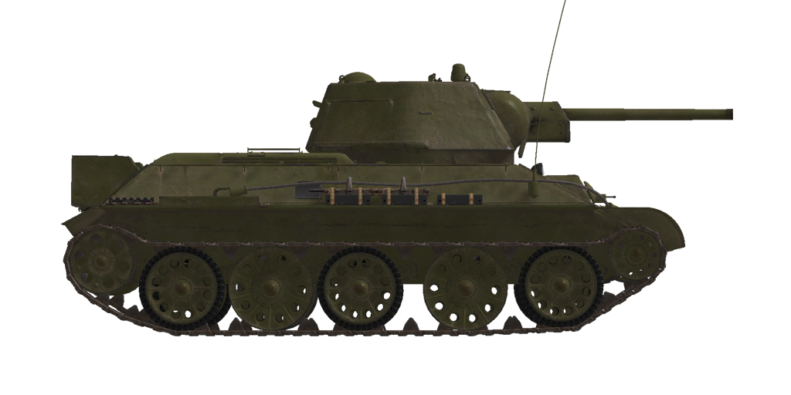

# T-34/76 UTZ (1943)

## Beschreibung

T-34 gebaut von der F.E. Dzerzhinsky Ural Panzerfabrik #183 (UTZ) im Frühjahr 1943. Diese Panzer hatten ausgeprägte sechseckig gegossene Türme, Mischguss (mit innenliegenden Dämpfern) und gummierten Rädern sowie externe Kraftstofftanks am Heck. Zur besseren Dämpfung wurden gummierte Räder eingeführt, die jedoch aufgrund des Gummimangels in der UdSSR mit älteren Typen von Rädern gemischt wurden.

Die Panzerkonstruktion wurde vereinfacht, indem die Anzahl der verschiedenen Arten von Panzerplatten reduziert wurde, so dass die Seiten-, Heck-, Boden-, Dach- und Bodenplatten über den Ketten die Panzerdicke erhöhten - 40 mm Panzerplatten wurden durch 45 mm und 13-16 mm Platten durch 20 mm ersetzt. Der neue Gussturm war je nach Trefferwinkel 5-11% stabiler.

Darüber hinaus wurden die in dieser Zeit gebauten Panzer in der Regel mit dem neuen 5-Gang-Getriebe ausgestattet, um die Beschleunigung und die Kapazität im Gelände zu erhöhen. Die Munition der Hauptkanone wurde auf 100 Schuss erhöht.

<b><u>Leergewicht:</u></b> ~30000 kg
Länge: 6,6 m
Breite: 3,0 m
Höhe: 2,5 m
Bodenfreiheit: 400 mm

Motor: V-2, Diesel
Maximale Leistung: 500 PS bei 1800 U/min
Maximale Drehzahl: 1900 U/min
Getriebe: 5-Gang-Schaltung

<b><u>Höchstgeschwindigkeit auf Straße:</u></b>
1. Gang: 7,4 km/h
2. Gang: 15,9 km/h
3. Gang: 22,4 km/h
4. Gang: 34,1 km/h
5. Gang: 54,0 km/h
Rückwärtsgang: 8,4 km/h

<b><u>Höchstgeschwindigkeit im Gelände:</u></b> 31 km/h

<b><u>Betriebsstoffe:</u></b>
Interne Tankkapazität: 460 l
Motorölmenge: 80 l
Sommer-Kühlmittel: 95 l Wasser
Winter-Kühlmittel: 95 l 50% Ethylenglycol
Reichweite: 300 km
Maximaler Ölverbrauch: 9 l/h

<b><u>Panzerung der Wanne:</u></b>
Front: 45 mm gewalzter Panzerstahl
Seiten: 45 mm gewalzter Panzerstahl
Heck: 45 mm gewalzter Panzerstahl
Wannendach: 20 mm gewalzter Panzerstahl
Boden: 20 mm gewalzter Panzerstahl
Boden über den Ketten: 20 mm gewalzter Panzerstahl

<b><u>Turmpanzerung:</u></b>
Front: 56 mm Gussstahl
Seiten: 56 mm Gussstahl
Rückseite: 56 mm Gussstahl
Turmdach: 56 mm Gussstahl
Kanonenblende: 45 mm gewalzter Panzerstahl

<b><u>Hauptkanone:</u></b> Gezogener Lauf, 76,2 mm F-34
Lauflänge: 41,6
Höhenrichtbereich: -5° bis +25°
Munition: Bis zu 100 Granaten
Mögliche Feuerrate: 8 Schuss pro Minute
Turmantrieb: Elektrisch, 14 Sekunden für eine volle Umdrehung

<b><u>Munition:</u></b>
BR-350B Panzersprenggranate (APHE): 6,5 kg, 660 m/s, 72 mm auf 500 m
BR-350BSP Panzergranate (AP): 6,6 kg, 660 m/s, 73 mm auf 500 m
BR-354P Hartkerngranate (APCR): 3,02 kg, 950 m/s, 129 mm auf kürzeste Entfernung
OF-350 Sprenggranate (HE): 6,2 kg, 680 m/s, 710 g Sprengstoff

<b><u>Maschinengewehre:</u></b> 7,62 mm Degtyarev DT
Geschossgewicht: 9,8 g
Mündungsgeschwindigkeit: 840 m/s
Durchschlagsleistung auf 100 m: 11 mm
Feuerrate: 600 Schuss pro Minute
Koaxial-MG: 29 Magazine, 63 Schuss pro Magazin (1827 Schuss)
Bug-MG: +-12°/+16°..-6°, 23 Magazine, 63 Schuss pro Magazin (1449 Schuss)

<b><u>Gunsights:</u></b>
TMFD-7 gunner scope-sight, field of view 15°.
PT4-7 gunner panoramic periscopic sight, field of view 26°.

<b><u>Radio equipment:</u></b>
VHF 9-RM transceiver.
3 intercom terminals.

## Änderungen

### Panzerbrechende Granaten

BR-350BSP

Panzerbrechende Hartkerngranaten ohne explosive Ladung. Geeignet gegen Panzerplatten mit Zwischenraum. Erzeugen aber weniger Schaden im Innern des Ziels als fortschrittlichere Panzersprenggranaten.

Gewicht: 6,6 kg

Abgefeuert aus einer F-34 / ZiS-5 Kanone:
Mündungsgeschwindigkeit: 660 m/s 
Durchschlagsleistung aus kürzester Entfernung: 87 mm
500 m: Durchschlagsleistung 73 mm, Geschwindigkeit 585 m/s, Fall -3,2 m
1000 m: Durchschlagsleistung 62 mm, Geschwindigkeit 524 m/s, Fall -13,6 m

### Panzersprenggranaten

BR-350B

Granaten mit einer explosiven Ladung im Sprengkopf.

Geeignet gegen gepanzerte Ziele. Im Geschossabfalle der Penetration richten sie mehr Schaden im Innern des Ziels an als Hartkerngeschosse, aber die hochexplosive Ladung kann bereits zu früh explodieren (z.B. bei Panzerplatten mit Zwischenraum).

Gewicht 6,5 kg, Sprengstoffgewicht 119 g

Abgefeuert aus einer F-34 / ZiS-5 Kanone:
Mündungsgeschwindigkeit: 660 m/s
Durchschlagsleistung aus kürzester Entfernung: 86 mm
500 m: Durchschlagsleistung 72 mm, Geschwindigkeit 584 m/s, Fall -3,2 m
1000 m: Durchschlagsleistung 61 mm, Geschwindigkeit 522 m/s, Fall -13,6 m

### Removed Fuel Tanks

### Sprenggranaten

OF-350

Geeignet gegen weiche, ungepanzerte oder leicht gepanzerte Ziele.

Gewicht 6,2 kg, Sprengstoffgewicht 710 g

Durchschlagsleistung bei Direkttreffer 20 mm, effektive Schadensdistanz für leichte Fahrzeuge 3 m

Abgefeuert aus einer F-34 / ZiS-5 Kanone:
Mündungsgeschwindigkeit: 680 m/s
500 m: Geschwindigkeit 616 m/s, Geschossabfall -3,0 m
1000 m: Geschwindigkeit 558 m/s, Geschossabfall -12,5 m

### Hartkerngranaten

BR-354P

Granaten mit unterkalibrigen panzerbrechenden Projektilen.

Gut gegen stark gepanzerte Ziele auf kurze Distanzen: Sie sind viel leichter als gewöhnliche Granaten und haben eine viel höhere Mündungsgeschwindigkeit und Durchschlagsleistung auf kurze Distanzen. Wegen der geringeren Masse nimmt ihre Geschwindigkeit jedoch mit der Entfernung schnell ab und sie sind schlechter als gewöhnliche Granaten auf größeren Entfernungen.

Der Eindringkörper wird von einem Treibkäfig, der wie eine Spule ausschaut, im Lauf gehalten. Während die Masse des Geschosses für eine erhöhte Mündungsgeschwindigkeit reduziert wird, verliert sie durch den Luftwiderstand dadurch noch schneller an Geschwindigkeit.

Gewicht: 3,02 kg, Durchmesser des Eindringkörpers 28 mm

Abgefeuert aus einer F-34 / ZiS-5 Kanone:
Mündungsgeschwindigkeit: 950 m/s 
Durchschlagsleistung aus kürzester Entfernung: 129 mm
500 m: Durchschlagsleistung 90 mm, Geschwindigkeit 741 m/s, Fall -1,7 m
1000 m: Durchschlagsleistung 60 mm, Geschwindigkeit 558 m/s, Fall -8,0 m

### 6 Stahlräder

Zwei zusätzliche innere gefederte Stahlräder (6 total) aufgrund der Knappheit an Gummi

### 8 Stahlräder

Vier zusätzliche innere gefederte Stahlräder (8 total) aufgrund der Knappheit an Gummi
