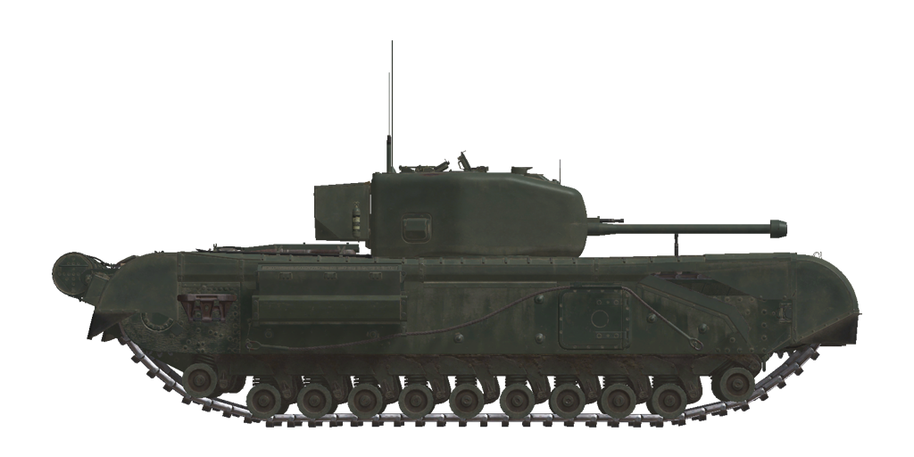

# Churchill IV  
  
  
  
## Descripción  
  
El tanque Churchill pertenecía a la clase de tanques de infantería desarrollados por el ejército británico. Según esta clasificación, el Churchill tenía poca movilidad y no contaba con el armamento más potente, pero estaba protegido con un potente blindaje, por lo que pertenecía a la clase de tanques pesados. El tanque se fabricó en Inglaterra durante los años de la guerra y fue uno de los vehículos blindados más numerosos de las fuerzas armadas de Su Majestad. El modelo que aparece en la simulación fue producido por la fábrica Leyland.  
  
El primer lote de carros Churchill incluidos en el marco del programa «<i>Lend-Lease</i>» se entregó a la URSS en el infame convoy ártico PQ-17. En total, se enviaron 301 tanques Churchill a la URSS durante los años de guerra, de los cuales algo menos de 50 vehículos se perdieron durante el transporte y 253 tanques fueron entregados al Ejército Rojo durante 1942 y 1943. El Churchill fue el único modelo de carro de combate pesado suministrado a la URSS por los Aliados.  
  
Los Churchill participaron en las batallas de la cara sur del saliente de Kursk en el verano de 1943. Allí, como parte del 2.º Cuerpo de Blindados de Guardias «Tatsinsky», lucharon contra las Divisiones <i>Panzer</i> alemanas Totenkopf y Das Reich. Al mismo tiempo, en la misma sección del frente, los Churchill sirvieron en el 5.º Cuerpo de Blindados de Guardias de Stalingrado y en el 18.º y 2.º Cuerpos de Blindados. Cada uno de estos Cuerpos contaba con 21 tanques Churchill, un total de 84 carros, un tercio del total de estos carros de combate suministrados en régimen de «<i>Lend-Lease</i>» durante la guerra.  
  
Las opiniones sobre el carro en el Ejército Rojo fueron contradictorias: junto con un buen blindaje, la eficacia de penetración del cañón, una estación de radio fiable y unos dispositivos de observación adecuados, tenía muchos problemas de fiabilidad, una movilidad insuficiente y la ausencia de proyectiles explosivos de fragmentación entre la munición disponible.  
  
El armamento principal del tanque era el cañón Ordnance Quick-Firing (QF) de 6 libras y 7 cwt. Se llegaron a instalar en el carro dos versiones de este cañón: Mk.III con una longitud de cañón de 43 calibres y Mk.V con una longitud de cañón de 50 calibres (la simulación representa la variante Mk.V). El único tipo de proyectil para este cañón presentaba una penetración de blindaje bastante alta. Sin embargo, era completamente sólido, es decir, no contaba con una carga explosiva, lo que reducía significativamente su efecto pospenetración. Además, la falta de proyectiles explosivos de fragmentación entre la munición disponible reducía su versatilidad.  
  
Desde un punto de vista técnico, el montaje de las orugas del Churchill era bastante peculiar y recordaba en cierto modo a los pioneros carros de combate británicos con forma de diamante de la Primera Guerra Mundial, con las orugas sobresaliendo por encima del casco. Esto permitió incluir escotillas adicionales en los laterales de la base del tanque que facilitaban abandonar el vehículo en caso de emergencia. Cada una de las 11 ruedas instaladas en cada lado del tanque tenía una suspensión de muelle individual. Sin embargo, sólo 6 de las 11 estaban bajo carga en posición normal. El blindaje del casco era complejo y constaba de muchas piezas de blindaje de acero laminado ensambladas en el bastidor con remaches y pernos. La característica clave del Churchill IV, que lo distingue de las modificaciones anteriores, era la torreta hecha de una sola pieza de fundición, con una caja de piezas de repuesto de paredes finas unida a su parte trasera. El mantelete del cañón presentaba un original diseño «interno», sin piezas que sobresalieran de la torreta.  
  
El tanque también estaba equipado con un mortero de 2 pulgadas fijo en el techo de la torreta, en el lado del cargador. Normalmente, se destinaba al despliegue de pantallas de humo a distancia con granadas de humo de 2 pulgadas disparadas a una distancia de unos 140 metros en la misma dirección que la del cañón del carro. En la realidad del Frente Oriental, el Ejército Rojo utilizaba a menudo granadas explosivas de 50 mm de producción soviética como munición para estos morteros de 2 pulgadas. Además del mortero, el tanque estaba equipado con dos generadores de humo montados en la parte trasera. Permitían al tanque desplegar una cortina de humo durante un minuto y medio.  
  
<b><u>Peso vacío:</u></b> 40500 kg  
Longitud: 7,6 m  
Anchura: 3,3 m  
Altura: 2,5 m  
Distancia al suelo: 484 mm  
  
Motor: Bedford «Twin-Six» de 12 cilindros, gasolina  
Potencia máxima: 350 CV a 2200 rpm  
Máximas rpm: 2550 rpm  
Cambio de 4 marchas  
  
<b><u>Velocidad máxima en carretera:</u></b>  
1.ª: 2,0 mph (3,3 km/h)  
2.ª: 5,7 mph (9,1 km/h)  
3.ª: 10,9 mph (17,5 km/h)  
4.ª: 18,2 mph (29,3 km/h)  
Marcha atrás: 1,1 mph (1,7 km/h)  
  
<b><u>Velocidad máxima en otros terrenos:</u></b> 11 mph (18 km/h)  
  
<b><u>Líquidos:</u></b>  
Capacidad depósitos de combustible internos: 682 l  
Capacidad aceite lubricante del motor: 25 l  
Refrigerante del motor en verano: 100 l de agura  
Refrigerante del motor en invierno: 100 l, 43% alcohol, 15% glycerol  
Autonomía: 210 km  
Consumo de aceite máximo: 1,3 l/h  
  
<b><u>Blindaje del casco:</u></b>  
Frontal superior: 92 mm laminado  
Frontal inferior: 83 mm laminado  
Laterales: 70 mm laminado  
Trasera: 51 mm laminado  
Techo frontal: 19 mm laminado  
Techo trasera: 16 mm laminado  
Fondo frontal: 19 mm laminado  
Fondo trasera: 16 mm laminado  
  
<b><u>Blindaje de torreta:</u></b>  
Frontal salientes: 89 mm fundición  
Frontal centro: 114 mm fundición  
Laterales: 76 mm fundición  
Trasera: 76 mm fundición  
Techo: 35 mm fundición  
Cúpula: 19 mm fundición  
Mantelete: 89 mm fundición  
  
<b><u>Cañón principal:</u></b> estriado, 6 libras 7 cwt Mk.V de 57 mm  
Longitud del cañón: 50 calibres  
Elevación: +20°..-11°  
Munición: hasta 81 proyectiles  
Cadencia de disparo útil: 12 proyectiles por minuto  
Movimiento torreta: eléctrico, 26 segundos por vuelta  
  
<b><u>Munición del cañón:</u></b>  
6pdr APT perforante sólido (AP): 2,8 kg, 890 m/s, 104 mm a 500 m  
  
<b><u>Ametralladora coaxial y en glacis:</u></b> BESA de 7,92 mm  
Peso de la bala: 11,5 g  
Velocidad de salida: 823 m/s  
Penetración de blindaje a 100 m: 10 mm  
Cadencia de disparo: 850 balas por minuto  
Coaxial: 20 cintas, 225 balas por cinta (4500 balas)  
Glacis: +-17°/+16°..-8°, 15 cintas, 225 balas por cinta (3375 balas)  
  
<b><u>Miras para apuntado del armamento:</u></b>  
Mira telescópica No.39 Mk IV en artillero, campo de visión de 13°  
Mira telescópica No.39 Mk IIs en ametrallador, campo de visión de 21°  
  
<b><u>Equipamiento de radio:</u></b>  
Transmisor-receptor HF/VHF <i>Wireless Set No. 19</i>  
5 intercomunicadores  
  
## Modificaciones  
  
  
### Granadas explosivas de mortero  
  
O-822Sh  
  
Sustitución de 20 de las 30 granadas de humo de mortero por otras explosivas de 50 mm. En el Frente Oriental, las tripulaciones de los carros Churchill disparaban granadas explosivas de 50 mm de fabricación soviética desde el mortero de 2 pulgadas instalado en la torreta, cuyo cometido original era el de poder crear pantallas de humo.  
  
Peso 850 g, peso del explosivo 90 g.  
Penetración de blindaje por  impacto directo 7 mm, efectivo contra infantería a menos de 5 m.  
Distancia de lanzamiento 410 m.  
  
### Proyectiles perforantes sólidos (AP)  
  
6pdr APT  
  
Proyectiles perforantes sólidos, sin carga explosiva en su interior.   
  
Adecuados contra objetivos con planchas de blindaje espaciadas, pero causan menos daños dentro del objetivo que el perforante explosivo (APHE), más avanzado.  
  
Peso 2,8 kg.  
  
Disparado desde un cañón Ordnance Quick-Firing (QF) 6-pounder 7 cwt Mk.V:  
Velocidad de salida 890 m/s, penetración del blindaje a bocajarro 136 mm.  
500 m: penetración del blindaje 104 mm, velocidad 738 m/s, caída -1.8 m.  
1000 m: penetración del blindaje 78 mm, velocidad 602 m/s, caída -8.4 m.  
2000 m: penetración del blindaje 41 mm, velocidad 387 m/s, caída -45.7 m.  
  
  
### Retirada guardabarros frontales  
  
En el Frente Oriental, la sección frontal de los guardabarros de las orugas de los carros de combate Churchill se retiraban a menudo.  
  
### Retirada guardabarros centrales  
  
Variante no muy habitual, con la sección central de los guardabarros de las orugas retirados.  
  
### Retirada de depósito externo  
  
En el Frente Oriental, el depósito de combustible externo instalado en la parte trasera del carro se retiraba con bastante frecuencia.  
