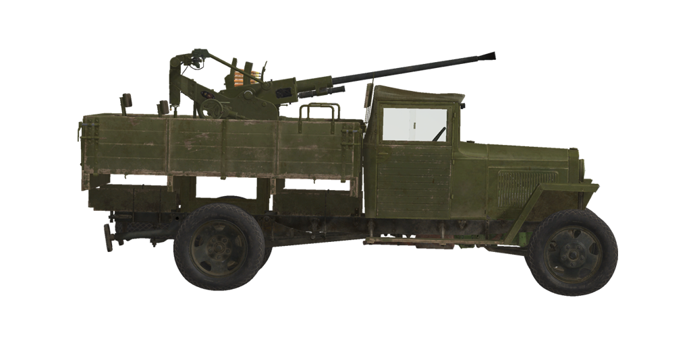

# ГАЗ-ММ 72-К  
  
  
  
## Описание  
  
Грузовой автомобиль ГАЗ-ММ Горьковского автомобильного завода имени Молотова, постройки 1943 года, со специализированной бортовой платформой и установленной на ней зенитной стрелковой установкой на базе 25-мм автоматической пушки 72-К. Данный грузовик является модифицированной версией "Полуторки" ГАЗ-АА с более мощным двигателем, улучшенным рулевым механизмом и усиленной подвеской.  
  
Разработка 25-мм зенитной автоматической пушки полковой противовоздушной обороны началась на ленинградском заводе имени Калинина в 1939 году. В 1940 году она была принята на вооружение, а 1941 году начался серийный выпуск. Однако в процессе серийного выпуска возникли проблемы с производством буксируемых повозок, в результате чего установки 72-К начали устанавливать сначала на платформы бронепоездов, трехосных грузовиков ГАЗ-ААА, а затем и двухосных ГАЗ-ММ.  
  
Для установки пушки 72-К грузовики ГАЗ-ММ дорабатывались. Эти доработки включали в себя:  
- Специализированную деревянную платформу с постаментом пушки посередине;  
- Откидные правый и левый борта платформы, откидывающиеся только до горизонтального состояния и образующие дополнительное рабочее пространство на платформе;  
- Убираемые вручную выдвижные задние опоры для дополнительной фиксации автомобиля в боевом положении;  
- Снарядные ящики по углам платформы, по 5 обойм в каждом;  
- Кронштейн походного положения пушки на переднем неубираемом борту платформы.  
  
<b><u>Снаряжённая масса:</u></b> ~2880 кг.  
Длина: 5,1 м.  
Ширина: 2,0 м.  
Высота: 2,5 м.  
Клиренс: 200 мм.  
  
Двигатель бензиновый ГАЗ-ММ  
Мощность максимальная: 50 л.с. при 2800 об/мин.  
Предельно допустимые обороты: 3000 об/мин.  
Коробка передач 4-ти скоростная.  
  
<b><u>Максимальные скорости по шоссе на передачах:</u></b>  
1-я: 11,5 км/ч.  
2-я: 23,7 км/ч.  
3-я: 43,4 км/ч.  
4-я: 65,0 км/ч.  
Задняя: 9,4 км/ч.  
  
<b><u>Максимальная скорость по пересечённой местности:</u></b> 20 км/ч.  
  
<b><u>Заправка:</u></b>  
Топлива во внутренних баках: 90 л.  
Масла в системе смазки двигателя: 5 л.  
Хладагент: 12 л. воды  
Запас хода по шоссе: 440 км.  
Максимальный расход масла: 1 л/ч.  
  
<b><u>Конструкция шасси:</u></b>  
Заднеприводный двухосный грузовой автомобиль со специализированной деревянной бортовой платформой.  
Задние двускатные колеса оборудованы барабанными тормозными механизмами. Передние колеса односкатные, управляемые.  
Рама стальная клёпаная. Кабина деревянно-металлическая с тканевой крышей, капот металлический.  
  
<b><u>Опциональный бронированный щит орудия:</u></b>  
5 мм катаная броня.  
  
<b><u>Главное орудие:</u></b> нарезное, 25 мм 72-К.  
Длина ствола: 67.3 калибра.  
Углы возвышения: +85°..-10°.  
Боезапас: до 147 снарядов (21 обойма по 7 снарядов).  
Скорострельность: 240 выст/мин.  
Привод турели: механический, 9 секунд на оборот.  
  
<b><u>Применяемые снаряды: </u></b>  
БР-132 бронебойный сплошной: 286 г, 900 м/с, 33 мм на 500м.  
ОЗР-132 осколочно-фугасный: 288 г, 910 м/с, 13 г ВВ.  
  
<b><u>Прицельное оборудование:</u></b>  
Коллиматорный прицел К8-Т с автоматизированным механизмом ввода поправок.  
Резервный прицел открытого типа.  
  
## Модификации  
### Сплошные бронебойные снаряды  
  
БР-132  
  
Сплошные бронебойные снаряды без взрывчатого вещества внутри обладают лучшим действием против разнесённых броневых преград, но имеют локализованное заброневое воздействие, в основном ограниченное линией полета снаряда внутри цели.  
  
Масса снаряда: 286 г.  
  
При выстреле из пушки 72-К:  
Начальная скорость: 900 м/с, бронепробиваемость в упор 44 мм.  
Дистанция 500 м: бронепробиваемость по нормали 33 мм, скорость 806 м/с, понижение -1,8 м.  
Дистанция 1000 м: бронепробиваемость по нормали 25 мм, скорость 528 м/с, понижение -8,3 м.  
Дистанция 2000 м: бронепробиваемость по нормали 13 мм, скорость 380 м/с, понижение -46,4 м.  
### Орудийный щит (ранний вариант)  
  
Дополнительная 5-мм защита расчёта орудия с передней полусферы от осколков и небронебойных пуль. Ранний вариант щита имел простую прямоугольную форму.  
В щите имеется дополнительное окно, которое необходимо открыть для прицеливания на малых углах возвышения.  
### Орудийный щит  
  
Дополнительная 5-мм защита расчёта орудия с передней полусферы от осколков и небронебойных пуль. Поздний вариант щита имел сложную форму.  
В щите имеется дополнительное окно, которое необходимо открыть для прицеливания на малых углах возвышения.  
### Снять кожух прицела  
  
Снятие защитного кожуха коллиматорного прицела К8-Т позволяет улучшить обзорность при стрельбе навскидку.  
### Осколочно-фугасные снаряды  
  
ОЗР-132  
  
Осколочно-фугасные снаряды являются основным средством поражения в условиях общевойскового боя, предназначены для поражения любых типов целей на любых дальностях, кроме бронированных.  
  
Масса снаряда: 288 г, разрывного заряда 13 г.  
Взрыватель снаряда оборудован самоликвидатором, настроенным на подрыв через 5 секунд на расстоянии около 2700 м.  
Бронепробиваемость при близком разрыве 4 мм, радиус эффективного поражения лёгкой техники 1 м.  
  
При выстреле из пушки 72-К:  
Начальная скорость: 910 м/с.  
Дистанция 500 м: скорость 753 м/с, понижение -1,8 м.  
Дистанция 1000 м: скорость 623 м/с, понижение -8,1 м.  
Дистанция 2000 м: скорость 436 м/с, понижение -42,4 м.  
