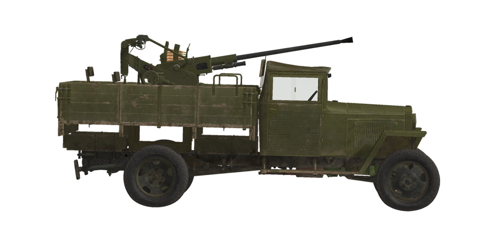

# GAZ-MM 72-K

## Descripción

Camión GAZ-MM fabricado en la Planta de Automóviles Molotov de Gorki (GAZ, <i>Gorkovsky Avtomobilny Zavod</i>) en 1943 con cañón automático antiaéreo de 25 mm modelo 72-K instalado en la plataforma especial de madera. Este camión era un modelo mejorado del GAZ-AA con un motor más potente, mejor sistema de dirección y suspensión reforzada.

El desarrollo del cañón automático antiaéreo de 25 mm para regimientos comenzó en la fábrica Kalinin de Leningrado en 1939. Fue aprobado para entrar en servicio en 1940 y su producción en masa comenzó en 1941. Sin embargo, la producción de remolques para estos cañones era problemática, por lo que estos 72-K se instalaban en plataformas  blindadas de trenes, camiones de tres ejes GAZ-AAA y posteriormente en los GAZ-MM de dos ejes.

Los camiones GAZ-MM eran sustancialmente reformados para permitir la instalación del 72-K. Las principales modificaciones eran las siguientes:
    - La plataforma especial de madera y el soporte del cañón en el centro
    - Laterales de la plataforma abatibles (cartolas) que generaban espacio de trabajo adicional cuando se  bajaban (no podían bajar más allá de la posición horizontal)
    - Soportes traseros extensibles manualmente para dar una mayor estabilidad al vehículo al disparar
    - Cajas de munición en las esquinas de la plataforma que contienen 5 proyectiles cada una
    - Brazo de reposo del cañón en el lateral delantero (fijo) de la pataforma

<b><u>Peso vacío:</u></b> ~2880 kg
Longitud: 5,1 m
Anchura: 2,0 m
Altura: 2,5 m
Distancia al suelo: 200 mm

Motor: GAZ-MM, gasolina
Potencia máxima: 50 CV a 2800 rpm
Máximas rpm: 3000 rpm
Cambio de 4 marchas

<b><u>Velocidad máxima en carretera:</u></b>
1.ª: 11,5 km/h
2.ª: 23,7 km/h
3.ª: 43,4 km/h
4.ª: 65,0 km/h
Marcha atrás: 9,4 km/h

<b><u>Velocidad máxima en otros terrenos:</u></b> 20 km/h

<b><u>Líquidos:</u></b>
Capacidad depósitos de combustible internos: 90 l
Capacidad aceite lubricante del motor: 5 l
Refrigerante del motor en verano: 12 l de agua
Autonomía: 440 km
Consumo de aceite máximo: 1 l/h

<b><u>Chasis:</u></b>
Camión de dos ejes de tracción trasera con plataforma especial de madera instalada
Las ruedas traseras son dobles y están equipadas con frenos de tambor; las delanteras, de dirección, son simples
La estructura del camión está fabricada en acero, la cabina del conductor en madera y metal, con techo de tela, y el capó del motor es metálico.

<b><u>Blindaje opcional:</u></b>
Escudo en cañón: 5 mm laminado

<b><u>Cañón principal:</u></b> estriado, 72-K de 25 mm
Longitud del cañón: 67,3
Elevación: +85°..-10°
Munición: hasta 147 proyectiles (21 cargadores, 7 proyectiles por cargador)
Cadencia de disparo: 240 proyectiles por minuto
Movimiento cañón: mecánico, 9 segundos por vuelta

<b><u>Munición del cañón:</u></b>
BR-132 perforante sólido (AP): 286 g, 900 m/s, 33 mm a 500 m
OZR-132 explosivo (HE): 288 g, 910 m/s, 13 g de explosivo

<b><u>Miras para apuntado del armamento:</u></b>
Mira colimadora K8-T con sistema de corrección automática
Miras de hierro de respaldo.

## Modificaciones
### Proyectiles perforantes sólidos (AP)

BR-132

Proyectiles perforantes sólidos, sin carga explosiva en su interior.

Adecuados contra objetivos con planchas de blindaje espaciadas, pero causan menos daños dentro del objetivo que el perforante explosivo (APHE), más avanzado.

Peso 286 g.

Disparado desde un cañón 72-K:
Velocidad de salida 900 m/s, penetración del blindaje a bocajarro 44 mm.
500 m: penetración del blindaje 3 mm, velocidad 806 m/s, caída -1,8 m.
1000 m: penetración del blindaje 25 mm, velocidad 528 m/s, caída -8,3 m.
2000 m: penetración del blindaje 13 mm, velocidad 380 m/s, caída -46,4 m.

### Escudo para el cañón (inicial)

Plancha blindada de 5 mm para proteger a la tripulación del cañón de los fragmentos de proyectiles y de las balas regulares (no AP). La primera variante tenía una forma rectangular simple.
El escudo tiene una ventana adicional que debe abrirse para disparar en ángulos bajos.

### Escudo para el cañón

Plancha blindada de 5 mm para proteger a la tripulación del cañón de los fragmentos de proyectiles y de las balas regulares (no AP). La variante posterior tenía una forma más compleja.
El escudo tiene una ventana adicional que debe abrirse para disparar en ángulos bajos.

### Retirar cubierta de la mira

La retirada de la cubierta de protección de la mira colimadora K8-T proporciona al artillero un ligero aumento del campo de visión.

### Proyectiles explosivos (HE)

OZR-132

Proyectiles de fragmentación con carga altamente explosiva en su interior.

Adecuados contra objetivos no blindados o con blindaje ligero.

Peso 288 g, cantidad explosivo 13 g.
Se autodestruyen (explotan después de 5 segundos a unos 2700 m de distancia).
Penetración de blindaje en impacto directo 4 mm, distancia de daño efectiva para vehículos ligeros 1 m.

Disparado desde un cañón 72-K:
Velocidad de salida 910 m/s.
500 m: velocidad 753 m/s, caída -1,8 m.
1000 m: velocidad 623 m/s, caída -8,1 m.
2000 m: velocidad 436 m/s, caída -42,4 m.
