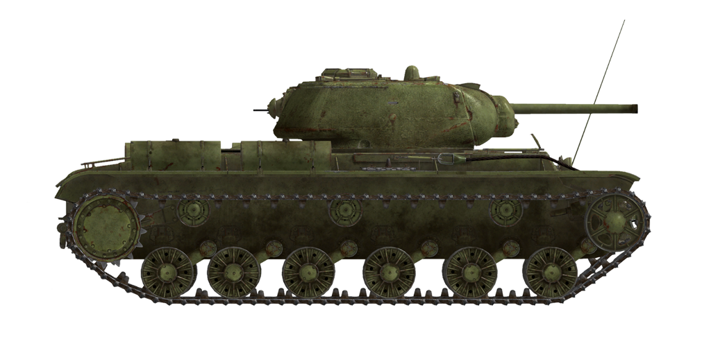

# KV-1s ChTZ (1943)

## Beschreibung

Der Panzer wurde im Sommer 1942 vom Konstruktionsbüro der Tscheljabinsker Panzerfabrik (ChTZ) entworfen. Die erste Kampfhandlung fand Ende 1942 an der Front von Don und Woronesch statt.

Der Panzer basiert auf seinem Vorgänger, dem schweren Panzer KV-1. Wegen seiner geringen Mobilität und Zuverlässigkeit wurde der KV-1s (\s\ bedeutet \skorostnoy\ - schnell) weniger gepanzert, aber mobiler und zuverlässiger konzipiert.

Seine Haupkanone war sein größter Mangel - die 76 mm ZiS-5 Kanone, die er vom KV-1 geerbt hat. Zusammen mit der reduzierten Panzerung machte es den Panzer fast gleichwertig mit dem weiter verbreiteten T-34/76.

Von Juli 1942 bis August 1943 wurden insgesamt 1083 KV-1 Panzer produziert.

<b><u>Leergewicht:</u></b> 43350 kg
Länge: 6,9 m
Breite: 3,3 m
Höhe: 2,6 m
Bodenfreiheit: 450 mm

Motor: В-2К, Diesel
Maximale Leistung: 600 PS bei 2000 U/min
Maximale Drehzahl: 2150 U/min
Getriebe: 4-Gang-Schaltung mit zweistufiger Untersetzung

<b><u>Höchstgeschwindigkeit auf Straße:</u></b>
1. Gang niedrig: 4,5 km/h
2. Gang niedrig: 6,6 km/h
3. Gang niedrig: 9,3 km/h
4. Gang niedrig: 12,9 km/h
1. Gang hoch: 16,0 km/h
2. Gang hoch: 23,1 km/h
3. Gang hoch: 33,0 km/h
4. Gang hoch: 45,4 km/h
Rückwärtsgang niedrig: 5,0 km/h
Rückwärtsgang hoch: 17,9 km/h

<b><u>Höchstgeschwindigkeit im Gelände:</u></b> 24 km/h

<b><u>Betriebsstoffe:</u></b>
Interne Tankkapazität: 600 l
Motorölmenge: 100 l
Sommer-Kühlmittel: 150 l Wasser
Winter-Kühlmittel: 150 l 67% Ethylenglycol
Reichweite: 200 km
Maximaler Ölverbrauch: 11 l/h

<b><u>Panzerung der Wanne:</u></b>
Obere Front: 75 mm gewalzter Panzerstahl
Mittlere Front: 50 mm gewalzter Panzerstahl
Untere Front: 60 mm gewalzter Panzerstahl
Seiten: 60 mm gewalzter Panzerstahl
Heck: 60 mm gewalzter Panzerstahl
Vorderes Wannendach: 40 mm gewalzter Panzerstahl
Hinteres Wannendach: 30 mm gewalzter Panzerstahl
Boden: 30 mm gewalzter Panzerstahl

<b><u>Turmpanzerung:</u></b>
Front: 82 mm Gussstahl
Seiten: 82 mm Gussstahl
Rückseite: 82 mm Gussstahl
Turmdach: 30 mm gewalzter Panzerstahl
Luke: 60 mm Gussstahl
Kanonenblende: 70-82 mm Gussstahl

<b><u>Hauptkanone:</u></b> Gezogener Lauf, 76,2 mm Zis-5
Lauflänge: 41,6
Höhenrichtbereich: -5° bis +12°
Munition: Bis zu 114 Granaten
Mögliche Feuerrate: 8 Schuss pro Minute
Turmantrieb: Elektrisch, 30 Sekunden für eine volle Umdrehung

<b><u>Munition:</u></b>
BR-350B Panzersprenggranate (APHE): 6,5 kg, 660 m/s, 72 mm auf 500 m
BR-350BSP Panzergranate (AP): 6,6 kg, 660 m/s, 73 mm auf 500 m
BR-354P Hartkerngranate (APCR): 3,02 kg, 950 m/s, 129 mm auf kürzeste Entfernung
OF-350 Sprenggranate (HE): 6,2 kg, 680 m/s, 710 g Sprengstoff

<b><u>Maschinengewehre:</u></b> 7,62 mm Degtyarev DT
Geschossgewicht: 9,8 g
Mündungsgeschwindigkeit: 840 m/s
Durchschlagsleistung auf 100 m: 11 mm
Feuerrate: 600 Schuss pro Minute
Koaxial-MG: 22 Magazine, 63 Schuss pro Magazin (1386 Schuss)
Bug-MG: +-15°/+15°..-5°, 21 Magazine, 63 Schuss pro Magazin (1323 Schuss)
Heck-MG: +-15°/+12°, 6 Magazine, 63 Schuss pro Magazin (378 Schuss)

<b><u>Gunsights:</u></b>
TMFD-7 gunner scope-sight, field of view 15°.
PT4-7 gunner panoramic periscopic sight, field of view 26°.

<b><u>Radio equipment:</u></b>
VHF 9-RM transceiver.
4 intercom terminals.

## Änderungen

### Panzerbrechende Granaten

BR-350BSP

Panzerbrechende Hartkerngranaten ohne explosive Ladung. Geeignet gegen Panzerplatten mit Zwischenraum. Erzeugen aber weniger Schaden im Innern des Ziels als fortschrittlichere Panzersprenggranaten.

Gewicht: 6,6 kg

Abgefeuert aus einer F-34 / ZiS-5 Kanone:
Mündungsgeschwindigkeit: 660 m/s 
Durchschlagsleistung aus kürzester Entfernung: 87 mm
500 m: Durchschlagsleistung 73 mm, Geschwindigkeit 585 m/s, Fall -3,2 m
1000 m: Durchschlagsleistung 62 mm, Geschwindigkeit 524 m/s, Fall -13,6 m
2000 m: Durchschlagsleistung 47 mm, Geschwindigkeit 429 m/s, Fall -63,5 m

### Panzersprenggranaten

BR-350B

Granaten mit einer explosiven Ladung im Sprengkopf.

Geeignet gegen gepanzerte Ziele. Im Geschossabfalle der Penetration richten sie mehr Schaden im Innern des Ziels an als Hartkerngeschosse, aber die hochexplosive Ladung kann bereits zu früh explodieren (z.B. bei Panzerplatten mit Zwischenraum).

Gewicht 6,5 kg, Sprengstoffgewicht 119 g

Abgefeuert aus einer F-34 / ZiS-5 Kanone:
Mündungsgeschwindigkeit: 660 m/s
Durchschlagsleistung aus kürzester Entfernung: 86 mm
500 m: Durchschlagsleistung 72 mm, Geschwindigkeit 584 m/s, Fall -3,2 m
1000 m: Durchschlagsleistung 61 mm, Geschwindigkeit 522 m/s, Fall -13,6 m
2000 m: Durchschlagsleistung 46 mm, Geschwindigkeit 427 m/s, Fall -64,0 m

### Removed Fuel Tank

The external rear-mounted fuel tank was commonly removed on the Eastern front.

### Sprenggranaten

OF-350

Geeignet gegen weiche, ungepanzerte oder leicht gepanzerte Ziele.

Gewicht 6,2 kg, Sprengstoffgewicht 710 g

Durchschlagsleistung bei Direkttreffer 20 mm, effektive Schadensdistanz für leichte Fahrzeuge 3 m

Abgefeuert aus einer F-34 / ZiS-5 Kanone:
Mündungsgeschwindigkeit: 680 m/s
500 m: Geschwindigkeit 616 m/s, Geschossabfall -3,0 m
1000 m: Geschwindigkeit 558 m/s, Geschossabfall -12,5 m
2000 m: Geschwindigkeit 468 m/s, Geschossabfall -56,7 m

### Hartkerngranaten

BR-354P

Granaten mit unterkalibrigen panzerbrechenden Projektilen.

Gut gegen stark gepanzerte Ziele auf kurze Distanzen: Sie sind viel leichter als gewöhnliche Granaten und haben eine viel höhere Mündungsgeschwindigkeit und Durchschlagsleistung auf kurze Distanzen. Wegen der geringeren Masse nimmt ihre Geschwindigkeit jedoch mit der Entfernung schnell ab und sie sind schlechter als gewöhnliche Granaten auf größeren Entfernungen.

Der Eindringkörper wird von einem Treibkäfig, der wie eine Spule ausschaut, im Lauf gehalten. Während die Masse des Geschosses für eine erhöhte Mündungsgeschwindigkeit reduziert wird, verliert sie durch den Luftwiderstand dadurch noch schneller an Geschwindigkeit.

Gewicht: 3,02 kg, Durchmesser des Eindringkörpers 28 mm

Abgefeuert aus einer F-34 / ZiS-5 Kanone:
Mündungsgeschwindigkeit: 950 m/s 
Durchschlagsleistung aus kürzester Entfernung: 129 mm
500 m: Durchschlagsleistung 90 mm, Geschwindigkeit 741 m/s, Fall -1,7 m
1000 m: Durchschlagsleistung 60 mm, Geschwindigkeit 558 m/s, Fall -8,0 m
2000 m: Durchschlagsleistung 24 mm, Geschwindigkeit 295 m/s, Fall -53,3 m
