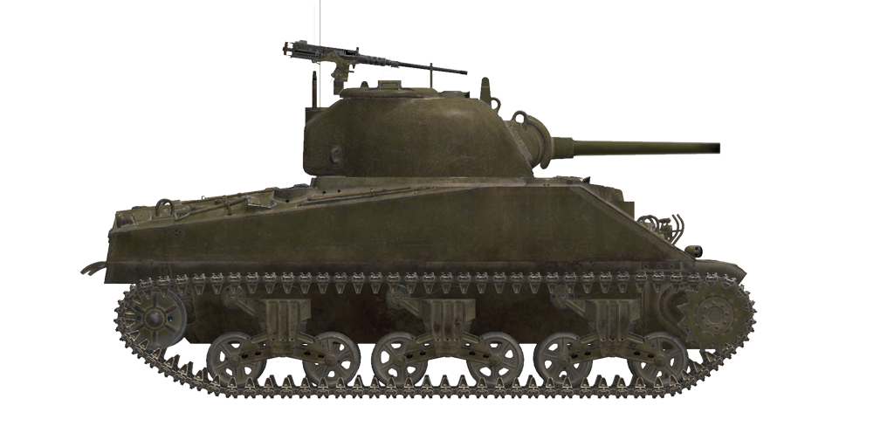

# M4A2  

<table><tbody><tr><td style="text-align: center"></td></tr></tbody></table>  

Der M4 war der wichtigste amerikanische mittlere Panzer des Zweiten Weltkriegs. Er wurde von den USA und den Alliierten (einschließlich des Lend-lease-Programms) auf allen großen Kriegsschauplätzen eingesetzt.  
  
Diese Panzer wurden ab November 1942 an die UdSSR verliehen und erschienen Anfang 1943 an der Ostfront. Sie wurden in vielen sowjetischen Operationen der zweiten Kriegshälfte eingesetzt.  
  
Im Allgemeinen war der M4-Panzer in Bezug auf die Kampfeffektivität ähnlich dem T-34-76, allerdings mit einem Bonus(die 75 mm M3 Geschosse hatten eine bessere Qualität, während die Kaliber .50 Maschinengewehre auf dem Dach mehr Feuerkraft und Schutz boten). Die sowjetischen Panzerbesatzungen mochten besonders den komfortableren und geräumigeren Panzerinnenraum (dies bedeutete jedoch, dass der Panzer größer und höher war, was es einfacher machte, ihn im Kampf zu erkennen und zu treffen).  
  
Gute Innenausstattung, hochwertige Visiere, hydraulischer Waffenstabilisator, stabilerer Funk (im Vergleich zu sowjetischen Panzern), gute Wartbarkeit und Zuverlässigkeit machten den M4 zu einem guten Panzer.  
  
Die Modifikation M4A2 wurde von zwei 6-Zylinder-Dieselmotoren GM 6046 angetrieben. Insgesamt 1990 M4A2 Panzer mit 75 mm M3-Kanone wurden an die UdSSR verliehen.  
  
<b><u>Leergewicht:</u></b> 30900 kg  
Länge: 6,1 m  
Breite: 2,7 m  
Höhe: 2,9 m  
Bodenfreiheit: 470 mm  
  
Motor: Zwei 6-Zylinder-Dieselmotoren GM 6046-71  
Maximalleistung: 2 x 375 PS bei 2100 U/min  
Maximale Drehzahl: 2150 U/min  
Getriebe: 5-Gang-Schaltung  
  
<b><u>Höchstgeschwindigkeit auf Straße:</u></b>  
1. Gang: 2,4 mph (3,8 km/h)  
2. Gang: 7,2 mph (11,5 km/h)  
3. Gang: 11,9 mph (19,2 km/h)  
4. Gang: 19,1 mph (30,7 km/h)  
5. Gang: 29,9 mph (48,0 km/h)  
Rückwärtsgang: 3,6 mph (5,8 km/h)  
  
<b><u>Höchstgeschwindigkeit im Gelände:</u></b> 16 mph (26 km/h)  
  
<b><u>Betriebsstoffe:</u></b>  
Interne Tankkapazität: 590 l  
Motorölmenge: 80 l  
Sommer-Kühlmittel: 95 l Wasser  
Winter-Kühlmittel: 95 l 43% Alkohol 15% Glycerin  
Reichweite: 315 km  
Maximaler Ölverbrauch: 3,7 l/h  
  
<b><u>Panzerung der Wanne:</u></b>  
Obere Front: 51 mm gewalzter Panzerstahl  
Untere Front: 51 mm gewalzter Panzerstahl  
Seiten: 38 mm gewalzter Panzerstahl  
Heck: 38 mm gewalzter Panzerstahl  
Vorderes Wannendach: 19 mm gewalzter Panzerstahl  
Hinteres Wannendach: 13 mm gewalzter Panzerstahl  
Vorderer Boden: 25 mm gewalzter Panzerstahl  
Hinterer Boden: 13 mm gewalzter Panzerstahl  
  
<b><u>Turmpanzerung:</u></b>  
Frontausbuchtung: 76 mm Gussstahl  
Front mitte: 51 mm Gussstahl  
Seiten: 51 mm Gussstahl  
Rückseite: 51 mm Gussstahl  
Turmdach: 25 mm Gussstahl  
Luke: 25 mm Gussstahl  
Kanonenblende: 38 mm Gussstahl  
  
<b><u>Hauptkanone:</u></b> Gezogener Lauf, 75 mm M-3  
Lauflänge: 40  
Höhenrichtbereich: -10° bis +25°  
Munition: Bis zu 97 Granaten  
Mögliche Feuerrate: 8 Schuss pro Minute  
Turmantrieb: Elektrohydraulisch, 16 Sekunden für eine volle Umdrehung  
  
<b><u>Munition:</u></b>  
M61 Panzersprenggranate (APHE): 6,79 kg, 618 m/s, 83 mm auf 500 m  
M72 Panzergranate (AP): 6,33 kg, 618 m/s, 91 mm auf 500 m  
M48 Sprenggranate (HE): 6,67 kg, 604 m/s, 667 g Sprengstoff  
  
<b><u>Koaxial- und Bug-MGs:</u></b> 7,62 mm M1919  
Geschossgewicht: 11 g  
Mündungsgeschwindigkeit: 845 m/s  
Durchschlagsleistung auf 100 m: 12 mm  
Feuerrate: 600 Schuss pro Minute  
Koaxial-MG: 8 Gurte, 250 Schuss pro Gurt (2000 Schuss)  
Bug-Mg: +-21°/+21°..-10°, 19 Gurte, 250 Schuss pro Gurt (4750 Schuss)  
  
<b><u>Luftabwehr-MG:</u></b> 12,7 mm M2 Kaliber .50  
Geschossgewicht: 41,9 g.  
Mündungsgeschwindigkeit: 895 m/s.  
Durchschlagsleistung auf 100 m: 22 mm.  
Feuerrate: 550 Schuss pro Minute.  
Munition: 6 Gurte, 50 Schuss pro Gurt (300 Schuss).  
  
<b><u>Gunsights:</u></b>  
M38 gunner scope-sight combined with М4А1 periscope, field of view 9°.  
  
<b><u>Radio equipment:</u></b>  
Wireless Set No. 19. HF/VHF transceiver.  
5 intercom terminals.  

## Änderungen  
### Panzerbrechende Granaten  

M72  
  
Panzerbrechende Hartkerngranaten ohne explosive Ladung. Geeignet gegen Panzerplatten mit Zwischenraum. Erzeugen aber weniger Schaden im Innern des Ziels als fortschrittlichere Panzersprenggranaten.  
  
Das M72 Geschoss kann etwas dickere Panzerungen auf kurzer und mittlerer Entfernung durchschlagen als das M61 APHE-Geschoss, aber bei Entfernungen über ~1000 m lässt die Durschlagsleistung nach.   
  
Gewicht 6,33 kg  
  
Abgefeuert aus einer M3 Kanone:  
Mündungsgeschwindigkeit: 618 m/s  
Durchschlagsleistung aus kürzester Entfernung: 109 mm  
500 m: Durchschlagsleistung 91 mm, Geschwindigkeit 545 m/s, Fall -3,7 m  
1000 m: Durchschlagsleistung 76 mm, Geschwindigkeit 482 m/s, Fall -15,8 m  
2000 m: Durchschlagsleistung 54 mm, Geschwindigkeit 379 m/s, Fall -74,4 m  
  
### Panzersprenggranaten  

M61  
  
Granaten mit einer explosiven Ladung im Sprengkopf.  
  
Geeignet gegen gepanzerte Ziele. Im Geschossabfalle der Penetration richten sie mehr Schaden im Innern des Ziels an als Hartkerngeschosse, aber die hochexplosive Ladung kann bereits zu früh explodieren (z.B. bei Panzerplatten mit Zwischenraum).  
  
Gewicht 6,79 kg, Sprengstoffgewicht 65 g  
  
Abgefeuert aus einer M3 Kanone:  
Mündungsgeschwindigkeit: 618 m/s  
Durchschlagsleistung aus kürzester Entfernung: 92 mm  
500 m: Durchschlagsleistung 83 mm, Geschwindigkeit 575 m/s, Fall -3,5 m  
1000 m: Durchschlagsleistung 75 mm, Geschwindigkeit 533 m/s, Fall -14,6 m  
2000 m: Durchschlagsleistung 59 mm, Geschwindigkeit 454 m/s, Fall -64,4 m  
  
### Sprenggranaten  

M48  
  
Geeignet gegen weiche, ungepanzerte oder leicht gepanzerte Ziele.  
  
Gewicht 6,67 kg, Sprengstoffgewicht 667 g.  
  
Durchschlagsleistung bei Direkttreffer 20 mm, effektive Schadensdistanz für leichte Fahrzeuge 3 m  
  
Abgefeuert aus einer M3 Kanone:  
Mündungsgeschwindigkeit: 680 m/s  
500 m: Geschwindigkeit 558 m/s, Geschossabfall -3,8 m  
1000 m: Geschwindigkeit 515 m/s, Geschossabfall -15,3 m  
2000 m: Geschwindigkeit 441 m/s, Geschossabfall -67,7 m  
