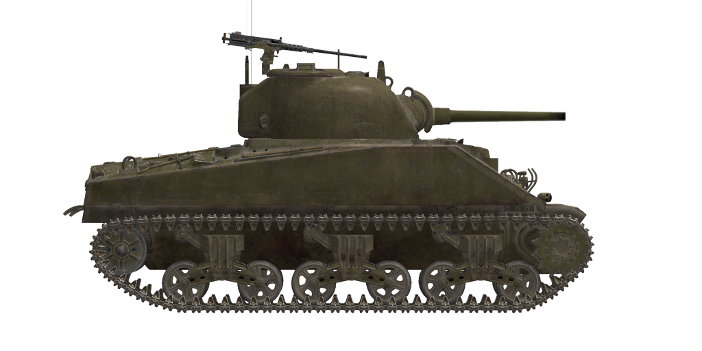

# M4A2  

<table><tbody><tr><td style="text-align: center"></tr></td></tr></tbody></table>  

M4 "Шерман" был основным американским средним танком Второй мировой войны, он широко использовался американской армией на всех основных театрах боевых действий и поставлялся в армии стран союзников, в том числе по программе ленд-лиза.  
  
В СССР танки "Шерман" начали поступать в ноябре 1942-го и появились на фронте уже в начале 1943-го года, участвовали практически во всех основных операциях советских войск во второй половине Великой Отечественной Войны.  
  
В целом, американские танки получили у советских танкистов положительный отзыв, так как были по боевым качествам не хуже Т-34 с 76 мм пушкой Ф-34, а за счёт более высокого качества снарядов американской 75 мм пушки М3 даже немного превосходили его. Кроме того, наличие крупнокалиберного зенитного пулемета на башне значительно увеличивало его огневую мощь и защиту.  
  
Особенно нашим танкистам нравилось более комфортабельное внутреннее пространство, что, в свою очередь, являлось и его недостатком - более крупные, особенно по высоте, габариты, делали его более заметным и уязвимым на поле боя.   
  
Хорошее внутренее оснащение, качественные приборы наблюдения, гиростабилизатор для пушки, более устойчивая, в сравнении с отечественными машинами радиосвязь, надежность и ремонтопригодность - всё это делало Шерман неплохим танком на поле боя.  
  
Особенностью модификации M4A2 была силовая установка, выполненная в виде спарки двух 6-цилиндровых дизельных двигателей GM 6046. Всего в СССР было поставлено 1990 танков модификации М4А2 с 75мм пушкой М3.  
  
<b><u>Снаряжённая масса:</u></b> 30900 кг.  
Длина: 6.1 м.  
Ширина: 2.7 м.  
Высота: 2.9 м.  
Клиренс: 470 мм.  
  
Двигатель спаренный дизельный 6-ти цилиндровый GM 6046-71  
Мощность максимальная: 2 x 375 л.с. при 2100 об/мин.  
Предельно допустимые обороты: 2150 об/мин.  
Коробка передач 5-ти скоростная.  
  
<b><u>Максимальные скорости по шоссе на передачах:</u></b>  
1-я: 2.4 миль/ч (3.8 км/ч).  
2-я: 7.2 миль/ч (11.5 км/ч).  
3-я: 11.9 миль/ч (19.2 км/ч).  
4-я: 19.1 миль/ч (30.7 км/ч).  
5-я: 29.9 миль/ч (48.0 км/ч).  
Задняя: 3.6 миль/ч (5.8 км/ч).  
  
<b><u>Максимальная скорость по пересечённой местности:</u></b> 16 миль/ч (26 км/ч).  
  
<b><u>Заправка:</u></b>  
Топлива во внутренних баках: 590 л.  
Масла в системе смазки двигателя: 80 л.  
Летний хладагент: 95 л. вода  
Зимний хладагент: 95 л. 43% спирт 15% глицерин  
Запас хода по шоссе: 315 км.  
Максимальный расход масла: 3.7 л/ч.  
  
<b><u>Бронирование корпуса:</u></b>  
Лоб верх: 51 мм катаная.  
Лоб низ: 51 мм литая.  
Борт: 38 мм катаная.  
Корма: 38 мм катаная.  
Крыша перед: 19 мм катаная.  
Крыша зад: 13 мм катаная.  
Днище перед: 25 мм катаная.  
Днище зад: 13 мм катаная.  
  
<b><u>Бронирование башни:</u></b>  
Лоб скулы: 76 мм литая.  
Лоб центр: 51 мм литая.  
Борт: 51 мм литая.  
Корма: 51 мм литая.  
Крыша: 25 мм литая.  
Башенка: 25 мм литая.  
Маска орудия: 38 мм литая.  
  
<b><u>Главное орудие:</u></b> нарезное, 75 мм M-3.  
Длина ствола: 40 калибров.  
Углы возвышения: +25°..-10°.  
Боезапас: до 97 снарядов.  
Практическая скорострельность: 8 выст/мин.  
Привод башни: электрогидравлический, 16 секунд на оборот.  
  
<b><u>Применяемые снаряды:</u></b>  
M61 бронебойный каморный: 6,79 кг, 618 м/с, 83 мм на 500м.  
M72 бронебойный сплошной: 6,33 кг, 618 м/с, 91 мм на 500м.  
M48 осколочно-фугасный: 6,67 кг, 604 м/с, 667 г ВВ.  
  
<b><u>Спаренный и курсовой пулемёты:</u></b> 7,62 мм M1919.  
Масса пули: 11 г.  
Начальная скорость: 845 м/с.  
Бронепробиваемость по нормали на 100 м: 12 мм.  
Скорострельность: 600 выст/мин.  
Спаренный: 8 лент по 250 патронов (2000 патронов).  
Курсовой: +-21°/+21°..-10°, 19 лент по 250 патронов (4750 патронов).  
  
<b><u>Зенитный пулемёт:</u></b> 12,7 мм M2.50.  
Масса пули: 41.9 г.  
Начальная скорость: 895 м/с.  
Бронепробиваемость по нормали на 100 м: 22 мм.  
Скорострельность: 550 выст/мин.  
Боезапас: 6 лент по 50 патронов (300 патронов).  
  
<b><u>Прицельное оборудование:</u></b>  
Телескопический прицел наводчика M38 совмещенный с перископом М4А1, поле зрения 9°.  
  
<b><u>Радиооборудование:</u></b>  
КВ/УКВ радиостанция Wireless Set No. 19.  
5 терминалов внутренней связи.  

## Модификации  
### Сплошные бронебойные снаряды  

M72  
  
Сплошные бронебойные снаряды без взрывчатого вещества внутри обладают лучшим действием против разнесённых броневых преград, но имеют локализованное заброневое воздействие, в основном ограниченное линией полета снаряда внутри цели.   
Снаряд М72 обладает преимуществом в бронепробиваемости на малых и средних дальностях, по сравнению со стандартным бронебойно-разрывным снарядом. На дальностях более 1000м он теряет это преимущество.  
  
Масса снаряда: 6.33 кг.  
  
При выстреле из пушки M3:  
Начальная скорость: 618 м/с, бронепробиваемость в упор 109 мм.  
Дистанция 500 м: бронепробиваемость по нормали 91 мм, скорость 545 м/с, понижение -3.7 м.  
Дистанция 1000 м: бронепробиваемость по нормали 76 мм, скорость: 482 м/с, понижение -15.8 м.  
Дистанция 2000 м: бронепробиваемость по нормали 54 мм, скорость: 379 м/с, понижение -74.4 м.  
  
### Бронебойные разрывные снаряды  

M61  
  
Снаряды, снаряженные бронебойно-разрывной (каморной) боевой частью, срабатывающей с определённой задержкой.  
Предназначены для поражения бронированных целей на любой дистанции (обладая значительной массой, теряют скорость значительно медленнее, чем более лёгкие типы снарядов). Наносят больше провреждений внутри цели при пробитии брони, но заряд в некоторых случаях может сработать раньше времени, например, при встрече с разнесённой броней.  
  
Масса снаряда: 6.79 кг, разрывного заряда 65 г.  
  
При выстреле из пушки M3:  
Начальная скорость: 618 м/с, бронепробиваемость в упор 92 мм.  
Дистанция 500 м: бронепробиваемость по нормали 83 мм, скорость 575 м/с, понижение -3.5 м.  
Дистанция 1000 м: бронепробиваемость по нормали 75 мм, скорость: 533 м/с, понижение -14.6 м.  
Дистанция 2000 м: бронепробиваемость по нормали 59 мм, скорость: 454 м/с, понижение -64.4 м.  
  
### Осколочно-фугасные снаряды  

M48  
  
Осколочно-фугасные снаряды являются основным средством поражения в условиях общевойскового боя, предназначены для поражения любых типов целей на любых дальностях, кроме бронированных.  
  
Масса снаряда: 6.67 кг, разрывного заряда 667 г.  
Бронепробиваемость при близком разрыве 20 мм, радиус эффективного поражения лёгкой техники 3 м.  
  
При выстреле из пушки M3:  
Начальная скорость: 604 м/с.  
Дистанция 500 м: скорость 558 м/с, понижение -3.8 м.  
Дистанция 1000 м: скорость: 515 м/с, понижение -15.3 м.  
Дистанция 2000 м: скорость: 441 м/с, понижение -67.7 м.  
