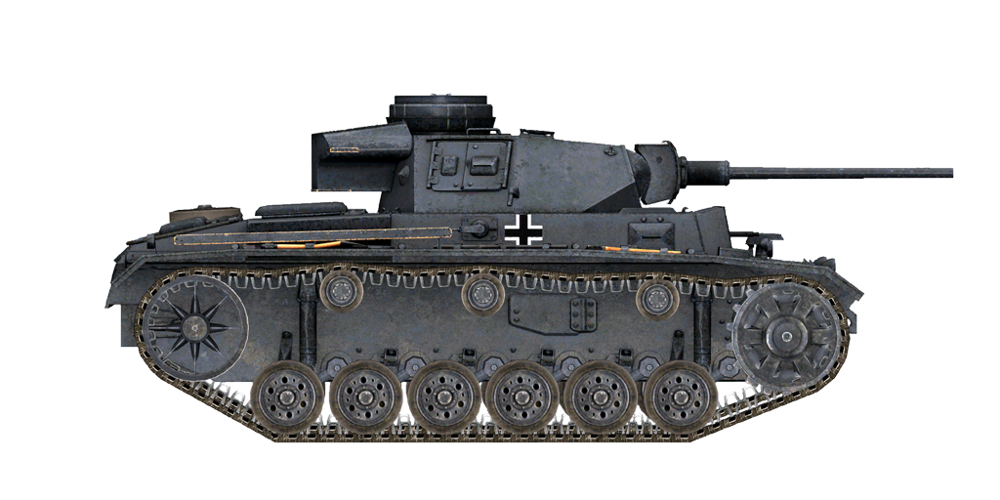

# Pz.Kpfw.III Ausf.L  
  
  
  
## Описание  
  
Танк Pz.Kpfw. III Ausf.L с 50мм пушкой KwK 39/L60. Данная модификация танка (Ausf.L) вооружена длинноствольной 50-мм пушкой с хорошими показателями бронепробиваемости и усилена навесными плитами дополнительного бронирования толщиной 20 мм на маске пушки и лобовом листе корпуса. Усиление брони и вооружения было связано с тем, что немецким танкистам пришлось столкнуться в боях с лучше бронированными и вооружёнными советскими Т-34 и КВ.  
  
Производство данной модификации танка началось в апреле и продолжалось до августа 1942-го года, за этот период было построено около 700 машин данного типа.  
  
<b><u>Снаряжённая масса:</u></b> 22700 кг.  
Длина: 6,3 м.  
Ширина: 3,0 м.  
Высота: 2,5 м.  
Клиренс: 385 мм.  
  
Двигатель бензиновый Maybach HL 120TRM  
Мощность максимальная: 300 л.с. при 3000 об/мин.  
Предельно допустимые обороты: 3000 об/мин.  
Коробка передач 6-ти скоростная.  
  
<b><u>Максимальные скорости по шоссе на передачах:</u></b>  
1-я: 4,8 км/ч.  
2-я: 9,2 км/ч.  
3-я: 15,5 км/ч.  
4-я: 23,5 км/ч.  
5-я: 33,2 км/ч.  
6-я: 42,8 км/ч.  
Задняя: 5,9 км/ч.  
  
<b><u>Максимальная скорость по пересечённой местности:</u></b> 18 км/ч.  
  
<b><u>Заправка:</u></b>  
Топлива во внутренних баках: 320 л.  
Масла в системе смазки двигателя: 25 л.  
Летний хладагент: 100 л. 40% глисантин  
Зимний хладагент: 100 л. 60% глисантин  
Запас хода по шоссе: 155 км.  
Максимальный расход масла: 2 л/ч.  
  
<b><u>Бронирование корпуса:</u></b>  
Лоб верх: 50 мм + 20 мм катаная.  
Лоб середина: 25 мм катаная.  
Лоб низ: 50 мм катаная.  
Лоб днище: 30 мм катаная.  
Борт: 30 мм катаная.  
Корма верх: 50 мм катаная.  
Корма середина: 50 мм катаная.  
Корма низ: 30 мм катаная.  
Крыша перед: 10 мм катаная.  
Крыша зад: 15 мм литая.  
Днище: 26 мм катаная.  
Днище полки: 26 мм катаная.  
  
<b><u>Бронирование башни:</u></b>  
Лоб: 30 мм катаная.  
Борт: 30 мм катаная.  
Корма: 30 мм катаная.  
Крыша: 10 мм катаная.  
Башенка: 50 мм литая.  
Маска орудия: 50 мм литая.  
  
<b><u>Главное орудие:</u></b> нарезное, 5 cm KwK 39 L/60.  
Длина ствола: 56,5 калибра.  
Углы возвышения: +20°..-10°.  
Боезапас: до 92 снарядов.  
Практическая скорострельность: 15 выст/мин.  
Привод башни: механический, 33 секунды на оборот.  
  
<b><u>Применяемые снаряды:</u></b>  
5 cm Pzgr. 39 бронебойный каморный: 2,06 кг, 835 м/с, 68 мм на 500 м.  
5 cm Pzgr. 40 бронебойный подкалиберный: 0,925 кг, 1180 м/с, 175 мм в упор.  
5 cm Sprgr. 38 осколочно-фугасный: 1,81 кг, 550 м/с, 175 г ВВ.  
  
<b><u>Пулемёты:</u></b> 7,92 мм MG 34.  
Масса пули: 11,5 г.  
Начальная скорость: 855 м/с.  
Бронепробиваемость по нормали на 100 м: 11 мм.  
Скорострельность: 900 выст/мин.  
Спаренный: 33 ленты по 150 патронов (4950 патронов).  
Курсовой: не задействован.  
  
<b><u>Прицельное оборудование:</u></b>  
Телескопический прицел наводчика Tzf 5f2, поле зрения 25°.  
  
<b><u>Радиооборудование:</u></b> УКВ радиостанция Fu 5, 4 терминала внутренней связи.  
  
  
<b><u>ПРИМЕЧАНИЕ:</u></b>  
Данный танк доступен пользователям любых проектов серии "Ил-2 Великие сражения" и является демонстратором технологии физики и вооружения.  
Танки из проекта "Tank Crew" обладают более детализированной и современной внешней моделью, а также полной детализированной моделью интерьера всех основных рабочих мест.  
  
## Модификации  
### Бронебойные разрывные снаряды  
  
5 cm Pzgr. 39  
  
Снаряды, снаряженные бронебойно-разрывной (каморной) боевой частью, срабатывающей с определённой задержкой. Предназначены для поражения бронированных целей на любой дистанции. Наносят больше провреждений внутри цели при пробитии брони, но заряд в некоторых случаях может сработать раньше времени, например, при встрече с разнесённой броней.  
  
Масса снаряда: 2.06 кг, разрывного заряда 17 г.  
  
При выстреле из пушки 5 cm KwK 39 L/60:  
Начальная скорость: 835 м/с, бронепробиваемость в упор 87 мм.  
Дистанция 500 м: бронепробиваемость по нормали 68 мм, скорость 702 м/с, понижение -1.5 м.  
Дистанция 1000 м: бронепробиваемость по нормали 53 мм, скорость: 587 м/с, понижение -8.4 м.  
Дистанция 2000 м: бронепробиваемость по нормали 30 мм, скорость: 394 м/с, понижение -76.7 м.  
### Осколочно-фугасные снаряды  
  
5 cm Sprgr. 38  
  
Осколочно-фугасные снаряды являются основным средством поражения в условиях общевойскового боя, предназначены для поражения любых типов целей на любых дальностях, кроме бронированных.  
  
Масса снаряда: 1.81 кг, разрывного заряда 175 г.  
  
Бронепробиваемость при близком разрыве 11 мм, радиус эффективного поражения лёгкой техники 1,5 м.  
  
При выстреле из пушки 5 cm KwK 39 L/60:  
Начальная скорость: 550 м/с.  
Дистанция 500 м: скорость 444 м/с, понижение -4.9 м.  
Дистанция 1000 м: скорость: 368 м/с, понижение -22.6 м.  
Дистанция 2000 м: скорость: 285 м/с, понижение -118.5 м.  
### Подкалиберные бронебойные снаряды  
  
5 cm Pzgr. 40  
  
Снаряды, снаряженные подкалиберной бронебойной боевой частью. Предназначены для поражения тяжело бронированных целей на малой дистанции: имея гораздо меньшую массу, чем обычные бронебойные снаряды, получают значительно большую начальную скорость при выстреле и, как следствие, повышенную бронепробиваемость на близких дистанциях. В то же время, быстрая потеря скорости с расстоянием из-за меньшей массы приводит к неэффективности на значительных дистанциях. Также недостатком является локализованное заброневое воздействие, в основном ограниченное линией полета снаряда внутри цели.  
  
5 cm Pzgr. 40 является подкалиберным снарядом катушечного типа, когда твердосплавный бронебойный сердечник заключен в два направляющих калиберных кольца, обеспечивающих обтюрацию при движении в канале ствола. Это уменьшает массу снаряда, увеличивая его начальную скорость, но такая форма увеличивает сопротивление воздуха и вызывает ещё большую потерю скорости с расстоянием.  
  
Масса снаряда: 0.925 кг, калибр бронебойного сердечника 21 мм.  
  
При выстреле из пушки 5 cm KwK 39 L/60:  
Начальная скорость: 1180 м/с, бронепробиваемость в упор 175 мм.  
Дистанция 500 м: бронепробиваемость по нормали 82 мм, скорость 696 м/с, понижение -2.1 м.  
Дистанция 1000 м: бронепробиваемость по нормали 43 мм, скорость: 443 м/с, понижение -9.2 м.  
Дистанция 2000 м: бронепробиваемость по нормали 16 мм, скорость: 223 м/с, понижение -49.0 м.  
