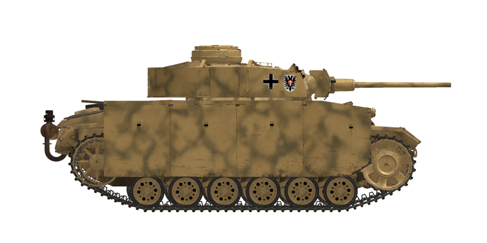

# Pz.Kpfw.III Ausf.M  

<table><tbody><tr><td style="text-align: center"></tr></td></tr></tbody></table>  

El Pz.Kpfw. III Ausf.M era un carro de combate similar a su modificación anterior, Ausf.L. Se modificaron algunos elementos internos, chasis, compartimento del motor y otras cuestiones menores, de acuerdo a la experiencia adquirida durante el periodo de servicio de la versión anterior.  
  
La diferencia visual más evidente era la adición de planchas de blindaje lateral a modo de faldones o <i>Schürzen</i>, que se unían a los laterales de casco y torreta. Se añadieron principalmente para proteger el tanque de los disparos de rifle anticarro, peligrosos para los blindajes laterales, más finos. Aunque no eran capaces de detener una bala anticarro, estas chapas adicionales la desestabilizaban o provocaban que se fragmentara antes de que pudiera impactar contra el casco blindado.  
  
Cabe destacar que el blindaje frontal era relativamente grueso gracias a las planchas de blindaje adicional montadas en capas espaciadas entre sí.  
  
El carro podía estar equipado con seis morteros montados en la torreta diseñados para disparar granadas de humo a una distancia de unos 80 metros.  
  
Los proyectiles APCR disparados por el cañón KwK 39/L60 de 50 mm podían penetrar el blindaje de los carros de combate medios y pesados de la Unión Soviética a una distancia de hasta 500 m, mientras que el proyectil habitual APHE podía ser usado contra los laterales de los carros medios hasta a 1 km de distancia.  
  
En total, se fabricaron 517 carros de combate de esta actualización entre septiembre de 1942 y febrero de 1943.  
  
<b><u>Peso vacío:</u></b> 22700 kg  
Longitud: 6,3 m  
Anchura: 3,22 m  
Altura: 2,5 m  
Distancia al suelo: 385 mm  
  
Motor: Maybach HL 120TRM, gasolina  
Potencia máxima: 300 CV at 3000 rpm  
Máximas rpm: 3000 rpm  
Cambio de 6 marchas  
  
<b><u>Velocidad máxima en carretera:</u></b>  
1.ª: 4,8 km/h  
2.ª: 9,2 km/h  
3.ª: 15,5 km/h  
4.ª: 23,5 km/h  
5.ª: 33,2 km/h  
6.ª: 42,8 km/h  
Marcha atrás: 5,9 km/h  
  
<b><u>Velocidad máxima en otros terrenos:</u></b> 18 km/h  
  
<b><u>Líquidos:</u></b>  
Capacidad depósitos de combustible internos: 320 l  
Capacidad aceite lubricante del motor: 25 l  
Refrigerante del motor en verano: 100 l de 40% glysantin  
Refrigerante del motor en invierno: 100 l de 60% glysantin  
Autonomía: 155 km  
Consumo de aceite máximo: 2 l/h  
  
<b><u>Blindaje del casco:</u></b>  
Frontal superior: 50 mm + 20 mm laminado  
Frontal medio: 25 mm laminado  
Frontal inferior: 50 mm laminado  
Frontal bajo: 30 mm laminado  
Laterales: 30 mm laminado  
Trasera superior: 30 mm laminado  
Trasera media: 50 mm laminado  
Trasera inferior: 30 mm laminado  
Techo frontal: 10 mm laminado  
Techo trasera: 15 mm fundición  
Fondo: 15 mm laminado  
  
<b><u>Blindaje de torreta:</u></b>  
Frontal: 37..50 mm laminado  
Laterales: 30 mm laminado  
Trasera: 30 mm laminado  
Techo: 18 mm laminado  
Cúpula: 50 mm fundición  
Mantelete: 50 mm fundición + 20 mm laminado  
  
<b><u>Planchas de blindaje adicional:</u></b>  
5 mm laminado para protección adicional contra rifles anticarro  
  
<b><u>Cañón principal:</u></b> estriado, KwK 39 L/60 de 5 cm  
Longitud del cañón: 56,5 calibres  
Elevación: +20°..-8°  
Munición: hasta 84 proyectiles  
Cadencia de disparo útil: 15 proyectiles por minuto  
Movimiento torreta: mecánico, 33 segundos por vuelta  
  
<b><u>Munición del cañón:</u></b>  
Pzgr. 39 de 5 cm perforante explosivo (APHE): 2,06 kg, 835 m/s, 68 mm a 500 m  
Pzgr. 40 de 5 cm perforante núcleo rígido (APCR): 0,925 kg, 1.180 m/s, 175 mm a bocajarro  
Sprgr. 38 de 5 cm explosivo (HE): 1,81 kg, 550 m/s, 175 g de explosivo  
  
<b><u>Ametralladoras:</u></b> Maschinengewehr MG 34 de 7,92 mm  
Peso de la bala: 11,5 g  
Velocidad de salida: 855 m/s  
Penetración de blindaje a 100 m: 11 mm  
Cadencia de disparo: 900 balas por minuto  
Coaxial: 33 cintas, 150 balas cada cinta (4950 balas)  
Glacis: +-15°/+20°..-10°, 12 cintas, 150 balas por cinta (1800 balas)  
  
<b><u>Miras para apuntado del armamento:</u></b>  
Mira telescópica Tzf 5e en artillero, campo de visión de 25°  
Mira de respaldo de tipo abierta con abertura que puede cerrarse  
Mira telescópica KZF 2 en operador de radio, campo de visión de 18°  
  
<b><u>Equipamiento de radio:</u></b>  
Transmisor-receptor VHF Fu 5  
4 intercomunicadores  

## Modificaciones  
### Proyectiles perforantes explosivos (APHE)  

Pzgr. 39 de 5 cm  
  
Proyectiles perforantes armados con una pequeña carga explosiva que estalla con un ligero retraso tras el impacto.  
  
Adecuados contra objetivos blindados. En caso de perforación causan más daño dentro del objetivo que los proyectiles perforantes sólidos (AP), pero la parte explosiva puede detonarse prematuramente (por ejemplo, cuando se usan contra objetivos con capas blindadas espaciadas).  
  
Peso 2,06 kg, cantidad explosivo 17 g.  
  
Disparado desde un cañón de 5 cm KwK 39 L/60:  
Velocidad de salida 835 m/s, penetración del blindaje a bocajarro 87 mm.  
500 m: penetración del blindaje 68 mm, velocidad 702 m/s, caída -1,5 m.  
1000 m: penetración del blindaje 53 mm, velocidad 587 m/s, caída -8,4 m.  
2000 m: penetración del blindaje 30 mm, velocidad 394 m/s, caída -76,7 m.  
  
### Proyectiles explosivos (HE)  

Sprgr. 38 de 5 cm  
  
Proyectiles de fragmentación con carga altamente explosiva en su interior.  
  
Adecuados contra objetivos no blindados o con blindaje ligero.  
  
Peso 1,81 kg, cantidad explosivo 175 g.  
Penetración de blindaje en impacto directo 11 mm, distancia de daño efectiva para vehículos ligeros 1,5 m.  
  
Disparado desde un cañón de 5 cm KwK 39 L/60:  
Velocidad de salida 550 m/s.  
500 m: velocidad 444 m/s, caída -4,9 m.  
1000 m: velocidad 368 m/s, caída -22,6 m.  
2000 m: velocidad 285 m/s, caída -118,5 m.  
  
### Proyectiles perforantes de núcleo rígido (APCR)  

Pzgr. 40 de 5 cm  
  
Proyectiles perforantes que poseen un núcleo de pequeño calibre de material muy duro y denso.  
  
Adecuado contra objetivos fuertementre blindados en distancias cortas: mucho más ligeros que los proyectiles ordinarios, tienen mayor velocidad de salida y penetración en blindajes en distancias cortas. Sin embargo, debido a su menor peso su velocidad disminuye rápidamente con la distancia, por lo que son peores que los proyectiles ordinarios en largas distancias.  
  
El núcleo rígido se mantiene en el cañón rodeado de un cuerpo de material muy ligero. Se reduce el peso del proyectil para aumentar la velocidad de salida, pero esto hace que pierda velocidad aún más rápido debido al rozamiento del aire.  
  
Peso 0,925 kg, calibre núcleo rígido 21 mm.  
  
Disparado desde un cañón de 5 cm KwK 39 L/60:  
Velocidad de salida 1180 m/s, penetración del blindaje a bocajarro 175 mm.  
500 m: penetración del blindaje 82 mm, velocidad 696 m/s, caída -2,1 m.  
1000 m: penetración del blindaje 43 mm, velocidad 443 m/s, caída -9,2 m.  
2000 m: penetración del blindaje 16 mm, velocidad 223 m/s, caída -49,0 m.  
  
### Planchas blindadas adicionales  

Protección adicional: planchas blindadas de 5 mm unidas a los laterales del casco y torreta.  
Las planchas están diseñadas para contrarrestar los disparos de rifles anticarro, peligrosos para los laterales, que cuentan con un blindaje más fino. No son capaces de detener una bala anticarro, pero la desestabilizan o provocan que se fragmente antes de que pueda impactar contra el casco blindado.  
  
### Lanzagranadas de humo  

Instalación de 6 morteros externos lanzagranadas de humo de un único proyectil.  
Granada de humo Schnellnebelkerze 39 (Nb K S 39)  
Distancia de lanzamiento: 80 m  
Duración del humo: 3 minutos  
