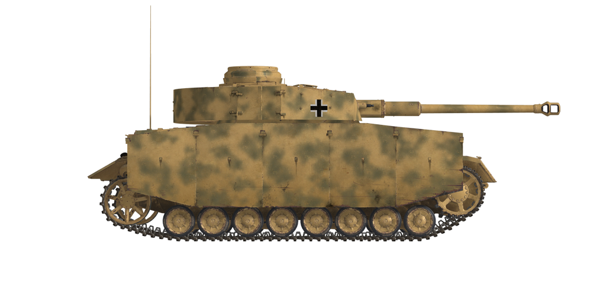

# 四号坦克G型（Pz.Kpfw.IV Ausf.G）  
  
  
  
## 描述  
  
此安装了75mmKwK 40/L48炮的四号坦克G型是在尼伯龙根工厂于1943年6月制造的。G型改型与以前的改型相比，主要区别在于新的炮管更长（+5口径），但使用固定膛线而不是可变的。  
  
最明显的视觉差异是在车体和炮塔侧面附加了侧装甲“Schürzen”。安装它们主要是为了在反坦克步枪的射击下保护坦克，反坦克步枪对于较薄的侧面装甲来说是危险的。虽然无法挡住所有穿甲弹，这些额外的装甲可以使穿甲弹跳弹或或导致其碎裂，这使得炮弹接触车体装甲的概率降低。  
  
应当指出的是，这种在前车体上覆盖额外的30mm装甲板的修改实际上达到了可能进行现代化改造的极限-无法以相同的方式增加对炮塔的保护。顶部和底部的装甲厚度降低。然而，尽管缺乏装甲保护，它的主炮能够在1公里或更近的距离击中敌人的坦克。  
  
温迈格、尼伯龙根工厂和克虏伯工厂共制造了1930辆“G”型坦克。其中588辆是在尼伯朗格温克制作的，它们有一个有趣的特点——履带是反向安装的。  
  
<b><u>空载重量：</u></b> 23600 kg  
长度：7.02m  
宽度：3.17m  
高度：2.63m  
间隙：400 mm  
  
发动机：迈巴赫HL 120TRM，汽油。  
最大功率：300 HP（3000 RPM）  
最大转速：3000 RPM  
6档变速箱。  
  
<b><u>最高行车速度 ：</u></b>  
前进挡1：5.4 km/h  
前进挡2：10.4 km/h  
前进挡3：17.5 km/h  
前进挡4：26.6 km/h  
前进挡5：37.6 km/h  
前进挡6：48.5 km/h  
倒挡：6.7 km/h  
  
<b><u>最大越野速度 ：</u></b> 18 km/h  
  
<b><u>流体：</u></b>  
内部油箱容量：470 L  
机油系统容量：25 L  
夏季发动机冷却液：120L含40%防冻液  
冬季发动机冷却液：120L含60%防冻液  
续航范围：210 кm  
最大油耗：2 L/h  
  
<b><u>车体装甲：</u></b>  
上前：50mm+ 30mm轧制装甲  
中前：25mm轧制装甲  
前下：50mm+ 30mm轧制装甲  
底前：30mm轧制装甲  
侧面：30mm轧制装甲  
上后部：20mm轧制装甲  
后排中间：20mm轧制装甲  
后下：15mm轧制装甲  
车顶前：12mm轧制装甲  
顶后：10mm铸造装甲  
底部：10mm轧制装甲  
  
<b><u>炮塔装甲：</u></b>  
前面：50mm轧制装甲  
侧面：30mm轧制装甲  
后面：30mm轧制装甲  
顶盖：10mm轧制装甲  
炮塔：50mm铸造装甲  
炮盾为50mm铸造/轧制装甲  
  
<b><u>附加装甲板：</u></b>  
5mm轧制装甲，提升对反坦克步枪的防护  
  
<b><u>主炮：</u></b> 线膛炮，7.5cm KwK 40 L/48坦克 炮。  
炮管长度：55  
俯仰角：+20°~-8°  
弹药：最多84发  
有效射速：10 发/分  
方向机：电驱动，旋转360°需26s  
  
<b><u>炮弹：</u></b>  
7.5cm Pzgr.39 穿甲榴弹（APHE）：弹头重量6.8 kg，炮口初速750 m/s，500m距离上最大穿深104 mm  
7.5cm Pzgr.40 硬芯穿甲弹（APCR）：弹头重量4.1 kg，炮口初速930 m/s，最大穿深150 mm  
7.5cm Gr.38 HL/С 高爆反坦克弹（HEAT）：弹头重量4.57 kg，炮口初速450 m/s，最大穿深104 mm  
7.5cm SprGr.34 高爆弹（HE）：弹头重量5.74 kg，炮口初速550 m/s，装弹量660 g  
  
<b><u>机枪：</u></b>7.92mm MG34  
子弹质量：11.5 g  
炮口初速：855 m/s  
100m处穿甲能力：11 mm  
射速：900 发/分  
同轴机枪：12条弹链，每条弹链150发（1800发）  
航向机枪：+-15°/+20°~-10°，11个弹链，每个弹链150发（1650发）  
  
<b><u>Gunsights:</u></b>  
Tzf 5f2 gunner scope-sight, field of view 25°.  
Backup open-type sight with closable port.  
KZF 2 machinegunner scope-sight, field of view 18°.  
  
<b><u>Radio equipment:</u></b>  
VHF Fu 5 transceiver with additional Fu 2 receiver.  
4 intercom terminals.  
  
## 修改  
### 穿甲榴弹  
  
7，5 cm Pzgr.39  
  
炮弹上装有爆炸弹头。  
  
对抗装甲目标效果好。击穿时对目标内部造成比穿甲弹（AP）更大伤害，但是榴弹（HE）装药可能过早引爆（比如用于对抗间隙装甲板时）  
  
质量 6.8 kg，炸药质量 18 g.  
  
当从7.5cm KwK 40 L/48火炮发射时：  
炮口初速：750 m/s，近距离装甲穿深 117 mm  
500m时：装甲穿深 104mm，速度 691 m/s，下坠高度 2.4m  
1000m时：装甲穿深 92mm，速度 636 m/s，下坠高度 10.0m  
2000m时：装甲穿深 72mm，速度 537 m/s，下坠高度 44.8m  
  
### 榴弹  
  
7，5 cm SprGr.34  
  
对抗软目标、无装甲和轻装甲目标效果好。  
  
质量 5.74 kg，炸药质量 660 g.  
  
直接命中装甲穿深 20mm，对轻型车辆有效杀伤距离3m  
  
当从7.5cm KwK 40 L/48火炮发射时：  
炮口初速：550 m/s  
500m时：速度 509 m/s，下坠高度 4.5m  
1000m时：速度 473 m/s，下坠高度 18.5m  
2000m时：速度 405 m/s，下坠高度 80.9m  
  
### 破甲弹  
  
7，5 cm Gr.38 HL/С  
  
破甲弹有成型高爆聚能战斗部装药  
  
它们的穿甲能力不会随射程的增加而降低，但准确性却会降低，因为弹速较低，而类似的动能穿甲弹通常在近距离具有较高的装甲穿透能力。  
  
质量4.57 kg，炸药质量530 g，装甲穿深 104 mm  
  
当从7.5cm KwK 40 L/48火炮发射时：  
炮口初速：450 m/s  
500m时：速度 328 m/s，下坠高度 7.8m  
1000m时：速度 278 m/s，下坠高度 38.1m  
2000m时：速度 244 m/s，下坠高度 200.4m  
  
### 次口径穿甲弹  
  
7，5 cm Pzgr.40  
  
装有次口径穿甲弹芯的炮弹。在近距离对抗重装甲目标效果好。  
  
7.5cm Pzgr.40是一种复合弹药 - 硬（钨合金）弹芯在由较软的钢组成的弹体里（用于炮管内密封）  
  
质量：4.1 kg，弹芯口径28 mm  
  
当从7.5cm KwK 40 L/48火炮发射时：  
炮口初速：930 m/s，近距离装甲穿深 150 mm  
500m时：装甲穿深 128mm，速度 832 m/s，下坠高度 1.6m  
1000m时：装甲穿深 108mm，速度 739 m/s，下坠高度 10.0m  
2000m时：装甲穿深 75mm，速度 573 m/s，下坠高度 44.8m  
  
### 额外装甲  
  
附加防护：车身和炮塔附上5mm装甲板。  
添加它们主要是为了保护坦克免受大规模反坦克步枪火力的伤害，这对装甲较薄的一侧来说是危险的。  
虽然无法阻停穿甲子弹，这种附加装甲可以使其失稳或导致其碎裂，然后才击中主装甲保护车体。  
