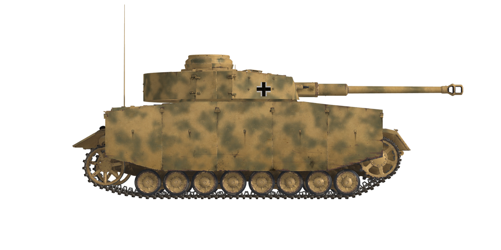

# Pz.Kpfw.IV Ausf.G  
  
  
  
## Descripción  
  
Este Pz.Kpfw. IV Ausf.G con cañón KwK 40/L48 de 75 mm fue fabricado en Nibelungenwerke en junio de 1943. La princpal diferencia de la modificación Ausf.G respecto a las anteriores fue su cañón, 5 calibres más largo, pero con el giro del estriado fijo en lugar de variable.   
  
La diferencia visual más evidente era la adición de planchas de blindaje lateral a modo de faldones o <i>Schürzen</i>, que se unían a los laterales de casco y torreta. Se añadieron principalmente para proteger el tanque de los disparos de rifle anticarro, peligrosos para los blindajes laterales, más finos. Aunque no eran capaces de detener una bala anticarro, estas chapas adicionales la desestabilizaban o provocaban que se fragmentara antes de que pudiera impactar contra el casco blindado.  
  
Es necesario reseñar que esta modificación con las planchas de blindaje adicional de 30 mm en varias capas espaciadas entre sí en la parte frontal del casco alcanzó su límite para futuras mejoras, ya que era imposible incrementar la protección de la torreta de la misma forma. Se redujo el grosor del blindaje del techo y la parte inferior. Sin embargo, a pesar de esta pérdida de protección, su cañón era capaz de destruir un carro de combate enemigo a 1 km de distancia.   
  
Vomag, Nibelungenwerke, y Krupp-Grusonwerk fabricaron 1.930 Pz.Kpfw. IV Ausf.G. Del total, 588 fueron construidos en Nibelungenwerke y tuvieron una interesante peculiaridad: Las cadenas de sus orugas estaban montadas en dirección opuesta a la normal.  
  
<b><u>Peso vacío:</u></b> 23600 kg  
Longitud: 7,02 m  
Anchura: 3,17 m  
Altura: 2,63 m  
Distancia al suelo: 400 mm  
  
Motor: Maybach HL 120TRM, gasolina  
Potencia máxima: 300 CV a 3000 rpm  
Máximas rpm: 3000 rpm  
Cambio de 6 marchas  
  
<b><u>Velocidad máxima en carretera:</u></b>  
1.ª: 5,4 km/h  
2.ª: 10,4 km/h  
3.ª: 17,5 km/h  
4.ª: 26,6 km/h  
5.ª: 37,6 km/h  
6.ª: 48,5 km/h  
Marcha atrás: 6,7 km/h  
  
<b><u>Velocidad máxima en otros terrenos:</u></b> 18 km/h  
  
<b><u>Líquidos:</u></b>  
Capacidad depósitos de combustible internos: 470 l  
Capacidad aceite lubricante del motor: 25 l  
Refrigerante del motor en verano: 100 l de 40% glysantin  
Refrigerante del motor en invierno: 100 l de 60% glysantin  
Autonomía: 210 кm  
Consumo de aceite máximo: 2 l/h  
  
<b><u>Blindaje del casco:</u></b>  
Frontal superior: 50 mm + 30 mm laminado  
Frontal medio: 25 mm laminado  
Frontal inferior: 50 mm + 30 mm laminado  
Frontal bajo: 30 mm laminado  
Laterales: 30 mm laminado  
Trasera superior: 20 mm laminado  
Trasera media: 20 mm laminado  
Trasera inferior: 15 mm laminado  
Techo frontal: 12 mm laminado  
Techo trasera: 10 mm fundición  
Fondo: 10 mm laminado  
  
<b><u>Blindaje de torreta:</u></b>  
Frontal: 50 mm laminado  
Laterales: 30 mm laminado  
Trasera: 30 mm laminado  
Techo: 10 mm laminado  
Cúpula: 50 mm fundición  
Mantelete: 50 mm fundición/laminado  
  
<b><u>Planchas de blindaje adicional:</u></b>  
5 mm laminado para protección adicional contra rifles anticarro  
  
<b><u>Cañón principal:</u></b> estriado, KwK 40 L/48 de 7,5 cm  
Longitud del cañón: 55 calibres  
Elevación: +20°..-8°  
Munición: hasta 84 proyectiles  
Cadencia de disparo útil: 10 proyectiles por minuto  
Movimiento torreta: asistido por generador eléctrico autónomo, 26 segundos por vuelta  
  
<b><u>Munición del cañón:</u></b>  
Pzgr. 39 de 7,5 cm perforante explosivo (APHE): 6,8 kg, 750 m/s, 104 mm a 500 m  
Pzgr. 40 de 7,5 cm perforante núcleo rígido (APCR): 4,1 kg, 930 m/s, 150 mm a bocajarro  
Gr.38 HL/C de 7,5 cm de carga hueca (HEAT): 4,57 kg, 450 m/s, 104 mm  
SprGr.34 de 7,5 cm explosivo (HE): 5,74 kg, 550 m/s, 660 g de explosivo  
  
<b><u>Ametralladoras:</u></b> Maschinengewehr MG 34 de 7,92 mm  
Peso de la bala: 11,5 g  
Velocidad de salida: 855 m/s  
Penetración de blindaje a 100 m: 11 mm  
Cadencia de disparo: 900 balas por minuto  
Coaxial: 12 cintas, 150 balas por cinta (1800 balas)  
Glacis: +-15°/+20°..-10°, 11 cintas, 150 balas por cinta (1650 balas)  
  
<b><u>Miras para apuntado del armamento:</u></b>  
Mira telescópica Tzf 5e en artillero, campo de visión de 25°  
Mira de respaldo de tipo abierta con abertura que puede cerrarse  
Mira telescópica KZF 2 en operador de radio, campo de visión de 18°  
  
<b><u>Equipamiento de radio:</u></b>  
Transmisor-receptor VHF Fu 5  
4 intercomunicadores  
  
  
## Modificaciones  
  
  
### Proyectiles perforantes explosivos (APHE)  
  
Pzgr. 39 de 7,5 cm  
  
Proyectiles perforantes armados con una pequeña carga explosiva que estalla con un ligero retraso tras el impacto.  
  
Adecuados contra objetivos blindados. En caso de perforación causan más daño dentro del objetivo que los proyectiles perforantes sólidos (AP), pero la parte explosiva puede detonarse prematuramente (por ejemplo, cuando se usan contra objetivos con capas blindadas espaciadas).  
  
Peso 6,8 kg, cantidad explosivo 18 g.  
  
Disparado desde un cañón de 7,5 cm KwK 40 L/48:  
Velocidad de salida 750 m/s, penetración del blindaje a bocajarro 117 mm.  
500 m: penetración del blindaje 104 mm, velocidad 691 m/s, caída -2,4 m.  
1000 m: penetración del blindaje 92 mm, velocidad 636 m/s, caída -10,0 m.  
2000 m: penetración del blindaje 72 mm, velocidad 537 m/s, caída -44,8 m.  
  
### Proyectiles explosivos (HE)  
  
Sprgr. 34 de 7,5 cm  
  
Proyectiles de fragmentación con carga altamente explosiva en su interior.  
  
Adecuados contra objetivos no blindados o con blindaje ligero.  
  
Peso 5,74 kg, cantidad explosivo 660 g.  
Penetración de blindaje en impacto directo 20 mm, distancia de daño efectiva para vehículos ligeros 3 m.  
  
Disparado desde un cañón de 7,5 cm KwK 40 L/48:  
Velocidad de salida 550 m/s.  
500 m: velocidad 509 m/s, caída -4,5 m.  
1000 m: velocidad 473 m/s, caída -18,5 m.  
2000 m: velocidad 405 m/s, caída -80,9 m.  
  
### Proyectiles de carga hueca (HEAT)  
  
Gr.38 HL/С de 7,5 cm  
  
Proyectiles basados en el efecto Munroe. Cuando su explosivo detona, un cono, generalmente de cobre, instalado con la punta hacia el interior del proyectil, se invierte y se transforma en un chorro de metal fundido que perfora el blindaje.  
  
Su capacidad de perforación no se ve alterada por la distancia, pero sí su precisión debido a la menor velocidad del proyectil. Los proyectiles cinéticos similares suelen tener más capacidad de penetración en distancias cortas.  
  
Peso 4,57 kg, cantidad de explosivo 650 g, penetración de blindaje 104 mm.  
  
Disparado desde un cañón 7,5 cm KwK 40 L/48:  
Velocidad de salida: 450 m/s.  
500 m: velocidad 328 m/s, caída -7,8 m.  
1000 m: velocidad 278 m/s, caída -38,1 m.  
2000 m: velocidad 244 m/s, caída -200,4 m.  
  
### Proyectiles perforantes núcleo rígido (APCR)  
  
Pzgr. 40 de 7,5 cm  
  
Proyectiles perforantes que poseen un núcleo de pequeño calibre de material muy duro y denso. El Pzgr. 40 de 7,5 cm posee un núcleo rígido (aleación de tungsteno) dentro de un cuerpo fabricado en acero más blando (para ocupar el diámetro del cañón).  
  
Adecuado contra objetivos fuertementre blindados en distancias cortas.  
  
Peso 4.1 kg, calibre núcleo rígido 28 mm.  
  
Disparado desde un cañón 7,5 cm KwK 40 L/48:  
Velocidad de salida 930 m/s, penetración del blindaje a bocajarro 150 mm.  
500 m: penetración del blindaje 128 mm, velocidad 832 m/s, caída -1,6 m.  
1000 m: penetración del blindaje 108 mm, velocidad 739 m/s, caída -10,0 m.  
2000 m: penetración del blindaje 75 mm, velocidad 573 m/s, caída -44,8 m.  
  
### Planchas blindadas adicionales  
  
Protección adicional: planchas blindadas de 5 mm unidas a los laterales del casco y torreta.  
Las planchas están diseñadas para contrarrestar los disparos de rifles anticarro, peligrosos para los laterales, que cuentan con un blindaje más fino. No son capaces de detener una bala anticarro, pero la desestabilizan o provocan que se fragmente antes de que pueda impactar contra el casco blindado.  
