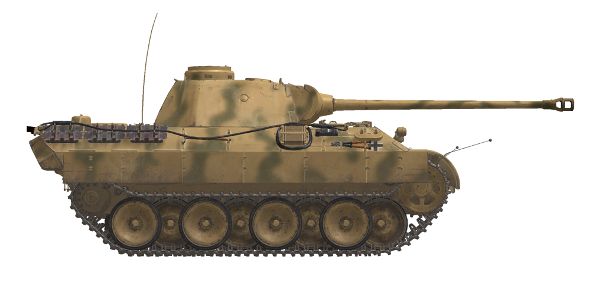

# 豹式坦克D型（Pz.Kpfw.V Ausf.D）  

<table><tbody><tr><td style="text-align: center"></td></tr></tbody></table>  

## 描述  

其于1942年由MAN公司开发，1943年首次出现在库尔斯克战役中。坦克拥有强大的主炮、厚实的正面装甲和良好的机动性，但要牺牲其他方向的防护性能作为代价。  
  
为了更好地分配重量并保护侧面，其车轮按棋盘格形式布置，这使得行走机构的维修非常困难-在战斗条件下，其损坏通常会导致坦克的损失。悬架的压缩行程非常大，而且悬挂比其他坦克的要软得多，从而带来行驶的舒适性。一个悬挂装置包括两个扭力杆（总共32个）。这些坦克的可靠性极为糟糕，特别是在生产之初——到1943年4月，174台中只有4台被送到前线部队，其余的被送回原厂返工。  
  
该坦克可在炮塔上安装六门迫击炮，设计用于在约 80 米的距离内发射烟雾弹。  
  
75mm KwK 42 坦克炮拥有高炮口初速，能在相当远的距离上击穿任何坦克的装甲。  
  
正面装甲防护中规中矩，但侧面装甲、尾部装甲不尽人意，尤其是底部和顶部装甲防护很差，对敌人坦克和火炮的防护不足。为了改善薄弱的侧面保护，安装了附加的的薄板装甲（Schürzen）。  
  
D型从1943年一月开始生产到九月结束生产间总计有842辆被制造。  
  
<b><u>空载重量：</u></b> 45500 kg  
长度：8.9m  
宽度：3.4m  
高度：3.0m  
间隙：550 mm  
  
迈巴赫发动机HL 210 P30（汽油）  
最大功率：650 HP（3000 RPM）  
最大转速：3000 RPM  
7档变速箱。  
  
<b><u>最高行车速度 ：</u></b>  
前进挡1：4.2 km/h  
前进挡2：8.4 km/h  
前进挡3：13.2 km/h  
前进挡4：21.6 km/h  
前进挡5： 30.0 km/h  
前进挡6： 42.0 km/h  
前进挡7：55.2 km/h  
倒挡：4.1 km/h  
  
<b><u>最大越野速度 ：</u></b> 25 km/h  
  
<b><u>流体：</u></b>  
内部油箱容量：720 L  
机油系统容量：42 L  
夏季发动机冷却液：120L含40%防冻液  
冬季发动机冷却液：120L含60%防冻液  
续航范围：205 km  
最大油耗：3.8 L/h  
  
<b><u>车体装甲：</u></b>  
上前：80mm轧制装甲  
前下：60mm轧制装甲  
侧面：40mm轧制装甲  
后面：40mm轧制装甲  
顶盖：16mm轧制装甲  
顶部格栅：20mm铸造装甲  
底部：16mm轧制装甲  
履带上方装甲：16mm轧制装甲  
  
<b><u>炮塔装甲：</u></b>  
前面：100mm铸造装甲  
侧面：45mm轧制装甲  
后面：45mm轧制装甲  
顶盖：16mm轧制装甲  
炮塔：95mm铸造装甲  
炮盾：100mm铸造装甲  
  
<b><u>主炮：</u></b> 线膛炮，7.5cm KwK 42 L/70坦克 炮。  
炮管长度：58.1.  
俯仰角：+18°~-8°  
弹药：最多79发  
有效射速：7 发/分  
炮塔驱动：液压，每圈60s  
  
<b><u>炮弹：</u></b>  
7.5cm Pzgr.39/42 硬芯穿甲弹（APCR） 弹头质量：4.1 kg 炮口初速：1170 m/s 炮口处穿透力：208mm  
7.5cm Pzgr.40/42 硬芯穿甲弹（APCR）弹头质量：4.1 kg 炮口初速：1170 m/s 炮口处穿透力：208mm  
7.7cm Sprgr.42 高爆弹（HE）：弹头重量5.74 kg，炮口初速700 m/s，装弹量660 g  
  
<b><u>机枪：</u></b>7.92mm机枪MG 34  
子弹质量：11.5 g  
炮口初速：855 m/s  
100m处穿甲能力：11 mm  
射速：900 发/分  
同轴机枪：20条弹链，每条弹链150发（3000发）  
航向机枪: +-15°/+13°~-6°，42型弹匣，每个弹匣50发 （共2100发）  
  
<b><u>Gunsights:</u></b>  
Tzf 12 gunner binocular scope-sight, field of view 29°.  
  
<b><u>Radio equipment:</u></b>  
VHF Fu 5 transceiver with additional Fu 2 receiver.  
4 intercom terminals.  

## 修改  
### 穿甲榴弹  

7，5 cm Pzgr.39/42  
  
炮弹上装有爆炸弹头。  
  
对抗装甲目标效果好。击穿时对目标内部造成比穿甲弹（AP）更大伤害，但是榴弹（HE）装药可能过早引爆（比如用于对抗间隙装甲板时）  
  
质量 6.8 kg，炸药质量 18 g.  
  
当从7.5cm KwK 42 L/70火炮发射时：  
炮口初速：925 m/s，近距离装甲穿深 158 mm  
500m时：装甲穿深 140mm，速度 825 m/s，下坠高度 1.6m  
1000m时：装甲穿深 125mm，速度 785 m/s，下坠高度 6.6m  
2000m时：装甲穿深 99mm，速度 667 m/s，下坠高度 29.6m  

### 榴弹  

7，5 cm SprGr.42  
  
对抗软目标、无装甲和轻装甲目标效果好。  
  
质量 5.74 kg，炸药质量 660 g.  
  
直接命中装甲穿深 20mm，对轻型车辆有效杀伤距离3m  
  
当从7.5cm KwK 42 L/70火炮发射时：  
炮口初速：700 m/s  
500m时：速度 648 m/s，下坠高度 2.8m  
1000m时：速度 601 m/s，下坠高度 11.5m  
2000m时：速度 518 m/s，下坠高度 49.9m  
  
### 次口径穿甲弹  

7，5 cm Pzgr.40/42  
  
装有次口径穿甲弹芯的炮弹。在近距离对抗重装甲目标效果好。  
  
7.5cm Pzgr.40是一种复合弹药 - 硬（钨合金）弹芯在由较软的钢组成的弹体里（用于炮管内密封）  
  
质量：4.1 kg，弹芯口径28 mm  
  
当从7.5cm KwK 40 L/48火炮发射时：  
炮口初速：1170 m/s，近距离装甲穿深 208 mm  
500m时：装甲穿深 179mm，速度 1054 m/s，下坠高度 1.0m  
1000m时：装甲穿深 154mm，速度 949 m/s，下坠高度 4.3m  
2000m时：装甲穿深 111mm，速度 756 m/s，下坠高度 19.7m  
  
### 移除附加装甲板  

移除附在车体上的5mm装甲侧裙板（Schürzen）  
添加它们主要是为了保护坦克免受大规模反坦克步枪火力的伤害，这对装甲较薄的一侧来说是危险的。  
虽然无法阻停穿甲子弹，这种附加装甲可以使其失稳或导致其碎裂，然后才击中主装甲保护车体。  

### Smoke Mortars  

Installation of 6 external single-shot smoke mortars.  
Schnellnebelkerze 39 (Nb K S 39) smoke grenade  
Range: 80 m  
Smoking time: 3 min  
