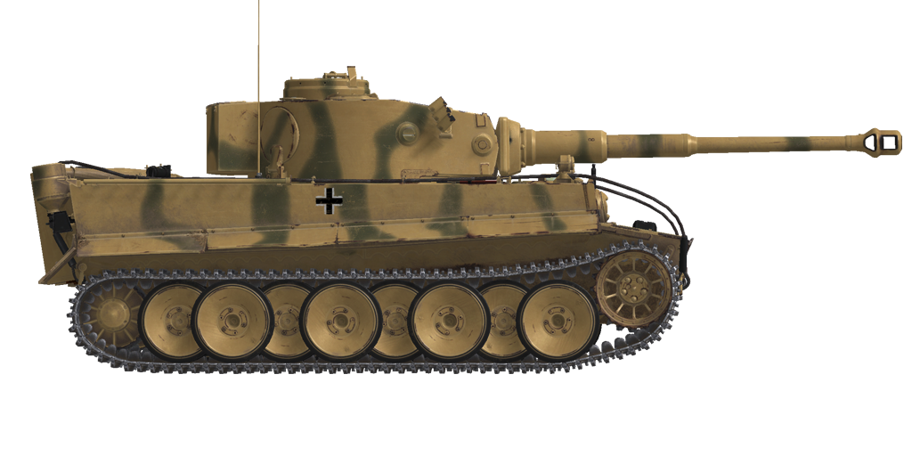

# Pz.Kpfw.VI Ausf.H1  
  
  
  
## Descripción  
  
Desarrollado por la compañía Henschel en 1942, su primera acción de combate tuvo lugar en el Frente de Leningrado en agosto de 1942.  
  
El carro de combate era famoso por su poderoso blindaje y apariencia «cuadrada». Sus ruedas estaban intercaladas y solapadas para optimizar la presión al suelo y proporcionar protección adicional a los lados del casco, pero esto hizo que las reparaciones del tren de rodaje fuesen complicadas, lo que en condiciones de combate real provocaba a menudo la pérdida del tanque.  
  
El carro podía estar equipado con seis morteros montados en la torreta diseñados para disparar granadas de humo a una distancia de unos 80 metros.  
  
El principal valor de esta máquina era su poderoso cañón KwK 36 de 88 mm desarrollado sobre la base del cañón antiaéreo FlaK 18/36. Este arma permitía a los <i>Tigers</i> destruir los carros enemigos a grandes distancias, ya que su potencia de fuego no tuvo rival en el campo de batalla hasta la aparición de los carros de combate pesados IS-2.  
  
A causa de su complejo y avanzado diseño, la fabricación de los <i>Tigers</i> eran muy cara (800.000 <i>Reichsmarks</i> —marco imperial—, el doble que la mayoría de los carros de esa época).   
  
En total se fabricaron 1354 <i>Tiger</i> entre agosto de 1942 y agosto de 1944.  
  
<b><u>Peso vacío:</u></b> 57000 kg  
Longitud: 8,5 m  
Anchura: 3,7 m  
Altura: 2,9 m  
Distancia al suelo: 470 mm  
  
Motor: Maybach HL 210 P30, gasolina  
Potencia máxima: 650 CV a 3000 rpm  
Máximas rpm: 3000 rpm  
Cambio de 8 marchas  
  
<b><u>Velocidad máxima en carretera:</u></b>  
1.ª: 2,8 km/h  
2.ª: 4,2 km/h  
3.ª: 6,1 km/h  
4.ª: 9,1 km/h  
5.ª: 14,0 km/h  
6.ª: 20,8 km/h  
7.ª: 30,1 km/h  
8.ª: 45,0 km/h  
1.ª marcha atrás: 3,7 km/h  
2.ª marcha atrás: 5,5 km/h  
3.ª marcha atrás: 8,1 km/h  
4.ª marcha atrás: 12,0 km/h  
  
<b><u>Velocidad máxima en otros terrenos:</u></b> 25 km/h  
  
<b><u>Líquidos:</u></b>  
Capacidad depósitos de combustible internos: 530 l  
Capacidad aceite lubricante del motor: 30 l  
Refrigerante del motor en verano: 120 l de 40% glysantin  
Refrigerante del motor en invierno: 120 l de 60% glysantin  
Autonomía: 140 km  
Consumo de aceite máximo: 4 l/h  
  
<b><u>Blindaje del casco:</u></b>  
Frontal superior: 102 mm laminado  
Frontal medio: 102 mm laminado  
Frontal inferior: 102 mm laminado  
Frontal bajo: 63 mm laminado  
Laterales superior: 82 mm laminado  
Laterales inferior: 63 mm laminado  
Trasera superior: 82 mm laminado  
Trasera inferior: 63 mm laminado  
Techo: 26 mm laminado  
Rejillas del techo: 25 mm fundición  
Fondo: 26 mm laminado  
Fondo por encima de orugas: 26 laminado  
  
<b><u>Blindaje de torreta:</u></b>  
Frontal superior: 102 mm laminado  
Frontal inferior: 90 mm laminado  
Laterales: 82 mm laminado  
Trasera: 26 mm laminado  
Techa: 26 mm laminado  
Cúpula: 75 mm fundición  
Mantelete: 100 mm fundición  
  
<b><u>Cañón principal:</u></b> estriado, KwK 36 L/56 de 88 mm  
Longitud del cañón: 56 calibres (4928 mm)  
Elevación: +11°..-4°  
Munición: hasta 92 proyectiles  
Cadencia de disparo útil: 7 proyectiles por minuto  
Movimiento torreta: hidraúlico, 60 segundos por vuelta  
  
<b><u>Munición del cañón:</u></b>  
Pzgr. 39 de 8,8 cm perforante explosivo (APHE): 10,16 kg, 800 m/s, 129 mm a 500 m  
Pzgr. 40 de 8,8 cm perforante núcleo rígido (APCR): 7,3 kg, 930 m/s, 201 mm a bocajarro  
Gr. 39 HL de 8,8 cm de carga hueca (HEAT): 7,65 kg, 600 m/s, 90 mm  
Sprgr L/4,5 de 8,8 cm explosivo (HE): 9,0 kg, 820 m/s, 900 g de explosivo  
  
<b><u>Ametralladoras:</u></b> Maschinengewehr MG 34 de 7,92 mm  
Peso de la bala: 11,5 g  
Velocidad de salida: 855 m/s  
Penetración de blindaje a 100 m: 11 mm  
Cadencia de disparo: 900 balas por minuto  
Coaxial: 21 cintas, 150 balas cada cinta (3150 balas)  
Glacis: +-15°/+20°..-10°, 15 cintas, 150 balas por cinta (2250 balas)  
  
<b><u>Miras para apuntado del armamento:</u></b>  
Mira telescópica binocular Tzf 9b en artillero, campo de visión de 26°  
Mira telescópica KZF 2 en operador de radio, campo de visión de 18°  
  
<b><u>Equipamiento de radio:</u></b>  
Transmisor-receptor VHF Fu 5  
4 intercomunicadores  
  
## Modificaciones  
### Proyectiles perforantes explosivos (APHE)  
  
Pzgr. 39 de 8,8 cm  
  
Proyectiles perforantes armados con una pequeña carga explosiva que estalla con un ligero retraso tras el impacto.  
  
Adecuados contra objetivos blindados. En caso de perforación causan más daño dentro del objetivo que los proyectiles perforantes sólidos (AP), pero la parte explosiva puede detonarse prematuramente (por ejemplo, cuando se usan contra objetivos con capas blindadas espaciadas).  
  
Peso 10,16 kg, cantidad explosivo 64 g.  
  
Disparado desde un cañón de 8,8 cm KwK 36 L/56:  
Velocidad de salida 800 m/s, penetración del blindaje a bocajarro 140 mm.  
500 m: penetración del blindaje 129 mm, velocidad 756 m/s, caída -2,2 m.  
1000 m: penetración del blindaje 119 mm, velocidad 713 m/s, caída -8,6 m.  
2000 m: penetración del blindaje 100 mm, velocidad 631 m/s, caída -36,3 m.  
### Proyectiles explosivos (HE)  
  
Sprgr. L/4,5 de 8,8 cm  
  
Proyectiles de fragmentación con carga altamente explosiva en su interior.  
  
Adecuados contra objetivos no blindados o con blindaje ligero.  
  
Peso 9,0 kg, cantidad explosivo 900 g.  
Penetración de blindaje en impacto directo 24 mm, distancia de daño efectiva para vehículos ligeros 3 m.  
  
Disparado desde un cañón de 8,8 cm KwK 36 L/56:  
Velocidad de salida 820 m/s.  
500 m: velocidad 771 m/s, caída -2,0 m.  
1000 m: velocidad 723 m/s, caída -8,1 m.  
2000 m: velocidad 629 m/s, caída -35,5 m.  
### Proyectiles de carga hueca (HEAT)  
  
Gr. 39 HL de 8,8 cm  
  
Proyectiles basados en el efecto Munroe. Cuando su explosivo detona, un cono, generalmente de cobre, instalado con la punta hacia el interior del proyectil, se invierte y se transforma en un chorro de metal fundido que perfora el blindaje.  
  
Su capacidad de perforación no se ve alterada por la distancia, pero sí su precisión debido a la menor velocidad del proyectil. Los proyectiles cinéticos similares suelen tener más capacidad de penetración en distancias cortas.  
  
Peso 7,65 kg, cantidad de explosivo 640 g, penetración de blindaje 90 mm.  
  
Disparado desde un cañón de 8,8 cm KwK 36 L/56:  
Velocidad de salida: 600 m/s.  
500 m: velocidad 476 m/s, caída -4,1 m.  
1000 m: velocidad 369 m/s, caída -19,4 m.  
2000 m: velocidad 273 m/s, caída -114,6 m.  
### Proyectiles perforantes núcleo rígido (APCR)  
  
Pzgr. 40 de 8,8 cm  
  
Proyectiles perforantes que poseen un núcleo de pequeño calibre de material muy duro y denso. El Pzgr. 40 de 8,8 cm posee un núcleo rígido (aleación de tungsteno) dentro de un cuerpo fabricado en acero más blando (para ocupar el diámetro del cañón).  
  
Adecuado contra objetivos fuertementre blindados en distancias cortas.  
  
Peso 7,3 kg, calibre núcleo rígido 37 mm.  
  
Disparado desde un cañón de 8,8 cm KwK 36 L/56:  
Velocidad de salida 930 m/s, penetración del blindaje a bocajarro 201 mm.  
500 m: penetración del blindaje 179 mm, velocidad 858 m/s, caída -1,7 m.  
1000 m: penetración del blindaje 159 mm, velocidad 791 m/s, caída -6,6 m.  
2000 m: penetración del blindaje 126 mm, velocidad 670 m/s, caída -29,1 m.  
### Lanzagranadas de humo  
  
Instalación de 6 morteros externos lanzagranadas de humo de un único proyectil.  
Granada de humo Schnellnebelkerze 39 (Nb K S 39)  
Distancia de lanzamiento: 80 m  
Duración del humo: 3 minutos  
