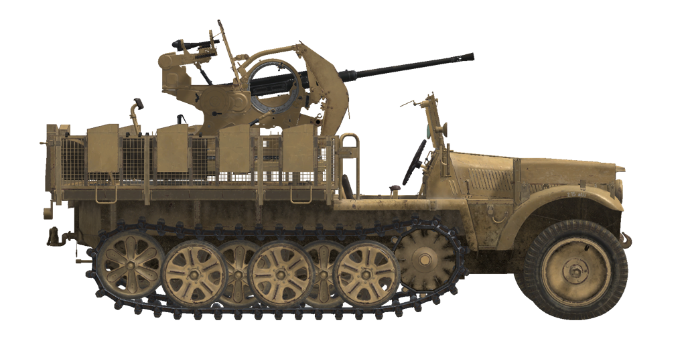

# Sd.Kfz.10/5  

<table><tbody><tr><td style="text-align: center"></tr></td></tr></tbody></table>  

Modificación del semioruga Sd.Kfz.10, una de las  muchas fabricadas por la compañía Demag, como plataforma móvil del cañón antiaéreo Flak 38 desde 1939.  
  
Este semioruga de carrocería monocasco totalmente metálica estaba equipado con un sistema de propulsión de orugas de doble diferencial con frenos (las ruedas delanteras carecían de ellos) y tenía una plataforma metálica a medida donde se instalaba el cañón.  
  
El cañón antiaéreo Flak 38 de 20 mm era una evolución del anterior diseño Flak 30 con doble cadencia de fuego y un sistema de apuntado con elevación y desplazamiento mejorado de dos velocidades. La producción de este cañón antiaéreo comenzó en 1938.  
  
<b><u>Peso vacío:</u></b> ~4900 kg  
Longitud: 4,8 m  
Anchura: 2,4 m  
Altura: 2,4 m  
Distancia al suelo: 310 mm  
  
Motor: Maybach HL42 TRKM, gasolina  
Potencia máxima: 100 CV a 2800 rpm  
Máximas rpm: 3000 rpm  
Cambio de 7 marchas  
  
<b><u>Velocidad máxima en carretera:</u></b>  
1.ª: 5,9 km/h  
2.ª: 9,6 km/h  
3.ª: 13,9 km/h  
4.ª: 21,4 km/h  
5.ª: 33,2 km/h  
6.ª: 51,4 km/h  
7.ª: 69,6 km/h  
1.ª atrás: 5,9 km/h  
2.ª atrás: 9,6 km/h  
3.ª atrás: 13,9 km/h  
  
<b><u>Velocidad máxima en otros terrenos:</u></b> 25 km/h  
  
<b><u>Líquidos:</u></b>  
Capacidad depósitos de combustible internos: 90 l  
Capacidad aceite lubricante del motor: 12 l  
Refrigerante del motor en verano: 18 l de agua  
Autonomía: 260 km  
Consumo de aceite máximo: 1 l/h  
  
<b><u>Blindaje opcional:</u></b>  
Escudo en cañón: 6 mm laminado  
  
<b><u>Cañón principal:</u></b> estriado, 2 cm Flak 38.  
Longitud del cañón: 65  
Elevación: +85°..-12°  
Munición: hasta 280 proyectiles (14 cargadores, 20 proyectiles por cargador)  
Cadencia de disparo: 450 proyectiles por minuto  
Movimiento cañón: mecánico, 6 segundos por vuelta  
  
<b><u>Munición del cañón:</u></b>  
2 cm Pzgr. L\spur perforante sólido (AP): 148 g, 780 m/s, 33 mm a 500 m  
2 cm Spgr.Patr. explosivo (HE): 115 g, 880 m/s, 6 g de explosivo  
  
<b><u>Miras para apuntado del armamento:</u></b>  
Mira antiaérea mecánica Schwebekreis Visier 38.  
Mira telescópica ZF 3x8 para objetivos en tierra.  
Miras de hierro de respaldo.  

## Modificaciones  
### Proyectiles perforantes sólidos (AP)  

2 cm Pzgr. Lspur  
  
Proyectiles perforantes sólidos, sin carga explosiva en su interior.  
  
Adecuados contra objetivos con planchas de blindaje espaciadas, pero causan menos daños dentro del objetivo que el perforante explosivo (APHE), más avanzado.  
  
Peso 148 g.  
  
Disparado desde un cañón Flak 38:  
Velocidad de salida 780 m/s, penetración del blindaje a bocajarro 25 mm.  
500 m: penetración del blindaje 16 mm, velocidad 561 m/s, caída -2,7 m.  
1000 m: penetración del blindaje 9 mm, velocidad 393 m/s, caída -13,6 m.  
2000 m: penetración del blindaje 5 mm, velocidad 264 m/s, caída -96,1 m.  
  
### Proyectiles explosivos (HE)  

2 cm Spgr.Patr.  
  
Proyectiles de fragmentación con carga altamente explosiva en su interior.  
  
Adecuados contra objetivos no blindados o con blindaje ligero.  
  
Peso 115 g, cantidad explosivo 6 g.  
Se autodestruyen (explotan después de 6 segundos a unos 2000 m de distancia).  
Penetración de blindaje en impacto directo 3 mm, distancia de daño efectiva para vehículos ligeros 1 m.  
  
Disparado desde un cañón Flak 38:  
Velocidad de salida 880 m/s.  
500 m: velocidad 634 m/s, caída -2,1 m.  
1000 m: velocidad 373 m/s, caída -11,0 m.  
2000 m: velocidad 245 m/s, caída -95,8 m.  
  
### Desinstalar escudos del cañón  

Desinstalación de los escudos blindados del cañón para mejorar el campo de visión.  
  
### Desinstalar escudo de la mira  

Desinstalación del escudo blindado de la mira para proporcionar al artillero un campo de visión ligeramente más amplio.  
