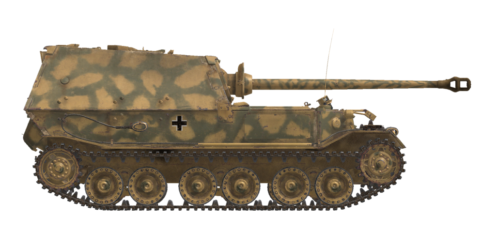

# Sd.Kfz.184  
  
  
  
## 描述  
  
Heavy tank destroyer Sd.Kfz.184 built at Nibelungenwerke in 1943. This early version lacking commander cupola and a machine gun is known as "Ferdinand", while a later one equipped with these is known as "Elefant". 91 vehicles of all modifications were produced in total.  
  
This self-propelled artillery was created to make use of the numerous "Tiger (P)" tanks chassis that were built for a new German heavy tank, but were left unused when the German authorities chose a competing design. This chassis had a unique electromechanical transmission, which, while being cutting-edge for its time, had many disadvantages - a significant drop in efficiency as the speed increased was the main one. This led to a very limited operational range and driving speed. However, "Ferdinand" was the most armored combat vehicle at the time of the Kursk battle. Its only weapon was long 88mm KwK 43 main gun designed on the basis of Flak 41 AA gun - its muzzle energy was more than 1.5 times higher than the muzzle energy of KwK 39 installed on Tiger tanks. As a result, armor-piercing rounds fired from it could knock out any armored vehicle of its time at any distance up to the maximum aiming distance. The early production vehicles had serious problems with the field of vision: the gunner used a periscopic gunsight with a very limited field of view while the commander had no optical visors usable with a closed hatch. Two loaders had periscopes for looking backward (in the game they can be used by the gunner and commander).  
  
At the Kursk battle, Sd.Kfz.184 was the most armored combat vehicle armed with the best anti-tank weapon, but they failed to make a decisive impact on the battle outcome because their numbers and mobility were limited.  
  
<b><u>Unladen weight:</u></b> 67000 kg.  
Length: 8.2 m.  
Width: 3.4 m.  
Height: 3.0 m.  
Clearance: 479 mm.  
  
Engine: 2 x Maybach HL 120TRM, petrol.  
Maximum power: 2 x 300 HP at 3000 RPM.  
Maximum RPM: 3000 RPM.  
Electromechanical transmission including two 250 kW DC traction generators, each attached to its own engine. Generators are powering the joint powerline which feeds two DC driving motors - one per side.  
Powerplant has 3 power modes:  
1st: beginning of the movement, low-speed turns and driving on stiff slopes.  
2nd: acceleration and driving on difficult terrain.  
3rd: general driving mode.  
  
<b><u>Maximum allowed road speed:</u></b> 20 kph.  
  
<b><u>Maximum offroad speed:</u></b> 11 kph.  
  
<b><u>Endurance range:</u></b> 150 km.  
  
<b><u>Fluids:</u></b>  
Internal fuel tanks capacity: 950 l.  
Engine oil system capacity: 50 l.  
Summer engine coolant: 200 l. of 40% glysantin  
Winter engine coolant: 200 l. of 60% glysantin  
Maximum oil consumption: 22 l/h.  
  
<b><u>Hull armour:</u></b>  
Gun mantlet: 100 mm cast armour + 30 mm rolled armour screen.  
Cabin front: 100 mm + 100 mm rolled armour.  
Hull front: 100 mm + 100 mm rolled armour.  
Upper sides: 80 mm rolled armour.  
Lower sides: 60 mm rolled armour.  
Rear: 60 mm rolled armour.  
Rear, armouring of cooling exhaust of electromotors: 45 mm rolled armour.  
Frontal roof: 30 mm rolled armour.  
Rear roof: 30 mm rolled armour.  
Bottom, forward: 50 mm rolled armour.  
Bottom, rear: 25 mm rolled armour.  
Bottom above tracks: 25 mm rolled armour.  
  
<b><u>Main gun:</u></b> rifled, 8,8 cm KwK 43 L/71.  
Barrel length: 58.5.  
Elevation: +15°..-7.5°.  
Azimuth: +12°..-12°.  
Ammo: up to 50 rounds.  
Usable rate of fire: 6 rounds per minute.  
Turret drive: mechanical.  
  
<b><u>Gun ammunition:</u></b>  
8,8 cm Pzgr. 39/43 armour piercing high explosive (APHE): 10.16 kg, 1000 m/s, 179 mm at 500 m.  
8,8 cm Pzgr. 40/43 armour piercing composite rigid (APCR): 7.3 kg, 1130 m/s, 266 mm point blank.  
8,8 cm Sprgr. Flak 41 high explosive (HE): 9.4 kg, 700 m/s, 1 kg explosives.  
  
<b><u>Gunsights:</u></b>  
Sfl ZF 1a gunner periscopic sight, field of view 8°.  
  
<b><u>Radio equipment:</u></b>  
VHF Fu 5 transceiver.  
5 intercom terminals.  
  
  
## 修改  
  
  
### Armour Piercing High Explosive Shells  
  
8,8 cm Pzgr. 39/43  
  
Shells armed with bursting charge warhead.  
  
Good against armoured targets. In case of penetration do more damage inside the target than solid AP shells, but HE filling can detonate prematurely (for instance, when used against spaced armour plates).  
  
Mass 10.16 kg, explosives mass 64 g.  
  
When fired from a 8,8 cm KwK 43 L/71 gun:  
Muzzle velocity 1000 m/s, armour penetration at point blank range 192 mm.  
500 m: armour penetration 179 mm, velocity 951 m/s, drop -1.3 m.  
1000 m: armour penetration 167 mm, velocity 905 m/s, drop -5.4 m.  
2000 m: armour penetration 144 mm, velocity 816 m/s, drop -22.8 m.  
  
### High-Explosive Shells  
  
8,8 cm Sprgr. Flak 41  
  
Good against soft, unarmored or lightly armored targets.  
  
Mass 9.4 kg, explosives mass 1 kg.  
  
Direct hit armour penetration 24 mm, effective damage distance for light vehicles 3 m.  
  
When fired from a 8,8 cm KwK 43 L/71 gun:  
Muzzle velocity 700 m/s.  
500 m: velocity 662 m/s, drop -2.7 m.  
1000 m: velocity 625 m/s, drop -11.1 m.  
2000 m: velocity 556 m/s, drop -47.4 m.  
  
### Sub-Caliber Armour Piercing Shells  
  
8,8 cm Pzgr. 40/43  
  
Shells armed with sub-caliber armour-piercing projectile. Good against heavily armoured targets at short ranges.  
  
8,8 cm Pzgr. 40 is a composite round - hard (tungsten alloy) penetrator inside a body made from a softer steel (for obturation inside a gun barrel).  
  
Mass: 7,3 kg, penetrator calibre 37 mm.  
  
When fired from a 8,8 cm KwK 43 L/71 gun:  
Muzzle velocity 1130 m/s, armour penetration at point blank range 266 mm.  
500 m: armour penetration 237 mm, velocity 1044 m/s, drop -1.1 m.  
1000 m: armour penetration 212 mm, velocity: 964 m/s, drop -4.6 m.  
2000 m: armour penetration 168 mm, velocity: 821 m/s, drop -19.7 m.  
  
### 倒置炮盾  
  
带有倒置炮盾的自定义改装。  
