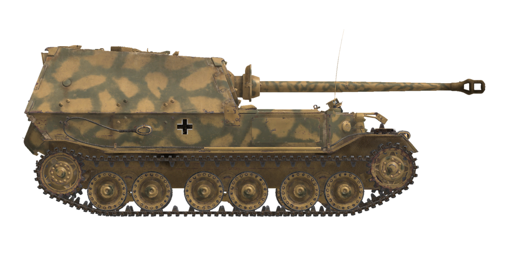

# Sd.Kfz.184  

  

## Descripción  

El «destructor de carros pesados», el cazacarros Sd.Kfz.184 se fabricó en Nibelungenwerke en 1943. Esta versión inicial, sin cúpula de mando ni ametralladora se conoce como «Ferdinand», mientras que una posterior, equipada con estas mejoras, se conoce como «Elefant». En total, se produjeron 91 vehículos de todas las variantes.  
  
Este cañón autopropulsado fue creado para hacer uso de los numerosos chasis de los carros de combate «Tiger (P)» que se construyeron para un nuevo tanque pesado alemán, pero que quedaron sin usar cuando las autoridades alemanas eligieron un diseño de la competencia. Este chasis tenía una transmisión electromecánica única que, si bien estaba a la vanguardia para su época, tenía muchas desventajas: la principal era una importante disminución de la eficiencia al aumentar la velocidad. Esto condujo a un rango operativo y una velocidad de movimiento muy limitadas. Sin embargo, el «Ferdinand» fue el vehículo de combate más blindado en la época de la batalla de Kursk. Su única arma era un cañón de 88 mm KwK 43 diseñado sobre la base del cañón Flak 41 AA. Su velocidad de salida era más de 1,5 veces mayor que la velocidad de salida del cañón KwK 39 instalado en los «Tiger». Como resultado, los proyectiles perforantes disparados desde él podían noquear a cualquier vehículo blindado de su época a su máxima distancia de puntería. Los primeros vehículos producidos tuvieron graves problemas con el campo de visión: el artillero utilizaba una mira telescópica con un campo de visión muy limitado mientras que el comandante no tenía visores ópticos que pudiera emplear cuando la escotilla estuviera cerrada. Los dos encargados de recargar tenían periscopios para mirar hacia atrás (en el juego pueden ser utilizados por el artillero y el comandante).  
  
En la batalla de Kursk, el Sd.Kfz.184 fue el vehículo de combate más blindado y estaba equipado con el mejor arma anticarro, pero no tuvo un impacto decisivo en el resultado de la batalla porque su número y movilidad eran limitados.  
  
<b><u>Peso vacío:</u></b> 67000 kg  
Longitud: 8,2 m  
Anchura: 3,4 m  
Altura: 3,0 m  
Distancia al suelo: 479 mm  
  
Motor: 2 Maybach HL 120TRM, diesel  
Potencia máxima: 2 x 300 CV a 3000 rpm  
Máximas rpm: 3000 rpm  
Transmisión electromecánica que incluye dos generadores de tracción en CC de 250 kW, cada uno con su propio motor. Los generadores alimentan la línea de potencia conjunta que suministra energía a los dos motores de tracción de CC - uno por cada lado.  
El sistema de transmisión de tracción tiene 3 modos de potencia:  
1.º: inicio del movimiento, giros a baja velocidad y conducción en cuestas pronunciadas.  
2.º: aceleración y conducción en terrenos difíciles.  
3.º: modo de conducción general.  
  
<b><u>Velocidad máxima en carretera:</u></b> 20 km/h  
  
<b><u>Velocidad máxima en otros terrenos:</u></b> 11 km/h  
  
<b><u>Autonomía:</u></b> 150 km  
  
<b><u>Líquidos:</u></b>  
Capacidad depósitos de combustible internos: 950 l  
Capacidad sistema lubricante del motor: 50 l  
Refrigerante del motor en verano: 200 l de 40% etilenglicol  
Refrigerante del motor en invierno: 200 l de 65% etilenglicol  
Consumo de aceite máximo: 22 l/h  
  
<b><u>Blindaje:</u></b>  
Mantelete: 100 mm fundición + pantalla de 30 mm laminado  
Frontal cabina: 100 mm + 100 mm laminado  
Frontal casco: 100 mm + 100 mm laminado  
Laterales superiores: 80 mm laminado  
Laterales inferiores: 60 mm laminado  
Trasera: 60 mm laminado  
Trasera, salida refrigeración de los motores eléctricos: 45 mm laminado  
Techo frontal: 30 mm laminado  
Techo trasero: 30 mm laminado  
Fondo delantero: 50 mm laminado  
Fondo trasero: 25 mm laminado  
Fondo por encima de orugas: 25 mm laminado  
  
<b><u>Cañón principal:</u></b> estriado, KwK 43 L/71 de 88 mm  
Longitud del cañón: 58,5 calibres  
Elevación: +15°..-7,5°  
Azimutal: +12°..-12°  
Munición: hasta 50 proyectiles  
Cadencia de disparo útil: 6 proyectiles por minuto  
Movimiento torreta: mecánico  
  
<b><u>Munición del cañón:</u></b>  
Pzgr. 39/43 de 8,8 cm perforante explosivo (APHE): 10,16 kg, 1000 m/s, 179 mm a 500 m  
Pzgr. 40/43 de 8,8 cm perforante núcleo rígido (APCR): 7,3 kg, 1130 m/s, 266 mm a bocajarro  
SprGr.Flak 41 de 8,8 cm explosivo (HE): 9,4 kg, 700 m/s, 1 kg de explosivo  
  
<b><u>Ajustes de la mira para el Sprgr. Flak 41:</u></b>  
(Distancia - número en escala superior):  
0000 m - 000  
0100 m - 001    4100 m - 060    8100 m - 182  
0200 m - 002    4200 m - 062    8200 m - 186  
0300 m - 003    4300 m - 064    8300 m - 190  
0400 m - 004    4400 m - 066    8400 m - 195  
0500 m - 005    4500 m - 068    8500 m - 200  
0600 m - 006    4600 m - 070    8600 m - 205  
0700 m - 008    4700 m - 072    8700 m - 210  
0800 m - 009    4800 m - 075    8800 m - 215  
0900 m - 010    4900 m - 077    8900 m - 220  
1000 m - 011    5000 m - 080    9000 m - 225  
  
1100 m - 012    5100 m - 082    9100 m - 231  
1200 m - 014    5200 m - 084    9200 m - 236  
1300 m - 015    5300 m - 087    9300 m - 241  
1400 m - 016    5400 m - 090    9400 m - 247  
1500 m - 017    5500 m - 092    9500 m - 253  
1600 m - 019    5600 m - 095    9600 m - 259  
1700 m - 020    5700 m - 097    9700 m - 265  
1800 m - 021    5800 m - 100    9800 m - 271  
1900 m - 023    5900 m - 103    9900 m - 277  
2000 m - 024    6000 m - 106   10000 m - 284  
  
2100 m - 025    6100 m - 109   10100 m - 290  
2200 m - 027    6200 m - 112   10200 m - 297  
2300 m - 028    6300 m - 115   10300 m - 303  
2400 m - 030    6400 m - 118   10400 m - 311  
2500 m - 031    6500 m - 121   10500 m - 318  
2600 m - 033    6600 m - 124  
2700 m - 034    6700 m - 127  
2800 m - 036    6800 m - 131  
2900 m - 038    6900 m - 134  
3000 m - 039    7000 m - 138  
  
3100 m - 041    7100 m - 142  
3200 m - 043    7200 m - 145  
3300 m - 045    7300 m - 149  
3400 m - 046    7400 m - 153  
3500 m - 048    7500 m - 157  
3600 m - 050    7600 m - 161  
3700 m - 052    7700 m - 165  
3800 m - 054    7800 m - 169  
3900 m - 056    7900 m - 173  
4000 m - 058    8000 m - 177  
  
<b><u>Miras para apuntado del armamento:</u></b>  
Mira periscópica Sfl ZF 1a en artillero, campo de visión de 8°  
  
<b><u>Equipamiento de radio:</u></b>  
Transmisor-receptor VHF Fu 5  
5 intercomunicadores  

## Modificaciones  
### Proyectiles perforantes explosivos (APHE)  

Pzgr. 39/43 de 8,8 cm  
  
Proyectiles perforantes armados con una pequeña carga explosiva que estalla con un ligero retraso tras el impacto.  
  
Adecuados contra objetivos blindados. En caso de perforación causan más daño dentro del objetivo que los proyectiles perforantes sólidos (AP), pero la parte explosiva puede detonarse prematuramente (por ejemplo, cuando se usan contra objetivos con capas blindadas espaciadas).  
  
Peso 10,16 kg, cantidad explosivo 64 g.  
  
Disparado desde un cañón de 8,8 cm KwK 43 L/71:  
Velocidad de salida 1000 m/s, penetración del blindaje a bocajarro 192 mm.  
500 m: penetración del blindaje 179 mm, velocidad 951 m/s, caída -1,3 m.  
1000 m: penetración del blindaje 167 mm, velocidad 905 m/s, caída -5,4 m.  
2000 m: penetración del blindaje 144 mm, velocidad 816 m/s, caída -22,8 m.  
  
### Proyectiles explosivos (HE)  

Sprgr. Flak 41 de 8,8 cm  
  
Proyectiles de fragmentación con carga altamente explosiva en su interior.  
  
Adecuados contra objetivos no blindados o con blindaje ligero.  
  
Peso 9,4 kg, cantidad explosivo 1 kg.  
Penetración de blindaje en impacto directo 24 mm, distancia de daño efectiva para vehículos ligeros 3 m.  
  
Disparado desde un cañón de 8,8 cm KwK 43 L/71:  
Velocidad de salida 700 m/s.  
500 m: velocidad 662 m/s, caída -2,7 m.  
1000 m: velocidad 625 m/s, caída -11,1 m.  
2000 m: velocidad 556 m/s, caída -47,4 m.  
  
### Proyectiles perforantes núcleo rígido (APCR)  

Pzgr. 40/43 de 8,8 cm  
  
Proyectiles perforantes que poseen un núcleo de pequeño calibre de material muy duro y denso. El Pzgr. 40 de 8,8 cm posee un núcleo rígido (aleación de tungsteno) dentro de un cuerpo fabricado en acero más blando (para ocupar el diámetro del cañón).  
  
Adecuado contra objetivos fuertementre blindados en distancias cortas.  
  
Peso 7,3 kg, calibre núcleo rígido 37 mm.  
  
Disparado desde un cañón de 8,8 cm KwK 43 L/71:  
Velocidad de salida 1130 m/s, penetración del blindaje a bocajarro 266 mm.  
500 m: penetración del blindaje 237 mm, velocidad 1044 m/s, caída -1,1 m.  
1000 m: penetración del blindaje 212 mm, velocidad 964 m/s, caída -4,6 m.  
2000 m: penetración del blindaje 168 mm, velocidad 821 m/s, caída -19,7 m.  
  
### Pantalla de cañón invertida  

Modificación en campo en el que se instala la plancha de protección del cañón dejando los pernos y tuercas que sujetan las dos mitades de la plancha hacia afuera, facilitando de esta forma su acceso.  
