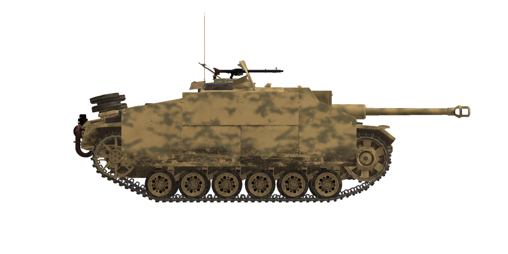

# StuG III Ausf.G  
  
  
  
## 描述  
  
This self-propelled assault gun Sturmgeschütz III Ausführung G was armed with 75 mm StuK 40 L/48 gun. Ausf.G was one of the last modifications, but the most numerous: 7800 SPG in total since December 1942 till April 1945. Compared to the previous one, it had a longer gun barrel (L/48 instead of L/43) and additional armour sheets installed in the hull and cabin front. The SPG modeled in our sim was built at MIAG factory using the Pz.Kpfw. Ausf.M chassis produced by MAN factory.  
  
The most apparent visual difference was the addition of side armor plates, "Schürzen", which were attached to the hull sides. They were added mainly to protect the tank from massed AT rifle fire which was dangerous for thinner armored sides. Not being able to stop an AP bullet, this additional armour destabilized it or caused its fragmentation before it could hit the main armored hull.  
  
The tank could be equipped with six mortars mounted on the turret and designed to shoot smoke grenades at a distance of about 80 meters.  
  
The long-barrelled 75 mm gun can reliably engage Soviet tanks at distances up to 1 km. However, the artillery periscopic gunsight was less convenient for quick direct firing than telescopic gunsights installed on tanks.  
  
Late StuG III modifications were equipped by infantry MG34 machinegun stored in the fighting compartment. To fire it, the loader had to get out of his hatch, raise the armored shield and set the machinegun up in one of the two positions - for firing at air or ground targets. Six one-shot smoke mortars could be also installed.  
  
<b><u>Unladen weight:</u></b> 23300 kg.  
Length: 6.3 m.  
Width: 3.29 m.  
Height: 2.2 m.  
Clearance: 385 mm.  
  
Engine: Maybach HL 120TRM, petrol.  
Maximum power: 300 HP at 3000 RPM.  
Maximum RPM: 3000 RPM.  
6 speed gearbox.  
  
<b><u>Maximum road speed:</u></b>  
1-st: 4.8 kph.  
2-nd: 9.2 kph.  
3-rd: 15.5 kph.  
4-th: 23.5 kph.  
5-th: 33.2 kph.  
6-th: 42.8 kph.  
Reverse: 5.9 kph.  
  
<b><u>Maximum offroad speed:</u></b> 18 kph.  
  
<b><u>Fluids:</u></b>  
Internal fuel tanks capacity: 320 l.  
Engine oil system capacity: 25 l.  
Summer engine coolant: 100 l. of 40% glysantin  
Winter engine coolant: 100 l. of 60% glysantin  
Endurance range: 155 km.  
Maximum oil consumption: 2 l/h.  
  
<b><u>Armour:</u></b>  
Gun mantlet: 50mm rolled armour.  
Cabin front, middle: 30mm rolled armour.  
Cabin front, lower: 50мм + 30mm rolled armour.  
Hull front, upper: 30 mm rolled armour.  
Hull front, middle: 50 mm rolled armour.  
Hull front, lower: 50 мм + 30 mm rolled armour.  
Hull front, bottom: 30 mm rolled armour.  
Cabin rear: 30 mm rolled armour.  
Hull rear, upper: 30 mm rolled armour.  
Hull rear, middle: 50 mm rolled armour.  
Hull rear, lower: 30 mm rolled armour.  
Cabin roof: 10 mm rolled armour.  
Cabin rear: 15 mm rolled armour.  
Sides: 30 mm rolled armour.  
Bottom: 15 mm rolled armour.  
  
<b><u>Additional armor sheets:</u></b>  
5 mm rolled armor for additional protection against AT rifles.  
  
<b><u>Main gun:</u></b> rifled, 7,5 cm Stu K 40 L/48.  
Barrel length: 55  
Elevation: +17°..-8°  
Azimuth: +10°..-10°.  
Ammo: up to 54 rounds  
Usable rate of fire: 10 rounds per minute.  
Turret drive: mechanical.  
  
<b><u>Gun ammunition:</u></b>  
7.5 cm Pzgr. 39 armor piercing high explosive (APHE): 6.8 kg, 750 m/s, 104 mm at 500 m.  
7.5 cm Pzgr. 40 armor piercing composite rigid (APCR): 4.1 kg, 930 m/s, 150 mm point blank.  
7.5 cm Gr.38 HL/С high explosive anti-tank (HEAT): 4.57 kg, 450 m/s, 104 mm.  
7.5 cm SprGr.34 high explosive (HE): 5.74 kg, 550 m/s, 660 g. explosives.  
  
<b><u>Gunsight settings for SprGr.34:</u></b>  
(Distance - point number of lower scale):  
0000m - 000  
0100m - 002    4100m - 110  
0200m - 004    4200m - 114  
0300m - 005    4300m - 118  
0400m - 007    4400m - 123  
0500m - 009    4500m - 127  
0600m - 011    4600m - 132  
0700m - 013    4700m - 137  
0800m - 015    4800m - 142  
0900m - 017    4900m - 146  
1000m - 019    5000m - 151  
  
1100m - 021    5100m - 157  
1200m - 023    5200m - 162  
1300m - 025    5300m - 167  
1400m - 027    5400m - 173  
1500m - 029    5500m - 179  
1600m - 032    5600m - 185  
1700m - 034    5700m - 190  
1800m - 036    5800m - 197  
1900m - 039    5900m - 203  
2000m - 041    6000m - 210  
  
2100m - 044    6100m - 216  
2200m - 046    6200m - 223  
2300m - 049    6300m - 230  
2400m - 052    6400m - 237  
2500m - 055    6500m - 244  
2600m - 057    6600m - 252  
2700m - 060    6700m - 260  
2800m - 063    6800m - 268  
2900m - 066    6900m - 276  
3000m - 069    7000m - 284  
  
3100m - 073    7100m - 293  
3200m - 076    7200m - 302  
3300m - 079    7300m - 311  
3400m - 082    7400m - 320  
3500m - 086  
3600m - 090  
3700m - 094  
3800m - 098  
3900m - 102  
4000m - 106  
  
<b><u>Machineguns:</u></b> 7.92 mm Maschinengewehr 34.  
Bullet mass: 11.5 g.  
Muzzle velocity: 855 m/s.  
Armour pentration at 100 m: 11 mm.  
Rate of fire: 900 rounds per minute.  
12 magazines, 50 rounds per magazine (600 rounds).  
  
<b><u>Gunsights:</u></b>  
Sfl ZF 1a gunner periscopic sight, field of view 8°.  
  
<b><u>Radio equipment:</u></b>  
VHF Fu 5 transceiver with additional Fu 2 receiver.  
4 intercom terminals.  
  
## 修改  
### 穿甲榴弹  
  
7，5 cm Pzgr.39  
  
炮弹上装有爆炸弹头。  
  
对抗装甲目标效果好。击穿时对目标内部造成比穿甲弹（AP）更大伤害，但是榴弹（HE）装药可能过早引爆（比如用于对抗间隙装甲板时）  
  
质量 6.8 kg，炸药质量 18 g.  
  
当从7.5cm Stu K 40 L/48火炮发射时：  
炮口初速：750 m/s，近距离装甲穿深 117 mm  
500m时：装甲穿深 104mm，速度 691 m/s，下坠高度 2.4m  
1000m时：装甲穿深 92mm，速度 636 m/s，下坠高度 10.0m  
2000m时：装甲穿深 72mm，速度 537 m/s，下坠高度 44.8m  
  
### 榴弹  
  
7，5 cm SprGr.34  
  
对抗软目标、无装甲和轻装甲目标效果好。  
  
质量 5.74 kg，炸药质量 660 g.  
  
直接命中装甲穿深 20mm，对轻型车辆有效杀伤距离3m  
  
当从7.5cm Stu K 40 L/48火炮发射时：  
炮口初速：550 m/s  
500m时：速度 509 m/s，下坠高度 4.5m  
1000m时：速度 473 m/s，下坠高度 18.5m  
2000m时：速度 405 m/s，下坠高度 80.9m  
  
### 破甲弹  
  
7，5 cm Gr.38 HL/С  
  
破甲弹有成型高爆聚能战斗部装药  
  
它们的穿甲能力不会随射程的增加而降低，但准确性却会降低，因为弹速较低，而类似的动能穿甲弹通常在近距离具有较高的装甲穿透能力。  
  
质量4.57 kg，炸药质量530 g，装甲穿深 104 mm  
  
当从7.5cm Stu K 40 L/48火炮发射时：  
炮口初速：450 m/s  
500m时：速度 328 m/s，下坠高度 7.8m  
1000m时：速度 278 m/s，下坠高度 38.1m  
2000m时：速度 244 m/s，下坠高度 200.4m  
  
### 次口径穿甲弹  
  
7，5 cm Pzgr.40  
  
装有次口径穿甲弹芯的炮弹。在近距离对抗重装甲目标效果好。  
  
7.5cm Pzgr.40是一种复合弹药 - 硬（钨合金）弹芯在由较软的钢组成的弹体里（用于炮管内密封）  
  
质量：4.1 kg，弹芯口径28 mm  
  
当从7.5cm Stu K 40 L/48火炮发射时：  
炮口初速：930 m/s，近距离装甲穿深 150 mm  
500m时：装甲穿深 128mm，速度 832 m/s，下坠高度 1.6m  
1000m时：装甲穿深 108mm，速度 739 m/s，下坠高度 10.0m  
2000m时：装甲穿深 75mm，速度 573 m/s，下坠高度 44.8m  
  
### 额外装甲  
  
附加防护：车身和炮塔附上5mm装甲板。  
添加它们主要是为了保护坦克免受大规模反坦克步枪火力的伤害，这对装甲较薄的一侧来说是危险的。  
虽然无法阻停穿甲子弹，这种附加装甲可以使其失稳或导致其碎裂，然后才击中主装甲保护车体。  
  
### Smoke Mortars  
  
Installation of 6 external single-shot smoke mortars.  
Schnellnebelkerze 39 (Nb K S 39) smoke grenade  
Range: 80 m  
Smoking time: 3 min  
