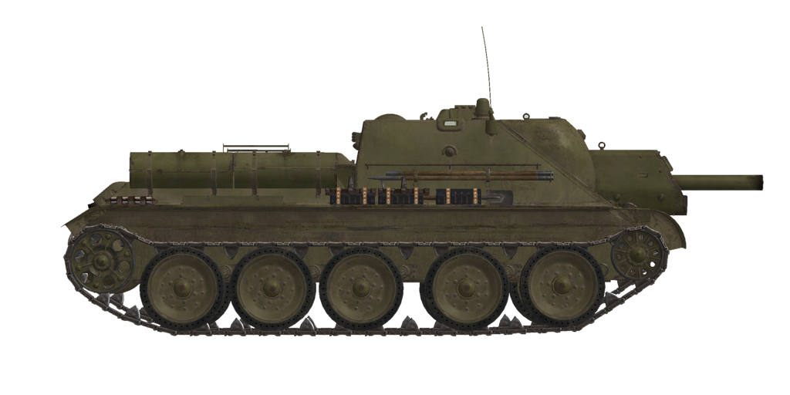

# SU-122 UZTM (1943)  

<table><tbody><tr><td style="text-align: center"></td></tr></td></tr></tbody></table>  

Das Sturmgeschütz SU-122 wurde von Ende Dezember 1942 bis August 1943 in der Uraler Schwermaschinenfabrik (UZTM) in Swerdlowsk mit insgesamt 640 gebauten Einheiten hergestellt.  
  
Es wurde das Panzerfahrgestell des Т-34-76 verwendet, aber der Mannschaftsraum wurde komplett umgebaut und der ursprüngliche Turm durch eine 122 mm M-30S Haubitze ersetzt. Die Aufhängung, der Motorraum und das Gesamtgewicht des Fahrzeuges blieben gleich, obwohl die Neigung der vorderen Panzerung reduziert wurde. Das Sturmgeschütz wurde mit einem rückstoßfreien Panoramaschussvisier für den Richtschützen und einem PTK-5-Panoramavisier für den Kommandanten ausgestatte  
  
Die Anfang Mai 1943 hergestellten Sturmgeschütze, wie das im Simulator dargestellte, hatten eine neue Verriegelung für die Kanone und verschiedene Schützenkuppel-Verschlussmechanismen.  
  
<b><u>Leergewicht:</u></b> 30900 kg  
Länge: 6,9 m  
Breite: 3,0 m  
Höhe: 2,2 m  
Bodenfreiheit: 400 mm  
  
Motor: V-2, Diesel  
Maximale Leistung: 500 PS bei 1800 U/min  
Maximale Drehzahl: 1900 U/min  
Getriebe: 5-Gang-Schaltung  
  
<b><u>Höchstgeschwindigkeit auf Straße:</u></b>  
1. Gang: 7,4 km/h  
2. Gang: 15,9 km/h  
3. Gang: 22,4 km/h  
4. Gang: 34,1 km/h  
5. Gang: 54,0 km/h  
Rückwärtsgang: 8,4 km/h  
  
<b><u>Höchstgeschwindigkeit im Gelände:</u></b> 31 km/h  
  
<b><u>Betriebsstoffe:</u></b>  
Interne Tankkapazität: 460 l  
Motorölmenge: 80 l  
Sommer-Kühlmittel: 95 l Wasser  
Winter-Kühlmittel: 95 l 50% Ethylenglycol  
Reichweite: 300 km  
Maximaler Ölverbrauch: 9 l/h  
  
<b><u>Panzerung:</u></b>  
Front: 45 mm gewalzter Panzerstahl  
Seiten: 45 mm gewalzter Panzerstahl  
Heck: 45 mm gewalzter Panzerstahl  
Wannendach: 20 mm gewalzter Panzerstahl  
Boden: 20 mm gewalzter Panzerstahl  
Boden über den Ketten: 20 mm gewalzter Panzerstahl  
Kanonenblende: 45 mm gewalzter Panzerstahl  
  
<b><u>Hauptkanone:</u></b> Gezogener Lauf, M-30S  
Lauflänge: 22,7  
Höhenrichtbereich: -3° bis +25°  
Azimutbereich: -10° bis +10°  
Munition: Bis zu 40 Granaten  
Mögliche Feuerrate: 3 Schuss pro Minute  
Turmantrieb: Mechanisch  
  
<b><u>Munition:</u></b>   
  
OF-462 Sprenggranate (HE): 21.79 kg, 515 m/s, 3.67 kg Sprengstoff  
Visiereinstellungen  
(Entfernung - Markenstrich "ДГ полный"):  
0000m - 000  
0200m - 004    3200m - 064    6200m - 124  
0400m - 008    3400m - 068    6400m - 128  
0600m - 012    3600m - 072    6600m - 132  
0800m - 016    3800m - 076    6800m - 136  
1000m - 020    4000m - 080    7000m - 140  
  
1200m - 024    4200m - 084    7200m - 144  
1400m - 028    4400m - 088    7400m - 148  
1600m - 032    4600m - 092    7600m - 152  
1800m - 036    4800m - 096    7800m - 156  
2000m - 040    5000m - 100    8000m - 160  
  
2200m - 044    5200m - 104    8200m - 164  
2400m - 048    5400m - 108    8400m - 168  
2600m - 052    5600m - 112    8600m - 172  
2800m - 056    5800m - 116    8800m - 176  
3000m - 060    6000m - 120    9000m - 180  
  
BP-460A Hohlladunggranate (HEAT): 13,34 kg, 335 m/s, 120 mm  
Visiereinstellungen  
(Entfernung - Markenstrich "ДГ третий"):  
0000m - 000  
0200m - 004    1200m - 026  
0400m - 008    1400m - 032  
0600m - 012    1600m - 037  
0800m - 017    1800m - 042  
1000m - 022    2000m - 047  
  
<b><u>Gunsights:</u></b>  
PG gunner panoramic periscopic sight, field of view 10.5°, allows indirect fire.  
PTK commander panoramic periscopic sight, field of view 26°, for target designation and observation.  
  
<b><u>Radio equipment:</u></b>  
VHF 9-RM transceiver.  
3 intercom terminals.  

## Änderungen  
### Removed Fuel Tanks  

The external rear-mounted fuel tanks oftenly were removed.  
  
### Sprenggranaten  

OF-462  
  
Geeignet gegen weiche, ungepanzerte oder leicht gepanzerte Ziele.  
  
Gewicht 21,79 kg, Sprengstoffgewicht 3,67 kg.  
  
Durchschlagsleistung bei Direkttreffer 44 mm, effektive Schadensdistanz für leichte Fahrzeuge 6 m  
  
Abgefeuert aus einer M-30S Kanone:  
Mündungsgeschwindigkeit: 515 m/s  
500 m: Geschwindigkeit 482 m/s, Geschossabfall -5,1 m  
1000 m: Geschwindigkeit 451 m/s, Geschossabfall -20,5 m  
2000 m: Geschwindigkeit 390 m/s, Geschossabfall -90,1 m  
  
### Hohlladunggranaten  

BP-460A  
  
Hohlladunggranaten mit speziell geformtem und mit Sprengstoff gefülltem Sprengkopf.  
  
Ihre panzerbrechende Fähigkeit nimmt nicht mit der Reichweite ab, allerdings die Genauigkeit aufgrund der geringeren Projektilgeschwindigkeit. Ähnliche kinetische Geschosse haben in der Regel auf kürzere Distanz eine höhere Durchschlagskraft gegen gepanzerte Ziele.  
  
Gewicht 13,34 kg, Sprengstoffgewicht 2,15 kg, Durchschlagsleistung 120 mm  
  
Abgefeuert aus einer M-30S:  
Mündungsgeschwindigkeit: 335 m/s  
500 m: Geschwindigkeit 309 m/s, Geschossabfall -11,7 m  
1000 m: Geschwindigkeit 284 m/s, Geschossabfall -49,6 m  
2000 m: Geschwindigkeit 238 m/s, Geschossabfall -224,6 m  
