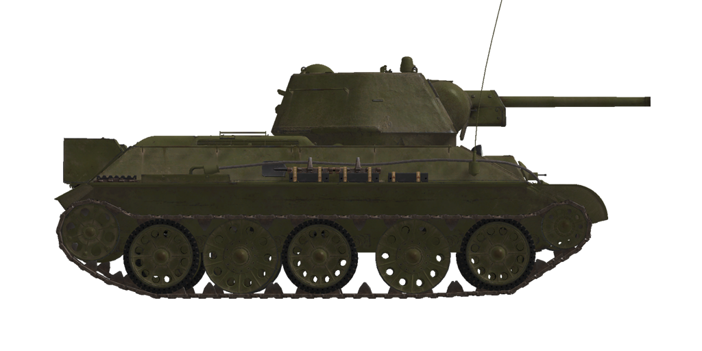

# T-34/76 UTZ (1943)  

<table><tbody><tr><td style="text-align: center"></tr></td></tr></tbody></table>  

T-34 gebaut von der F.E. Dzerzhinsky Ural Panzerfabrik #183 (UTZ) im Frühjahr 1943. Diese Panzer hatten ausgeprägte sechseckig gegossene Türme, Mischguss (mit innenliegenden Dämpfern) und gummierten Rädern sowie externe Kraftstofftanks am Heck. Zur besseren Dämpfung wurden gummierte Räder eingeführt, die jedoch aufgrund des Gummimangels in der UdSSR mit älteren Typen von Rädern gemischt wurden.  
  
Die Panzerkonstruktion wurde vereinfacht, indem die Anzahl der verschiedenen Arten von Panzerplatten reduziert wurde, so dass die Seiten-, Heck-, Boden-, Dach- und Bodenplatten über den Ketten die Panzerdicke erhöhten - 40 mm Panzerplatten wurden durch 45 mm und 13-16 mm Platten durch 20 mm ersetzt. Der neue Gussturm war je nach Trefferwinkel 5-11% stabiler.  
  
Darüber hinaus wurden die in dieser Zeit gebauten Panzer in der Regel mit dem neuen 5-Gang-Getriebe ausgestattet, um die Beschleunigung und die Kapazität im Gelände zu erhöhen. Die Munition der Hauptkanone wurde auf 100 Schuss erhöht.  
  
<b><u>Leergewicht:</u></b> ~30000 kg  
Länge: 6,6 m  
Breite: 3,0 m  
Höhe: 2,5 m  
Bodenfreiheit: 400 mm  
  
Motor: V-2, Diesel  
Maximale Leistung: 500 PS bei 1800 U/min  
Maximale Drehzahl: 1900 U/min  
Getriebe: 5-Gang-Schaltung  
  
<b><u>Höchstgeschwindigkeit auf Straße:</u></b>  
1. Gang: 7,4 km/h  
2. Gang: 15,9 km/h  
3. Gang: 22,4 km/h  
4. Gang: 34,1 km/h  
5. Gang: 54,0 km/h  
Rückwärtsgang: 8,4 km/h  
  
<b><u>Höchstgeschwindigkeit im Gelände:</u></b> 31 km/h  
  
<b><u>Betriebsstoffe:</u></b>  
Interne Tankkapazität: 460 l  
Motorölmenge: 80 l  
Sommer-Kühlmittel: 95 l Wasser  
Winter-Kühlmittel: 95 l 50% Ethylenglycol  
Reichweite: 300 km  
Maximaler Ölverbrauch: 9 l/h  
  
<b><u>Panzerung der Wanne:</u></b>  
Front: 45 mm gewalzter Panzerstahl  
Seiten: 45 mm gewalzter Panzerstahl  
Heck: 45 mm gewalzter Panzerstahl  
Wannendach: 20 mm gewalzter Panzerstahl  
Boden: 20 mm gewalzter Panzerstahl  
Boden über den Ketten: 20 mm gewalzter Panzerstahl  
  
<b><u>Turmpanzerung:</u></b>  
Front: 56 mm Gussstahl  
Seiten: 56 mm Gussstahl  
Rückseite: 56 mm Gussstahl  
Turmdach: 56 mm Gussstahl  
Kanonenblende: 45 mm gewalzter Panzerstahl  
  
<b><u>Hauptkanone:</u></b> Gezogener Lauf, 76,2 mm F-34  
Lauflänge: 41,6  
Höhenrichtbereich: -5° bis +25°  
Munition: Bis zu 100 Granaten  
Mögliche Feuerrate: 8 Schuss pro Minute  
Turmantrieb: Elektrisch, 14 Sekunden für eine volle Umdrehung  
  
<b><u>Munition:</u></b>  
BR-350B Panzersprenggranate (APHE): 6,5 kg, 660 m/s, 72 mm auf 500 m  
BR-350BSP Panzergranate (AP): 6,6 kg, 660 m/s, 73 mm auf 500 m  
BR-354P Hartkerngranate (APCR): 3,02 kg, 950 m/s, 129 mm auf kürzeste Entfernung  
OF-350 Sprenggranate (HE): 6,2 kg, 680 m/s, 710 g Sprengstoff  
  
<b><u>Maschinengewehre:</u></b> 7,62 mm Degtyarev DT  
Geschossgewicht: 9,8 g  
Mündungsgeschwindigkeit: 840 m/s  
Durchschlagsleistung auf 100 m: 11 mm  
Feuerrate: 600 Schuss pro Minute  
Koaxial-MG: 29 Magazine, 63 Schuss pro Magazin (1827 Schuss)  
Bug-MG: +-12°/+16°..-6°, 23 Magazine, 63 Schuss pro Magazin (1449 Schuss)  
  
<b><u>Gunsights:</u></b>  
TMFD-7 gunner scope-sight, field of view 15°.  
PT4-7 gunner panoramic periscopic sight, field of view 26°.  
  
<b><u>Radio equipment:</u></b>  
VHF 9-RM transceiver.  
3 intercom terminals.  

## Änderungen  
### Panzerbrechende Granaten  

BR-350BSP  
  
Panzerbrechende Hartkerngranaten ohne explosive Ladung. Geeignet gegen Panzerplatten mit Zwischenraum. Erzeugen aber weniger Schaden im Innern des Ziels als fortschrittlichere Panzersprenggranaten.  
  
Gewicht: 6,6 kg  
  
Abgefeuert aus einer F-34 / ZiS-5 Kanone:  
Mündungsgeschwindigkeit: 660 m/s   
Durchschlagsleistung aus kürzester Entfernung: 87 mm  
500 m: Durchschlagsleistung 73 mm, Geschwindigkeit 585 m/s, Fall -3,2 m  
1000 m: Durchschlagsleistung 62 mm, Geschwindigkeit 524 m/s, Fall -13,6 m  
2000 m: Durchschlagsleistung 47 mm, Geschwindigkeit 429 m/s, Fall -63,5 m  
  
### Panzersprenggranaten  

BR-350B  
  
Granaten mit einer explosiven Ladung im Sprengkopf.  
  
Geeignet gegen gepanzerte Ziele. Im Geschossabfalle der Penetration richten sie mehr Schaden im Innern des Ziels an als Hartkerngeschosse, aber die hochexplosive Ladung kann bereits zu früh explodieren (z.B. bei Panzerplatten mit Zwischenraum).  
  
Gewicht 6,5 kg, Sprengstoffgewicht 119 g  
  
Abgefeuert aus einer F-34 / ZiS-5 Kanone:  
Mündungsgeschwindigkeit: 660 m/s  
Durchschlagsleistung aus kürzester Entfernung: 86 mm  
500 m: Durchschlagsleistung 72 mm, Geschwindigkeit 584 m/s, Fall -3,2 m  
1000 m: Durchschlagsleistung 61 mm, Geschwindigkeit 522 m/s, Fall -13,6 m  
2000 m: Durchschlagsleistung 46 mm, Geschwindigkeit 427 m/s, Fall -64,0 m  
  
### Removed Fuel Tanks  

The external rear-mounted fuel tanks oftenly were removed.  
  
### Sprenggranaten  

OF-350  
  
Geeignet gegen weiche, ungepanzerte oder leicht gepanzerte Ziele.  
  
Gewicht 6,2 kg, Sprengstoffgewicht 710 g  
  
Durchschlagsleistung bei Direkttreffer 20 mm, effektive Schadensdistanz für leichte Fahrzeuge 3 m  
  
Abgefeuert aus einer F-34 / ZiS-5 Kanone:  
Mündungsgeschwindigkeit: 680 m/s  
500 m: Geschwindigkeit 616 m/s, Geschossabfall -3,0 m  
1000 m: Geschwindigkeit 558 m/s, Geschossabfall -12,5 m  
2000 m: Geschwindigkeit 468 m/s, Geschossabfall -56,7 m  
  
### Hartkerngranaten  

BR-354P  
  
Granaten mit unterkalibrigen panzerbrechenden Projektilen.  
  
Gut gegen stark gepanzerte Ziele auf kurze Distanzen: Sie sind viel leichter als gewöhnliche Granaten und haben eine viel höhere Mündungsgeschwindigkeit und Durchschlagsleistung auf kurze Distanzen. Wegen der geringeren Masse nimmt ihre Geschwindigkeit jedoch mit der Entfernung schnell ab und sie sind schlechter als gewöhnliche Granaten auf größeren Entfernungen.  
  
Der Eindringkörper wird von einem Treibkäfig, der wie eine Spule ausschaut, im Lauf gehalten. Während die Masse des Geschosses für eine erhöhte Mündungsgeschwindigkeit reduziert wird, verliert sie durch den Luftwiderstand dadurch noch schneller an Geschwindigkeit.  
  
Gewicht: 3,02 kg, Durchmesser des Eindringkörpers 28 mm  
  
Abgefeuert aus einer F-34 / ZiS-5 Kanone:  
Mündungsgeschwindigkeit: 950 m/s   
Durchschlagsleistung aus kürzester Entfernung: 129 mm  
500 m: Durchschlagsleistung 90 mm, Geschwindigkeit 741 m/s, Fall -1,7 m  
1000 m: Durchschlagsleistung 60 mm, Geschwindigkeit 558 m/s, Fall -8,0 m  
2000 m: Durchschlagsleistung 24 mm, Geschwindigkeit 295 m/s, Fall -53,3 m  
  
### 6 Stahlräder  

Zwei zusätzliche innere gefederte Stahlräder (6 total) aufgrund der Knappheit an Gummi  
  
### 8 Stahlräder  

Vier zusätzliche innere gefederte Stahlräder (8 total) aufgrund der Knappheit an Gummi  
