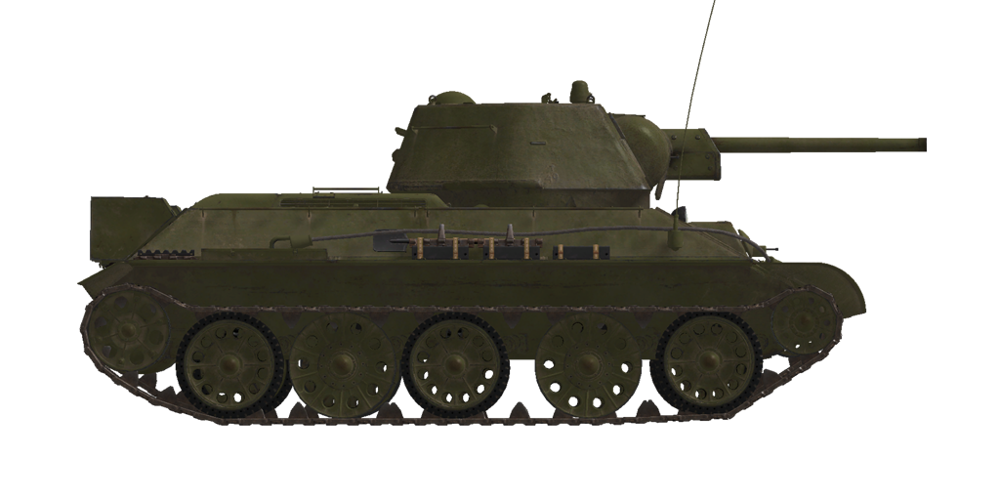

# T-34/76 UTZ (1943)  

<table><tbody><tr><td style="text-align: center"></td></tr></tbody></table>  

## Descripción  

T-34 construido por la <i>Uralvagonzavod</i> —fábrica de tanques de los Urales— (UTZ) n.º 183, conocida también como «F.E. Dzerzhinsky», en primavera de 1943. Estos carros de combate tenían una torreta de fundición de forma hexagonal muy característica y un mantelete más redondeado que el resto, fundición mixta (con amortiguadores internos) y ruedas recubiertas de goma, así como depósitos de combustible externos en la parte trasera. Las ruedas recubiertas de goma se introdujeron para mejorar la amortiguación, pero debido a la escasez de goma en la URSS, se mezclaron con los tipos de ruedas más antiguos.  
  
El diseño del carro se simplificó al reducir el número de grosores diferentes de las planchas blindadas, por lo que el espesor del blindaje de los laterales, parte trasera, fondo, techo y fondo por encima de las orugas aumentó: las planchas de 40 mm se sustituyeron por otras de 45 mm y las de 13-16 mm por otras de 20 mm. La nueva torreta de fundición también era un 5-11% más duradera, dependiendo del ángulo de impacto.  
  
Además, los carros fabricados durante este tiempo estuvieron equipados con una nueva caja de cambios de 5 velocidades para conseguir una aceleración más efectiva y mayor capacidad campo a través. La munición del cañón principal se incrementó hasta los 100 proyectiles.  
  
<b><u>Peso vacío:</u></b> ~30000 kg  
Longitud: 6,6 m  
Anchura: 3,0 m  
Altura: 2,5 m  
Distancia al suelo: 400 mm  
  
Motor: diesel de 12 cilindros en V, modelo V-2  
Potencia máxima: 500 CV a 1800 rpm  
Máximas rpm: 1900 rpm  
Cambio de 5 marchas  
  
<b><u>Velocidad máxima en carretera:</u></b>  
1.ª: 7,4 km/h  
2.ª: 15,9 km/h  
3.ª: 22,4 km/h  
4.ª: 34,1 km/h  
5.ª: 54,0 km/h  
Marcha atrás: 8,4 km/h  
  
<b><u>Velocidad máxima en otros terrenos:</u></b> 31 km/h  
  
<b><u>Líquidos:</u></b>  
Capacidad depósitos de combustible internos: 600 l  
Capacidad sistema lubricante del motor: 80 l  
Refrigerante del motor en verano: 95 l de agua  
Refrigerante del motor en invierno: 95 l de 50% etilenglicol  
Autonomía: 300 km  
Consumo de aceite máximo: 9 l/h  
  
<b><u>Blindaje del casco:</u></b>  
Frontal: 45 mm  
Laterales: 45 mm laminado  
Trasera: 45 mm laminado  
Techo: 20 mm laminado  
Fondo: 20 mm laminado  
Fondo por encima de orugas: 20 mm laminado  
  
<b><u>Blindaje de torreta:</u></b>  
Frontal: 56 mm fundición  
Laterales: 56 mm fundición  
Trasera: 56 mm fundición  
Techo: 56 mm fundición  
Mantelete: 45 mm laminado  
  
<b><u>Cañón principal:</u></b> estriado, 76,2 mm F-34  
Longitud del cañón: 41,6 calibres  
Elevación: +25°..-5°  
Munición: hasta 100 proyectiles  
Cadencia de disparo útil: 8 proyectiles por minuto  
Movimiento torreta: eléctrico, 14 segundos por vuelta  
  
<b><u>Munición del cañón:</u></b>  
BR-350B perforante explosivo (APHE): 6,5 kg, 660 m/s, 72 mm a 500 m  
BR-350BSP perforante sólido (AP): 6,6 kg, 660 m/s, 73 mm a 500 m  
BR-354P perforante núcleo rígido (APCR): 3,02 kg, 950 m/s, 129 mm a bocajarro  
OF-350 explosivo (HE): 6,2 kg, 680 m/s, 710 g de explosivo  
  
<b><u>Ametralladoras:</u></b> Degtyarev (DT) de 7,62 mm  
Peso de la bala: 9,8 g  
Velocidad de salida: 840 m/s  
Penetración de blindaje a 100 m: 11 mm  
Cadencia de disparo: 600 balas por minuto  
Coaxial: 29 cargadores, 63 balas por cargador (1827 balas)  
Glacis: +-12°/+16°..-6°, 23 cargadores, 63 balas por cargador (1449 balas)  
  
<b><u>Miras para apuntado del armamento:</u></b>  
Mira telescópica TMFD-7 en artillero, campo de visión de 15°  
Mira periscópica y panorámica PT4-7 en artillero, campo de visión de 26°  
  
<b><u>Equipamiento de radio:</u></b>  
Transmisor-receptor VHF 9-RM  
3 intercomunicadores  

## Modificaciones  
### Proyectiles perforantes sólidos (AP)  

BR-350BSP  
  
Proyectiles perforantes sólidos, sin carga explosiva en su interior.  
  
Adecuados contra objetivos con planchas de blindaje espaciadas, pero causan menos daños dentro del objetivo que el perforante explosivo (APHE), más avanzado.  
  
Peso 6,6 kg.  
  
Disparado desde un cañón F-34 / ZiS-5:  
Velocidad de salida 660 m/s, penetración del blindaje a bocajarro 87 mm.  
500 m: penetración del blindaje 73 mm, velocidad 585 m/s, caída -3,2 m.  
1000 m: penetración del blindaje 62 mm, velocidad 524 m/s, caída -13,6 m.  
2000 m: penetración del blindaje 47 mm, velocidad 429 m/s, caída -63,5 m.  
  
### Proyectiles perforantes explosivos (APHE)  

BR-350B  
  
Proyectiles perforantes armados con una pequeña carga explosiva que estalla con un ligero retraso tras el impacto.  
  
Adecuados contra objetivos blindados. En caso de perforación causan más daño dentro del objetivo que los proyectiles perforantes sólidos (AP), pero la parte explosiva puede detonarse prematuramente (por ejemplo, cuando se usan contra objetivos con capas blindadas espaciadas).  
  
Peso 6,5 kg, cantidad explosivo 119 g.  
  
Disparado desde un cañón F-34 / ZiS-5:  
Velocidad de salida 660 m/s, penetración del blindaje a bocajarro 86 mm.  
500 m: penetración del blindaje 72 mm, velocidad 584 m/s, caída -3,2 m.  
1000 m: penetración del blindaje 61 mm, velocidad 522 m/s, caída -13,6 m.  
2000 m: penetración del blindaje 46 mm, velocidad 427 m/s, caída -64,0 m.  
  
### Retirada de depósitos externos  

En el frente, los depósitos de combustible externos instalados en la parte trasera del carro se retiraban con bastante frecuencia.  
  
### Proyectiles explosivos (HE)  

OF-350  
  
Proyectiles de fragmentación con carga altamente explosiva en su interior.  
  
Adecuados contra objetivos no blindados o con blindaje ligero.  
  
Peso 6,2 kg, cantidad explosivo 710 g.  
  
Penetración de blindaje en impacto directo 20 mm, distancia de daño efectiva para vehículos ligeros 3 m.  
  
Disparado desde un cañón F-34 / ZiS-5:  
Velocidad de salida 680 m/s.  
500 m: velocidad 616 m/s, caída -3,0 m.  
1000 m: velocidad 558 m/s, caída -12,5 m.  
2000 m: velocidad 468 m/s, caída -56,7 m.  
  
### Proyectiles perforantes de núcleo rígido (APCR)  

BR-354P  
  
Proyectiles perforantes que poseen un núcleo de pequeño calibre de material muy duro y denso.  
  
Adecuado contra objetivos fuertementre blindados en distancias cortas: mucho más ligeros que los proyectiles ordinarios, tienen mayor velocidad de salida y penetración en blindajes en distancias cortas. Sin embargo, debido a su menor peso su velocidad disminuye rápidamente con la distancia, por lo que son peores que los proyectiles ordinarios en largas distancias.  
  
El núcleo rígido se mantiene en el cañón rodeado de un cuerpo de material muy ligero. Se reduce el peso del proyectil para aumentar la velocidad de salida, pero esto hace que pierda velocidad aún más rápido debido al rozamiento del aire.  
  
Peso 3,02 kg, calibre núcleo rígido 28 mm.  
  
Disparado desde un cañón F-34 / ZiS-5:  
Velocidad de salida 950 m/s, penetración del blindaje a bocajarro 129 mm.  
500 m: penetración del blindaje 90 mm, velocidad 741 m/s, caída -1,7 m.  
1000 m: penetración del blindaje 60 mm, velocidad 558 m/s, caída -8,0 m.  
2000 m: penetración del blindaje 24 mm, velocidad 295 m/s, caída -53,3 m.  
  
### 6 ruedas de acero  

Dos ruedas adicionales fabricadas completamente en acero con suspensión interna (para un total de 6), debido a la escasez de caucho.  
  
### 8 ruedas de acero  

Cuatro ruedas adicionales fabricadas completamente en acero con suspensión interna (para un total de 8), debido a la escasez de caucho.  
